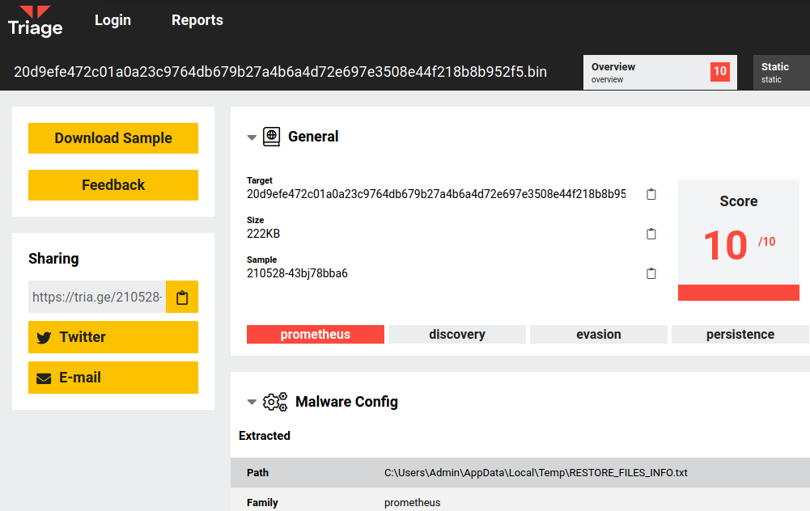
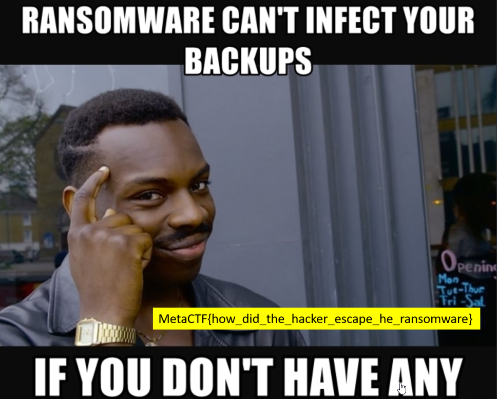

# I Want My Files Back

This was a fun challenge, they gave us an encoded file. I had to figure out what kind of ransomware the file was encrypted with and figure out if there was a way to decode it. 

Google searching eventually led me to this page. 

https://tria.ge/210528-43bj78bba6



The onoin link way at the bottom of this page (shown below) had the same characters as the file extension. Triage also had this labeled as prometheus ransomware. 

```sh
http://promethw27cbrcot.onion/ticket.php?track=AA4-MX4-GGQD
```

Doing further googling to see if this can be decrypted, I found this tool on github.

https://github.com/cycraft-corp/Prometheus-Decryptor

When I first used the tool it didn't work. I got a file format error. I renamed the file to copy.png and the tool worked. 

```sh
kali@kali-[~/boxes/ctfs/cybergames/ransom]$ls -al
total 4680
drwxr-xr-x  3 kali kali    4096 Dec  4 22:36  .
drwxr-xr-x 19 kali kali    4096 Dec  4 22:25  ..
-rw-r--r--  1 kali kali 1590208 Dec  4 22:35  copy.png
drwxr-xr-x  8 kali kali    4096 Dec  4 22:32  Prometheus-Decryptor
-rw-r--r--  1 kali kali 1590208 Dec  4 22:25 'supercriticalfile.png.[AA4-MX4-GGQD]'
```


```sh
kali@kali-[~/boxes/ctfs/cybergames/ransom/Prometheus-Decryptor]$./prometheus_decrypt -i ../copy.png -o ../decoded
2021/12/04 22:36:13 Start decrypt ../copy.png
Decrypt file with seed 586968, key: _/AetZp-dCSrG_'m2h-2V]RtwCKefEcn, path: ../586968_decoded
```

The decoded image is shown below, and contains the flag for this challenge. 



