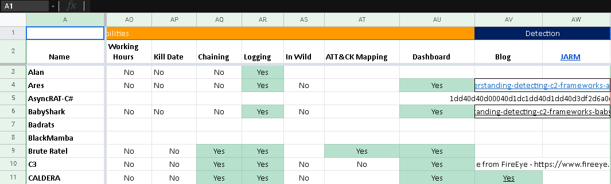
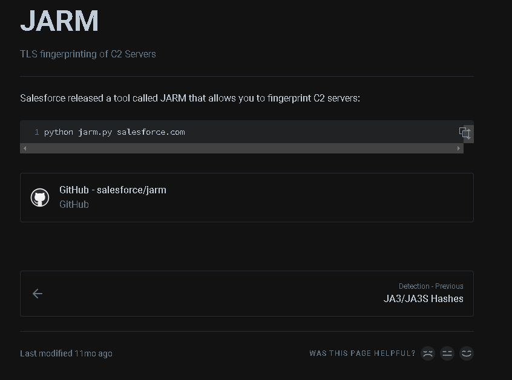
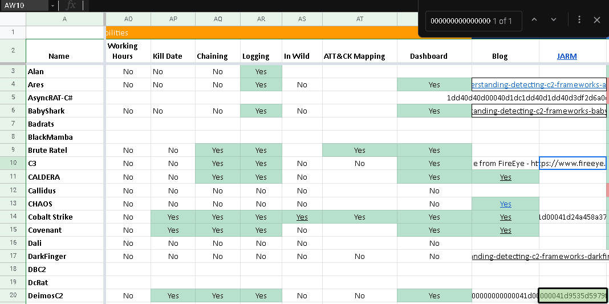

# MysteryC2

This challenge presented us with the address of a C2 listener and asks us to identify which C2 framework it is. 

>There is a C2 server running an HTTPS listener at 50.17.89.130:1337 can you determine what C2 framework it is? The flag is the name of the C2 framework.
Example: MetaCTF{Cobalt Strike}

The hint on this challenge recommended looking into the detection column on the C2 matrix, located at https://www.thec2matrix.com/.

Looking into the detection column, there is a column labeled JARM. 



The column title is a link which brings us to this page, describing a tool which can be used to fingerprint C2 servers.

https://github.com/salesforce/jarm


I ran the tool on the address given in the challenge and the tool returned a value. 

```sh
kali@kali-[~/tools/enum/jarm]$python3 jarm.py -p 1337 50.17.89.130
Domain: 50.17.89.130
Resolved IP: 50.17.89.130
JARM: 00000000000000000041d00000041d9535d5979f591ae8e547c5e5743e5b64
```

Searching for this value in the C2 matrix showed a match, DeimosC2.

 
 
 ```sh
 MetaCTF{DeimosC2}
 ```
 
 
 
 