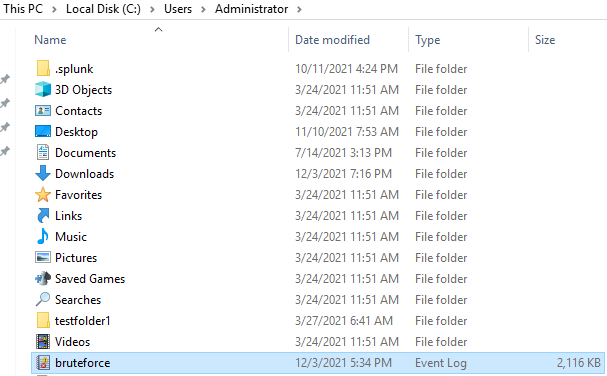
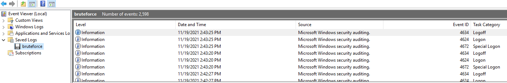
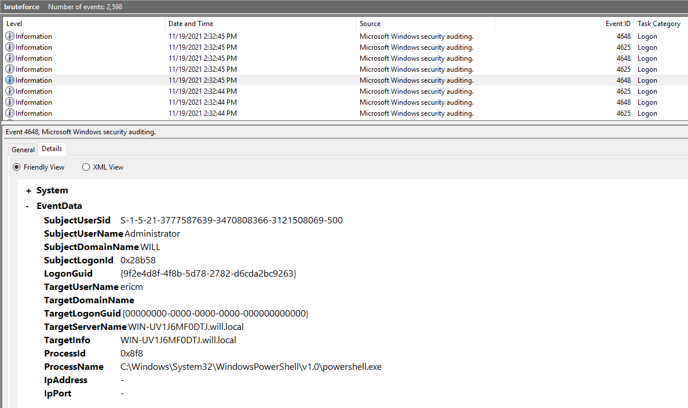

# Et Tu, Hacker?

This challenge gave me an event log to examine and determine which user account was targeted.

Challenge info:
>The law firm of William, Ian, Laura, and Lenny (WILL for short) has just been the victim of an attempted cyber attack. Someone tried to brute force the login for one of their employees. They have the event logs of the incident, and were wondering if you could tell them which user was targeted. Flag is in the form of MetaCTF{}.


Since this challenge gave me a windows event log, I transferred it over to my Windows VM.



Double clicking on the file will open it in Event Viewer.




Scrolling through there is a string of 'Logon' events all relating to a user account 'ericm'



The flag for this challenge is:
```sh
MetaCTF{ericm}
```