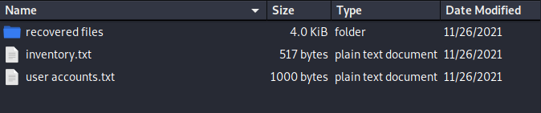

This file gave me a zip file from an incident. The challenge is to determine which user account was compromised, the user account is the flag.

Challenge info:
>Our security team has identified evidence of ransomware deployment staging in the network. We’re trying to contain and remediate the malicious operator’s deployment staging and access before the operator successfully spreads and executes ransomware within the environment. We’ve recovered some of the operator’s staging scripts and files. Can you help identify which user account’s credentials the operator had compromised and is planning to use to execute the ransomware?
>
>The flag format will be METAL\xxxxx 

After extracting the zip archive, it showed on folder name 'recovered files' and two other txt files.



The text files contained a list of usernames, but nothing pointing at an IOC outside of some suspicious file names (copy.bat, exe.bat and wmi.bat). These files were located within the 'recovered files' folder. 

Looking into these files all contained psexec commands. exe,copy and wmi.bat were each for a different user. I tried entering the flag as the timq-admin user and it accepted it.

```sh
kali@kali-[~/boxes/ctfs/cybergames/just_wanna_run/incident017/recovered files]$cat exe.bat
start PsExec.exe -d @C:\share$\comps1.txt -u METAL\timq-admin> -p “Fall2021!” cmd /c c:\windows\temp\evil.exe
start PsExec.exe -d @C:\share$\comps2.txt -u METAL\timq-admin> -p “Fall2021!” cmd /c c:\windows\temp\evil.exe
start PsExec.exe -d @C:\share$\comps3.txt -u METAL\timq-admin> -p “Fall2021!” cmd /c c:\windows\temp\evil.exe
```

```sh
MetaCTF{METAL\timq-admin}
```