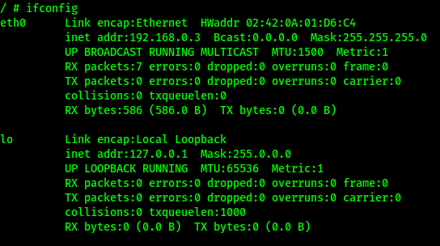
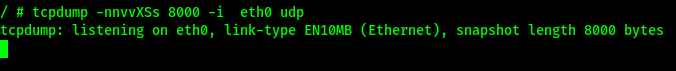
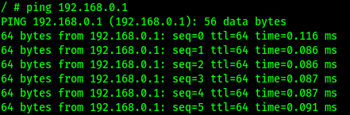
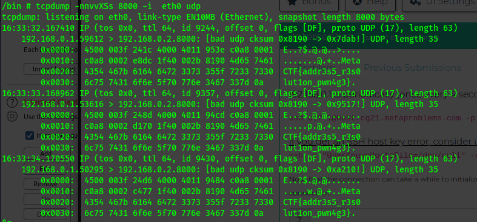

For this challenge, we are put into a simple network environment with 3 workstations connected by a switch. Getting the flag for this challenge involves poisoning the ARP table on the target system in order to trick the system into sending us the flag, instead of sending it to 192.168.0.2.

This challenge gives us ssh command to use to gain access to the challenge system. The challenge description also states:

> 192.168.0.1 is periodically (once every 4 seconds) sending the flag to 192.168.0.2 over UDP port 8000. Go get it.

Using the command provided I connected to the system.

```sh
kali@kali-[~]$ssh -o "UserKnownHostsFile=/dev/null" -o "StrictHostKeyChecking=no" ctf-1@host.cg21.metaproblems.com -p 7000
Warning: Permanently added '[host.cg21.metaproblems.com]:7000,[3.83.44.76]:7000' (ECDSA) to the list of known hosts.
Welcome, competitor #d01-5cy0D3i002-3. 21 minutes of battery remaining.
Granting console connection to device...
...
/ # 
```

A couple things I looked at first was the IP of the system I was on.



Also also made sure I had access to tcpdump.



Next I changed the IP address of the system I was on to 192.168.0.2. 

```sh
/bin # ifconfig eth0 192.168.0.2 netmask 255.255.255.0
```

In order to spoof the ARP table of the target system I need to initiate traffic to 192.168.0.1.



Then using tcpdump, I was able to read the flag. 




```sh
MetaCTF{addr3s5_r3s0lut1on_pwn4g3}
```