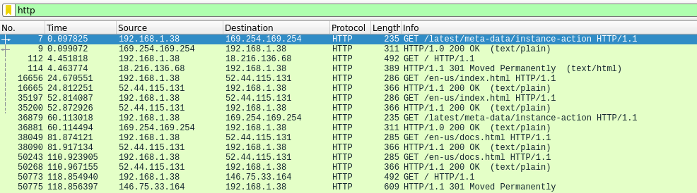
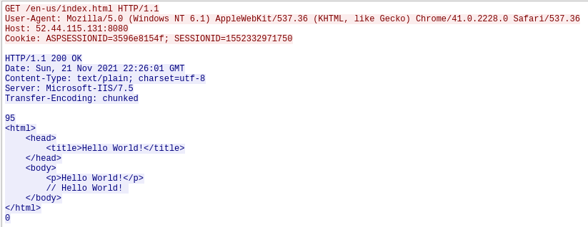
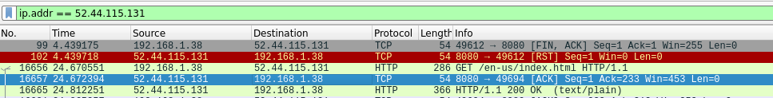

# Pattern Of Life

This challenge gave me another pcap file to determine the port number of the C2 server. 

Challenge info:
>Hackers have breached our network. We know they are there, hiding in the shadows as users continue to browse the web like normal. As a threat hunter, your job is to constantly be searching our environment for any signs of malicious behavior.
>
>Today you just received a packet capture (pcap) from a user's workstation. We think that an attacker may have compromised the user's machine and that the computer is beaconing out to their command and control (C2) server. Based on some other logs, we also think the attacker was *not* using a fully encrypted protocol and also did not put much care into making their C2 server look like a normal website. Your task? We'd like you to submit the port number that the C2 server is listening on in the form of MetaCTF{portnumber} as the flag.


The first step I took was to open the pcap file and filter out HTTP traffic.




Following the TCP stream revealed this communication, I had actually seen this exact type of communication on another pcap file containing C2 traffic. Here it doesn't look like any active commands were being issued by the C2, whereas on the other challenge under the '// Hello World' was encrypted data. 



I then filtered by this IP address, assuming that this was the C2 traffic for the challenge. On the blue highlighted line, it shows the source port for 52.44.115.131.




```sh
MetaCTF{8080}
```