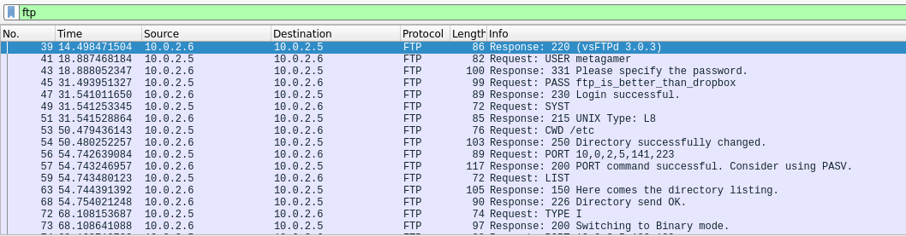

# Sharing Files and Passwords

This challange gave me a pcap file and hinted that there is FTP communications on there, find the password to get the flag. 


Challenge info:
>FTP servers are made to share files, but if its communications are not encrypted, it might be sharing passwords as well. The password in this pcap to get the flag


Since FTP transmits credentials in plaintext, I opened the pcap in wireshark and filtered for FTP traffic.





Right away the password is visible on the 4th line down.

```sh
MetaCTF{ftp_is_better_then_dropbox}
```