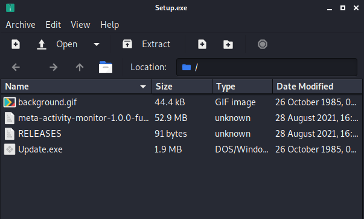
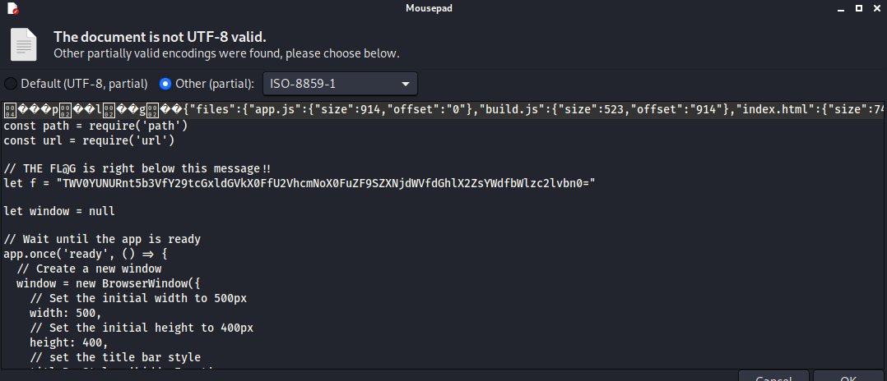

# Source Code Shipping

This challenge gives us an exe file and tells us the flag is hidden somewhere in the source code. I honestly got kind of lucky and found the file quickly, otherwise I would have pulled the files out and used grep to try and sort through some of them. 

Challenge Info:
> Ever wondered what was in those absolutely massive desktop apps such as Slack, Discord, and other apps built using Electron JS? Well we've created a small Electron-based app with a flag embedded in its source code for your perusal.
> You don't need to install or run the app to get the flag.


An exe file actaully contains other files necessary for execution and these can be viewed by right clicking the exe file and opening with an archive manager. As shown in the image below Setup.exe actually contains 4 files, the one we are interested is meta-activity-monitor-1.0.0-full.nupkg.




I'm not familiar with nupgk files, so Google led me to this definition.

>NUPKG file stores standardized NuGet packages, which can be used for distributing application or library source code. NUPKG is a ZIP archive that contains DLL library binaries and technical documentation files.
>https://www.file-extension.info/format/nupkg


Looking into the nupkg file, there was more folder and files. Eventually I came across Setup.exe/meta-activity-monitor-1.0.0-full.nupkg/lib/net45/resources/app.asar. In the app.asar file I found the flag. 



```sh
// THE FL@G is right below this message!!
let f = "TWV0YUNURnt5b3VfY29tcGxldGVkX0FfU2VhcmNoX0FuZF9SZXNjdWVfdGhlX2ZsYWdfbWlzc2lvbn0="
```

```sh
echo 'TWV0YUNURnt5b3VfY29tcGxldGVkX0FfU2VhcmNoX0FuZF9SZXNjdWVfdGhlX2ZsYWdfbWlzc2lvbn0' | base64 -d
MetaCTF{you_completed_A_Search_And_Rescue_the_flag_mission}
```

Also not knowing what asar files are I searched these as well.

>An ASAR file is an archive used to package source code for an application using Electron
>https://fileinfo.com/extension/asar
