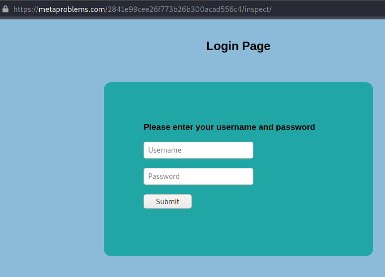
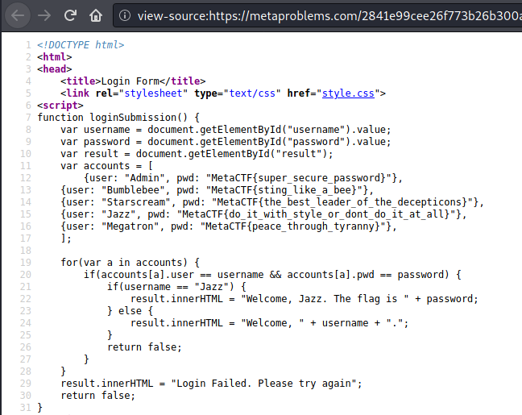
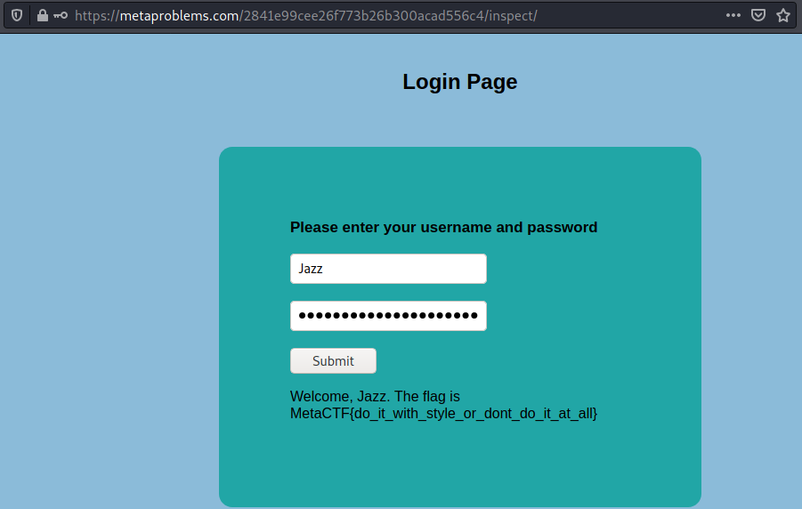

# Under Inspection

This challenge shows a website where I am tasked with finding the flag on one of the Autobots accounts.

Challenge info:
>Someone made this site for the Autobots to chat with each other. Seems like the Decepticons have found the site too and made accounts.
>
>One of the Autobot accounts has a flag that they're trying to keep hidden from the Decepticons, can you figure out which account it is and steal it?

Viewing the webpage showed the login shown below.



Viewing the source code reveals a loginsubmission function at the top of the html doc. 



Looking closely it looks like it checks if the username is equal to "Jazz", then it will show the flag, which is also the password for Jazz.

```sh
or(var a in accounts) {
		if(accounts[a].user == username && accounts[a].pwd == password) {
			if(username == "Jazz") {
				result.innerHTML = "Welcome, Jazz. The flag is " + password;
```


This function also contains the account information, including Jazz's password.

```sh
{user: "Jazz", pwd: "MetaCTF{do_it_with_style_or_dont_do_it_at_all}"},
```

