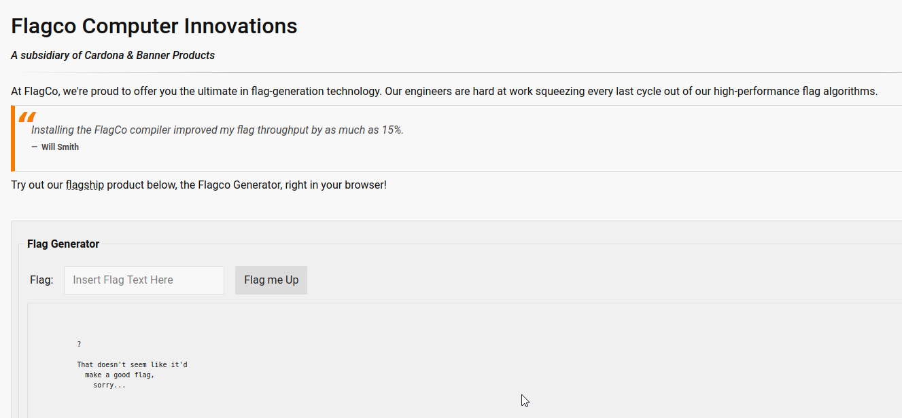
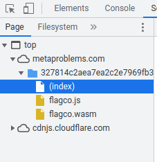
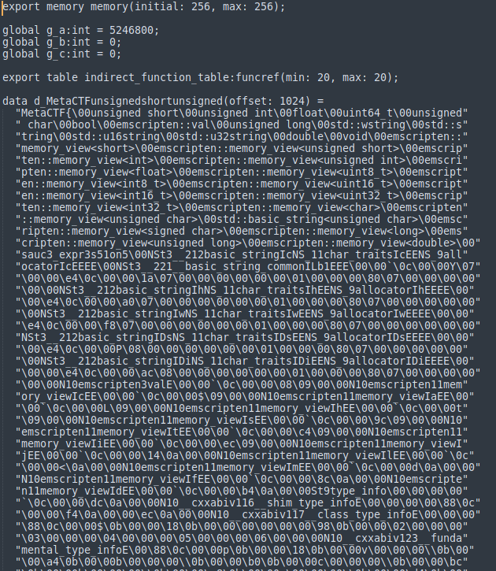
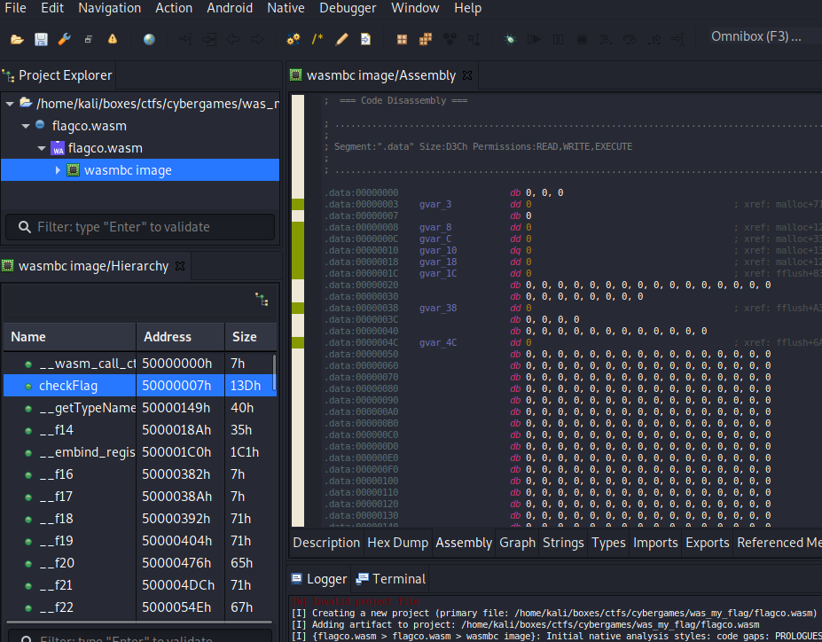
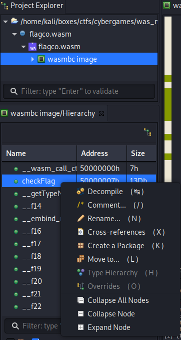
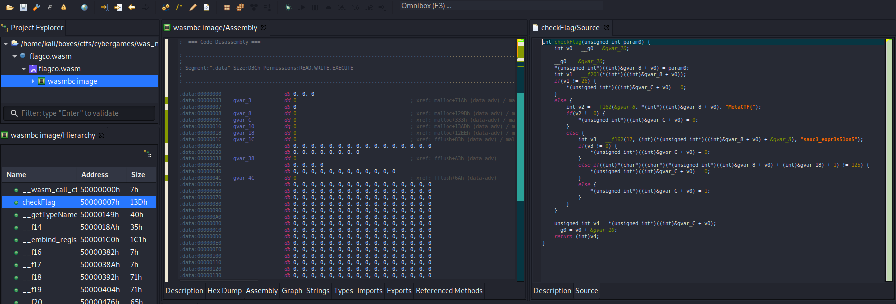
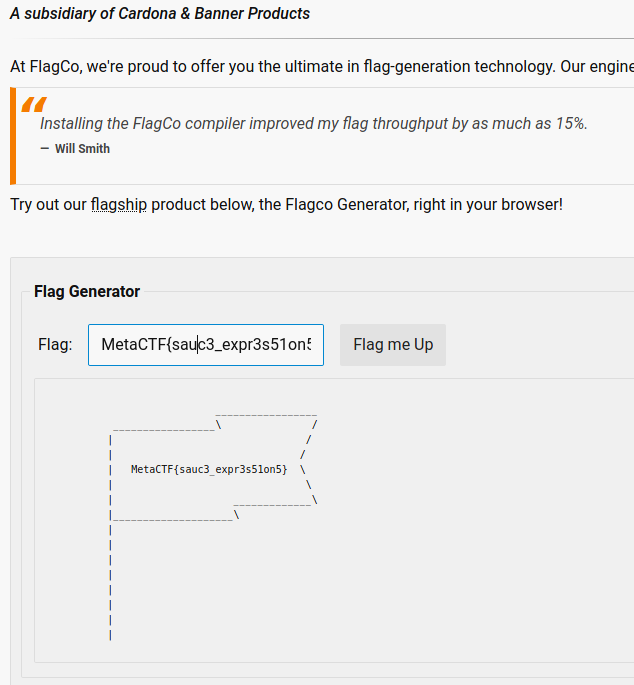
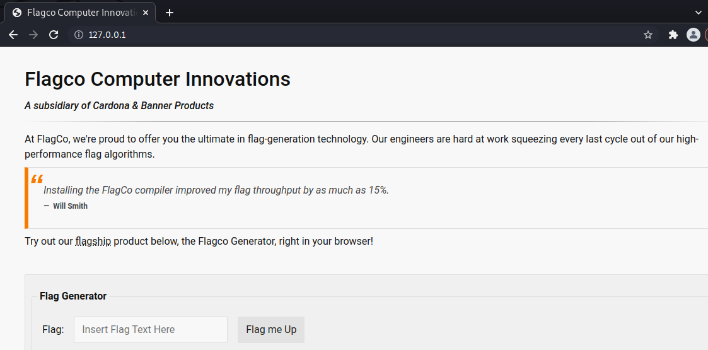
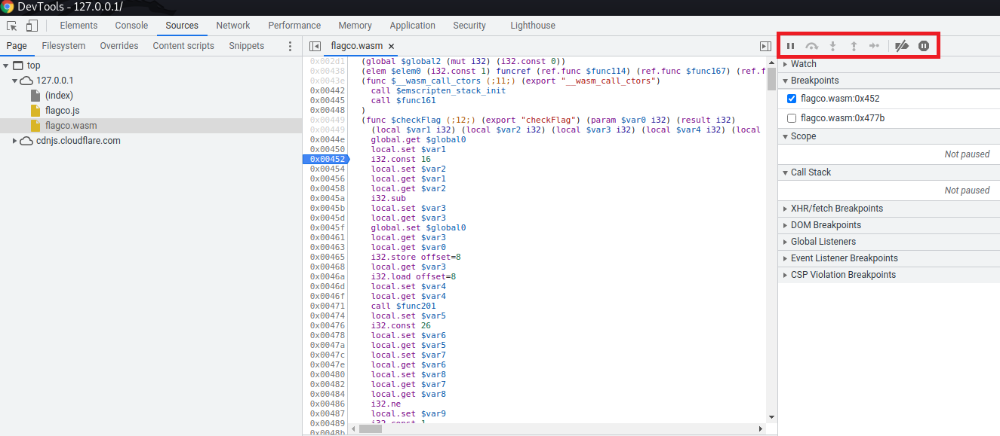
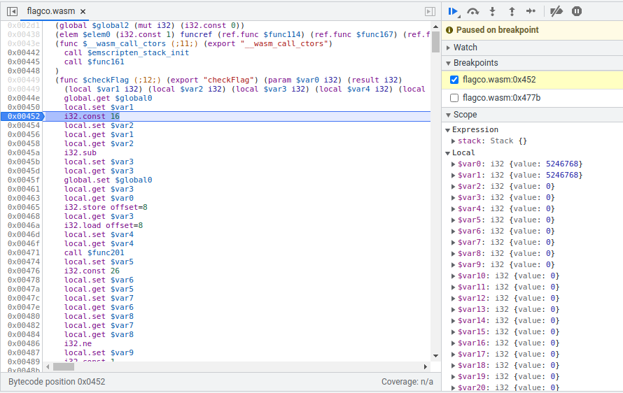

# WAS My Flag Part 1

This challenge brought me to a webpage hosting a Flag Generator. Enter some input and it'll tell you if it's a good flag or not.



Obviously its checking the input against something to verify the flag. Inspector shows 3 files, index.html, flagco.js and flagco.wasm. 



Trying to view the wasm file in firefox originally showed the browser could not render the page. Using chrome it did show the wasm file in the browser. Right clicking on the file in inspector gives the option to 'view in a new tab'. Using this option will download the file. 


I originally found this toolkit for WASM files. This repository offers a handful of programs to handle wasm files, including wasm-decompile, and wasm2c. However none of these programs actually helped me out. While it was able to decompile the file, I was still unable to read the flag. 

https://github.com/WebAssembly/wabt

Here is an example of the output I was getting from wasm-decompile. 




I eventually stumbled across another program called Jeb. I downloaded and installed the demo version. Using Jeb I was able to decompile the checkFlag function in the wasm file to something I could actually read. Below shows the initial screen after loading the flagco.wasm file into Jeb.

https://www.pnfsoftware.com/jeb/demo





Right click on the checkFlag function and click on 'decompile'.





Jeb then opens up a new window and the flag is shown in two parts. 





```sh
MetaCTF{sauc3_expr3s51on5}
```




# Beyond the Challenge

During this challenge I found out that Chrome devtools could be used as a debugger to actually step through the application.

I had downloaded all the files, and started a webserver using python3.

```sh
kali@kali-[~/boxes/ctfs/cybergames/was_my_flag]$ls -al
total 524
drwxr-xr-x  2 kali kali   4096 Dec  4 20:45 .
drwxr-xr-x 23 kali kali   4096 Dec  5 10:39 ..
-rw-r--r--  1 kali kali 162351 Oct  5 16:02 flagco.js
-rw-r--r--  1 kali kali  20692 Dec  4 20:28 flagco.wasm
-rw-r--r--  1 kali kali   2701 Oct  5 16:02 index.html
```


```sh
kali@kali-[~/boxes/ctfs/cybergames/was_my_flag]$python3 -m http.server 80
Serving HTTP on 0.0.0.0 port 80 (http://0.0.0.0:80/) ...
```

Browsing to 127.0.0.1 in Chrome I had a fully functional site I could test locally.




Hit F12 to bring up the devtools. This windows shows the 3 files and actually displays the wasm file, and here we can see the $checkFlag function. Selecting any bytecode position will set a breakpoint.



By entering input into the webpage, the application hits our breakpoint and we can step through the application.



While this method didn't help me solve this challenge, I took note of this and will use this in the future. 
